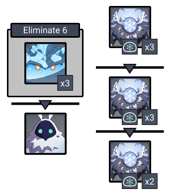
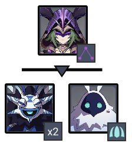
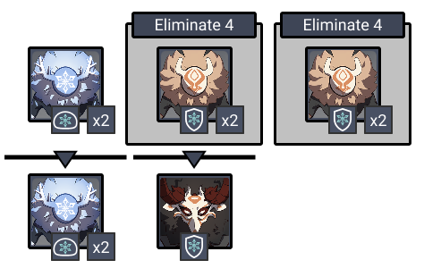
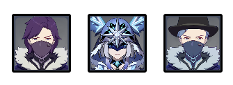
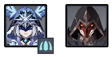
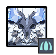

# Floor 10 (v1.2 - v1.5)

## Divergence

* Characters on the field will continuously accumulate **Sheer Cold**, and will continually lose HP after Sheer Cold reaches its limit
* **Warming Seelie** appear on the field, and will continually alleviate nearby characters' Sheer Cold

## General Tips

**Warming Seelie** will move around the room in a circle.

Keep an eye on your **Sheer Cold** gauge in this chamber. If you can't clear the mobs fast enough, you will want to try and lure enemies near the **Warming Seelie** if possible and fight near them.

## Team Recommendations

|                      |                                                                                                                               Side 1                                                                                                                              |                                                                                                                               Side 2                                                                                                                              |
| -------------------- | :---------------------------------------------------------------------------------------------------------------------------------------------------------------------------------------------------------------------------------------------------------------: | :---------------------------------------------------------------------------------------------------------------------------------------------------------------------------------------------------------------------------------------------------------------: |
| **Shieldbreakers**   |                                                                                                                                                                                                                          |                                                                                                                                                                                                                          |
| **Preferred Damage** |                                                                                                                                                                                                                          |                                                                                                                                                                                                                          |
| **Avoid Damage**     |                                                                                                                                                                                                                          |                                                                                                                                                                                |
| **4**★ **Supports**  |  |  |
| **5**★ **Supports**  |                                                                                                                                                                                                                 |                                                                                                                                                                                                                  |

## Chamber 1

**Monster Level - 80**

### Side 1

Fight near the **Grenadiers **and let the **Slimes **come to you

### Side 2

| Aura                                                  | DMG                                           |
| ----------------------------------------------------- | --------------------------------------------- |
| [**Ice Cage**](../../mechanics/auras/ice-cage.md)**** | 3785 |

Focus the **Hydro Samachurls** and quickly burst them down before they can heal. If get **Frozen** too much, try breaking **Cryo Abyss Mage** shield before switching to the **Hydro Samachurls** to make it easier.

## **Chamber 2**

**Monster Level - 82**

### Side 1

The pack of **Ice Shield Hilichurls** that spawn behind you will produce the **Mitachurl**. Prioritize those first to spawn it, then fight near the Grenadiers to group them together.

### Side 2

Killing off **Potioneers** will make it easier to deal with the **Cryo Cicin**.

**Cicin Flies **will continually recharge the shield on **Cryo Cicin Mage** when alive. Kill them to stop her from reshielding.

## **Chamber 3**

**Monster Level - 84**

### Side 1

| Aura                                                      | DMG                                           |
| --------------------------------------------------------- | --------------------------------------------- |
| ****[**Ice Cage**](../../mechanics/auras/ice-cage.md)**** | 4194 |

Focus the **Cryo Cicin** to get rid of **Ice Cage**. The **Pyro Fatui **will come towards you anyway, letting you group them easily.

**Cicin Flies **will continually recharge the shield on **Cryo Cicin Mage** when alive. Kill them to stop her from reshielding.

### Side 2

| Aura                                                      | DMG                                           |
| --------------------------------------------------------- | --------------------------------------------- |
| ****[**Ice Cage**](../../mechanics/auras/ice-cage.md)**** | 4266 |

Use  to break through the shield. After doing this, the **Lawachurl** will be vulnerable to staggering, making the fight easier.

Here are some basic attack patterns:

* Pattern 1: When engaged it shields up after 2 seconds (follows up with a large ground slam after 3-4sec if player close)
* Pattern 2: Winds up a wide frontal swing which leaves behind some exploding ice
* Pattern 3: Leans back and roars and then leaps at the player, and then does a large ground slam Pattern 4: charges at a distant player and leaves ice that explodes after a delay at it's destination (can also end in a slam if charge ends close to player)
* Pattern 5: digs up an object to throw at the player Pattern 6: slam followed by large ground slam

## Other Resources

Not sure what something means? Check the [Glossary](../../floors/glossary.md)
