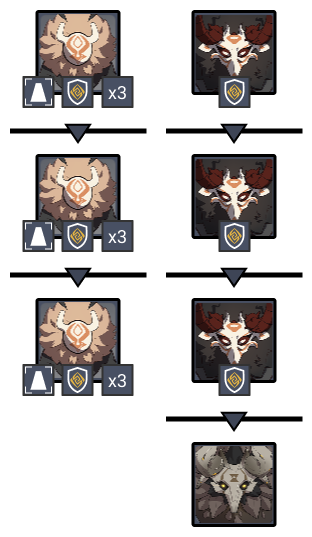
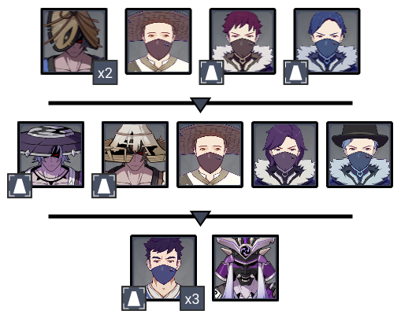
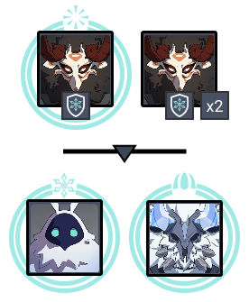
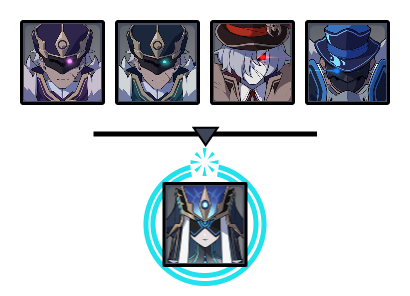
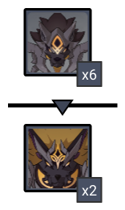
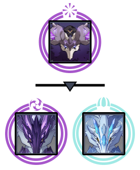

# Floor 11 (v2.7)

## Divergence

**DMG** dealt by claymore-wielding characters increased by **75%**

## General Tips

## Team Recommendations

|                            |                                                                               Side 1                                                                               |                                                               Side 2                                                               |
| -------------------------- | :----------------------------------------------------------------------------------------------------------------------------------------------------------------: | :--------------------------------------------------------------------------------------------------------------------------------: |
| **Shieldbreakers**         |                                                                                 |  |
| **Preferred DPS Elements** |                                                                                                                          |                                                                                      |
| **Avoid DPS Elements**     |                                                                                                                          |                                                                                       |
| **4**★ **Supports**        |  |                                                                                |
| **5**★ **Supports**        |                                                           |                                                                                |

## Chamber 1

**Monster Level - 88**

### Side 1

| In Depth Guide                                                                                  | Other Info |
| ----------------------------------------------------------------------------------------------- | ---------- |
| [stonehide-lawachurl.md](../../monsters/hilichurls/lawachurls/stonehide-lawachurl.md "mention") |            |

Focus the small Shield Hilichurls as they are the only ones that focus the Monolith.

Once they are all killed, move far from the Monolith and get rid of the rest of the enemies

Since Shield Hilichurls face the Monolith, you can use this to hit them from an attack from behind and bypass their shields.

### Side 2

| In Depth Guide                                            | Other Info |
| --------------------------------------------------------- | ---------- |
| [nobushi.md](../../monsters/samurai/nobushi.md "mention") |            |
| [kairagi.md](../../monsters/samurai/kairagi.md "mention") |            |

* First, go for the two Potioneers
* Kill the remaining enemies
* In the second wave, go for the Nobushi
* Kill the remaining enemies
* Go for the 3 Crushers. Using CC as soon as they spawn is most effective to prevent them hitting the Monolith
* Kill the remaining Kairagi

Enemies spawn apart on this side, so it can be useful to bring  to help group enemies if required.

## Chamber 2

**Monster Level - 90**

### Side 1

| In Depth Guide                                                                                                                                                                                   | Other Info |
| ------------------------------------------------------------------------------------------------------------------------------------------------------------------------------------------------ | ---------- |
| 
Mitachurl > <a data-mention href="../../mechanics/auras/elemental-blast.md">elemental-blast.md</a>
                                                                                     |            |
| 
<a data-mention href="../../monsters/abyss-order/cryo-abyss-mage.md">cryo-abyss-mage.md</a> > <a data-mention href="../../mechanics/debuffs/">debuffs</a> (Condensed Ice)
              |            |
| 
<a data-mention href="../../monsters/hilichurls/lawachurls/frostarm-lawachurl.md">frostarm-lawachurl.md</a> > <a data-mention href="../../mechanics/auras/ice-cage.md">ice-cage.md</a>
 |            |

The Mitachurls will occasionally use a shield charge attack, which can split them apart. Fight near the edge of the arena to keep them grouped.

In the second wave, go for the Cryo Abyss Mage first and try to kill it before it can debuff you with **Condensed Ice**. This will quickly deplete your stamina and make it harder to dodge the Lawachurl.

Make sure you keep an eye out for the **Ice Cage**, as being trapped will make the Lawachurl attacks much deadlier.

### Side 2

| In Depth Guide                                                                                                                                                                       | Other Info |
| ------------------------------------------------------------------------------------------------------------------------------------------------------------------------------------ | ---------- |
| [electrohammer-vanguard.md](../../monsters/fatui/electrohammer-vanguard.md "mention")                                                                                                |            |
| [anemoboxer.md](../../monsters/fatui/anemoboxer.md "mention")                                                                                                                        |            |
| [pyroslinger.md](../../monsters/fatui/pyroslinger.md "mention")                                                                                                                      |            |
| [hydrogunner-legionnaire.md](../../monsters/fatui/hydrogunner-legionnaire.md "mention")                                                                                              |            |
| 
<a data-mention href="../../monsters/fatui/mirror-maiden.md">mirror-maiden.md</a> > <a data-mention href="../../mechanics/auras/elemental-blast.md">elemental-blast.md</a>
 |            |

Focus the **Hydrogunner** first as he will heal allies. If you can kill him before shield, then you can skip bringing  on this side for breaking shield.

Afterwards, go for the **Pyroslinger** as the other enemies will come to you.

## Chamber 3

**Monster Level - 92**

### Side 1

| In Depth Guide                                                               | Other Info |
| ---------------------------------------------------------------------------- | ---------- |
| [rifthound-whelp.md](../../monsters/rifthounds/rifthound-whelp.md "mention") |            |
| [rifthound.md](../../monsters/rifthounds/rifthound.md "mention")             |            |

Fighting near the edge of the arena can help keep the wolves grouped longer.

Make sure you have strong AoE for the first side.

As usual, using the same element () can help boost damage, at the cost of making the Rifthounds more aggressive and more likely to split apart with their attacks.

If your main damage is not , make sure you don't have any incidental  damage that can enrage them.

### Side 2

| In Depth Guide                                                                                                                                                                                                                                                    | Other Info |
| ----------------------------------------------------------------------------------------------------------------------------------------------------------------------------------------------------------------------------------------------------------------- | ---------- |
| 
<a data-mention href="../../monsters/hilichurls/lawachurls/thunderhelm-lawachurl.md">thunderhelm-lawachurl.md</a> > <a data-mention href="../../mechanics/auras/elemental-blast.md">elemental-blast.md</a>
                                              |            |
| 
<a data-mention href="../../monsters/vishaps/bathysmal-vishap.md">bathysmal-vishap.md</a> > <a data-mention href="../../mechanics/debuffs/">debuffs</a> (Engulfing Storm) > <a data-mention href="../../mechanics/auras/ice-cage.md">ice-cage.md</a>
 |            |

The Bathysmal Vishaps here are not linked, so you do not need to kill them quickly after each other and can go one at a time.

Aim for the Vishap with **Ice Cage** first as it can make it harder to dodge attacks.

You can cleanse (see [removing-debuffs.md](../../mechanics/debuffs/removing-debuffs.md "mention")) the Engulfing Storm debuff with certain characters if the energy drain is an issue.
