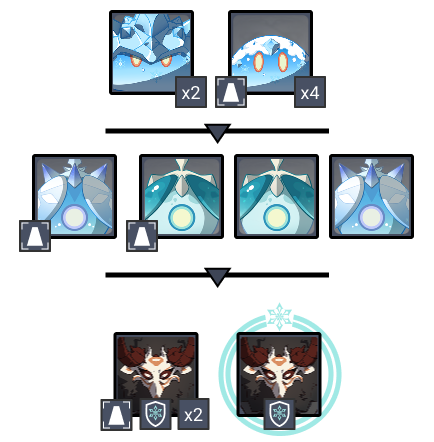
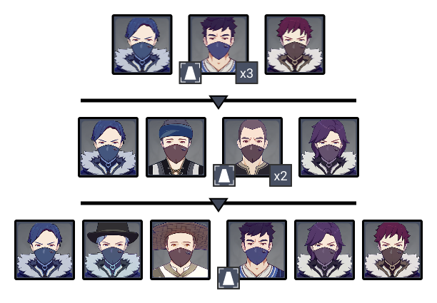
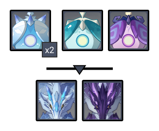
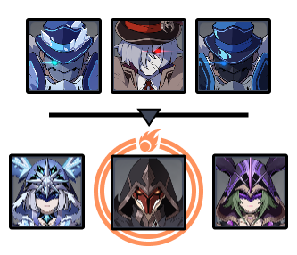

# Floor 11 (v2.8)

## Divergence

******DMG** increased by **75%**

## General Tips

Avoid using **Freeze** based teams on Side 1.

Keep in mind that Chamber 3 Side 1 has a **Thunder Manifestation**. If you have DPS characters that can work at a range, these will be more effective than melee.

## Team Recommendations

|                            |                                                    Side 1                                                    |                                                                                    Side 2                                                                                    |
| -------------------------- | :----------------------------------------------------------------------------------------------------------: | :--------------------------------------------------------------------------------------------------------------------------------------------------------------------------: |
| **Shieldbreakers**         |                                                                    |  |
| **Preferred DPS Elements** |                                                                    |                                                                                     |
| **Avoid DPS Elements**     |                         |                                                                                                                                                                              |
| **4**★ **Supports**        |  |                                                                   |
| **5**★ **Supports**        |     |                  |

## Chamber 1

**Monster Level - 88**

### Side 1

| In Depth Guide                                                         | Other Info |
| ---------------------------------------------------------------------- | ---------- |
| [cryo-specter.md](../../monsters/specters/cryo-specter.md "mention")   |            |
| [hydro-specter.md](../../monsters/specters/hydro-specter.md "mention") |            |


As of v2.8, specters are now able to be pulled byskills when not Enraged, meaning it is much easier to group them


Mob priority

* In the first wave, target the Small Cryo Slimes first as they go for the monlith and go down easily.
* Move away from the monolith and finish off the Large Cryo Slimes.
* In the next wave, one pair of Cryo/Hydro specters will target the monolith (They spawn across the monolith from where you start if you remember that position). Focus these first.
* The other 2 specters will move towards you.
* In the last wave, start near the monolith. The mitachurls will use a charge attack and group on the monolith. Use a strong AoEattack like Bennett's Burst to try and break all the shields at once.
* Once the shields are down, they will be easily stunned/staggered so be aggressive and attack them.

characters can help greatly with grouping, however save your best grouping character for the other side.

### Side 2

Mob Priority

* In each wave, target the **Melee Treasure Hoarder** first, as they are the ones that go for the monolith. Try to intercept them before they reach the monolith, or you might take splash damage from potioneers.
* Clean up the ranged mobs after and make sure to move away from the monolith.

Venti is the bestcharacter to use on this side, but other units with CC like Sucrose or Kazuha will also work.

**Freeze** based teams will also be effective since the melee enemies naturally cluster together, so you can easily keep them frozen and prevent them attacking the monolith.

## Chamber 2

**Monster Level - 90**

### Side 1

| In Depth Guide                                                              | Other Info |
| --------------------------------------------------------------------------- | ---------- |
| [cryo-specter.md](../../monsters/specters/cryo-specter.md "mention")        |            |
| [hydro-specter.md](../../monsters/specters/hydro-specter.md "mention")      |            |
| [electro-specter.md](../../monsters/specters/electro-specter.md "mention")  |            |
| [bathysmal-vishap.md](../../monsters/vishaps/bathysmal-vishap.md "mention") |            |


As of v2.8, specters are now able to be pulled byskills before they Enrage, meaning it is much easier to group them


Start by grouping the four Specters together, then focusing the Hydro Specter as it can heal. You can group using anskill, or just by running to one side of the arena first and letting the specters drift together.

The two Bathysmal Vishap Hatchlings will always begin with a swim attack and will come to you. You can stay where you are to save stamina and prep your attacks rather than chasing them down.

### Side 2

| In Depth Guide                                                                          | Other Info |
| --------------------------------------------------------------------------------------- | ---------- |
| [cryogunner-legionnaire.md](../../monsters/fatui/cryogunner-legionnaire.md "mention")   |            |
| [pyroslinger.md](../../monsters/fatui/pyroslinger.md "mention")                         |            |
| [hydrogunner-legionnaire.md](../../monsters/fatui/hydrogunner-legionnaire.md "mention") |            |
| [cryo-cicin-mage.md](../../monsters/fatui/cryo-cicin-mage.md "mention")                 |            |
| [pyro-agent.md](../../monsters/fatui/pyro-agent.md "mention")                           |            |
| [electro-cicin-mage.md](../../monsters/fatui/electro-cicin-mage.md "mention")           |            |

Venti is extremely effective here as he is able to pull enemies and permanently lock the enemies in the second wave in his burst.

Freeze teams are also effective here to prevent Fatui from shielding, although you will want to find a way to group them together.

Aim for the Hydrogunner in the first wave to stop the healing.

In the second wave, try to group all the enemies first. If you can't, then aim for the Cryo Cicin Mage first before she shields and summons flies. This prevents her from teleporting and lets you lock her down immediately with attacks.

## Chamber 3

**Monster Level - 92**

### Side 1

| In Depth Guide                                                                       | Other Info |
| ------------------------------------------------------------------------------------ | ---------- |
| [thunder-manifestation.md](../../monsters/elites/thunder-manifestation.md "mention") |            |

Ranged characters work best here to give you more windows to do damage.

Use strong single target DPS characters if possible.

Bringing a strong shield unit will help you tank some of the annoying attacks and give you more windows for damage. Consider this particularly if you are using a melee character.

Budget about 2 minutes for this half, as Side 2 is much easier.

If you are using aDPS, you should still bringfor Vaporize based teams. Applyingwon't cause any Electrocharged damage on the Thunder Manifestation due to immunity, but it will still let you Vaporize (and Overload) attacks.

For more general tips about this boss, see the [thunder-manifestation.md](../../monsters/elites/thunder-manifestation.md "mention")in depth guide.

### Side 2

| In Depth Guide                                                                                                                                                                   | Other Info |
| -------------------------------------------------------------------------------------------------------------------------------------------------------------------------------- | ---------- |
| [electro-abyss-mage.md](../../monsters/abyss-order/electro-abyss-mage.md "mention")                                                                                              |            |
| 
<a data-mention href="../../monsters/abyss-order/cryo-abyss-mage.md">cryo-abyss-mage.md</a> > <a data-mention href="../../mechanics/auras/ice-cage.md">ice-cage.md</a>
 |            |
| [hydro-abyss-mage.md](../../monsters/abyss-order/hydro-abyss-mage.md "mention")                                                                                                  |            |

The fastest way to break the shields is to infuseinto anskill, though you will need to do this without swirling an Abyss mage shield.

The other option is to try to infuseinto anskill using the Cryo Abyss Mage shield. This will be effective against the other two, and the Cryo Abyss Mage will go down easily withattacks. Avoid swirling the other two shields if possible.

Watch out for Ice Cage if you're not able to down the Cryo Abyss Mage quick enough.
