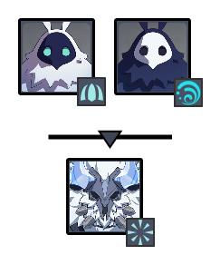

# Floor 11 \(v2.0\)

## Divergence

**DMG** dealt by all party members increased by **60%.**

**DMG** dealt by all party members increased by **60%.**

## General Tips

## Team Recommendations

|  | Side 1 | Side 2 |
| :--- | :---: | :---: |
| **Shieldbreakers** |  | \(or\) |
| **Preferred DPS Elements** |  |  |
| **Avoid DPS Elements** |  |  |
| **4**★ **Supports** |  |  |
| **5**★ **Supports** |  |  |

## Chamber 1

**Monster Level - 88**

### Side 1

| **In Depth Guide** | Other Info |
| :--- | :--- |
| [Electro Whopperflower](../../monsters/animals/electro-whopperflower.md) |  |
| [Pursuing Fireball](../../mechanics/auras/pursuing-fireball.md) | ?? DMG |

Go to the **Electro Slimes** first, and let the **Hydro Slimes** and **Whopperflowers** come to you and group together.

Focus damaging the **Electro Slimes** and **Whopperflowers**. The buff tomeans the **Hydro Slimes** will often die from AoE damage.

Use orto break **Whopperflower** shields.

Try to avoid taking damage from the **Hydro Slimes** or you will have to deal with **Electrocharged**, which can interrupt your attacks.

### Side 2

| **In Depth Guide** | Other Info |
| :--- | :--- |
| [Thunderhelm Lawachurl](../../monsters/hilichurls/thunderhelm-lawachurl.md) |  |
| [Electro Abyss Mage](../../monsters/abyss-order/electro-abyss-mage.md) |  |
| [Lightning Stake](../../mechanics/auras/lightning-stake.md) | ?? DMG |
| Engulfing Storm \([Debuffs](../../mechanics/debuffs/)\) |  |

Go to the **Thunderhelm Lawachurl** first and let the **Electro Abyss Mage** teleport to you.

In general, try to prioritize the **Lawachurl** and kill the **Abyss Mage** with AoE damage.

If the **Engulfing Storm** debuff is a problem, you can focus the **Abyss Mage** first and try to kill it before the first pulse goes out, which is about **15s** into the chamber.

## Chamber 2

**Monster Level - 90**

### Side 1

| **In Depth Guide** | Other Info |
| :--- | :--- |
| [Cryo Abyss Mage](../../monsters/abyss-order/cryo-abyss-mage.md) |  |
| [Hydro Abyss Mage](../../monsters/abyss-order/hydro-abyss-mage.md) |  |
| [Frostarm Lawachurl](../../monsters/hilichurls/frostarm-lawachurl.md) |  |
| [Ice Cage](../../mechanics/auras/ice-cage.md) | ?? DMG |
| Slowing Waters \([Debuffs](../../mechanics/debuffs/)\) |  |
| [Elemental Blast](../../mechanics/auras/elemental-blast.md) | ?? DMG |

Run towards the **Hydro Abyss Mage** and start damaging the shield, as it tends to be much harder to remove than **Cryo Abyss Mage** shield. The **Cryo Abyss Mage** will teleport to you shortly.

UsingAoE skills will let you damage both shields at once. You can also try to useto **Swirl** the **Cryo Abyss Mage** shield, **Freezing** the **Hydro Abyss Mage**.

### Side 2

| **In Depth Guide** | Other Info |
| :--- | :--- |
| [Electro Abyss Mage](../../monsters/abyss-order/electro-abyss-mage.md) |  |
| [Abyss Lector](../../monsters/abyss-order/abyss-lector.md) |  |
| [Pyro Abyss Mage](../../monsters/abyss-order/pyro-abyss-mage.md) |  |
| [Lightning Stake](../../mechanics/auras/lightning-stake.md) | ?? |
| [Pursuing Fireball](../../mechanics/auras/pursuing-fireball.md) | ?? |

Run towards the **Abyss Lector**, and the **Abyss Mages** will teleport to you.

When going for 3★, you can bringfor the **Abyss Lector** shields. However, when going for stars on Chamber 3, you may want to useinstead and take it slower.

You can also useto **Swirl** one of the **Abyss Mage** shields to help bring down the other one.

## Chamber 3

**Monster Level - 92**

### Side 1

| **In Depth Guide** | Other Info |
| :--- | :--- |
| [Cryo Hypostasis](../../monsters/elites/cryo-hypostasis.md) |  |

In general, the **Cryo Hypostasis** is easier to kill than the **Pyro Hypostasis**. Aim to spend less time on this side and leave more time for the other side.

Using**DPS** on this side is highly recommended.

Make sure you're familiar with how to break the **Cryo Hypostasis** shields using the **Frostfruits**.

| **Highly Recommended** |
| :---: |
|  |

### Side 2

| **In Depth Guide** | Other Info |
| :--- | :--- |
| [Pyro Hypostasis](../../monsters/elites/pyro-hypostasis.md) |  |

They **Pyro Hypostasis** attacks quickly. It may be helpful to bring **shields** to give you windows to it's shield.

You will need to bringto break the shield efficiently.

Using**DPS** is most effective due to the buff from the **Divergence**. However, make sure to still bring a character asis extremely ineffective against the shields.

| **Highly Recommended** |
| :---: |
|  |

