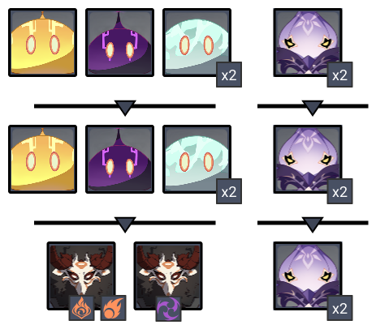

# Floor 11 (v2.0)

## Divergence

\*\*DMG \*\*dealt by all party members increased by **60%.**

**DMG** dealt by all party members increased by **60%.**

## General Tips

## Team Recommendations

|                            |                                                                                                          Side 1                                                                                                          |                                                                                                                                                                                          Side 2                                                                                                                                                                                          |
| -------------------------- | :----------------------------------------------------------------------------------------------------------------------------------------------------------------------------------------------------------------------: | :--------------------------------------------------------------------------------------------------------------------------------------------------------------------------------------------------------------------------------------------------------------------------------------------------------------------------------------------------------------------------------------: |
| **Shieldbreakers**         |                                                                                                                                      |                                                                                                                            (or)                                                                                                                           |
| **Preferred DPS Elements** |                                                                                                                                                                                |                                                                                                                                                                                                                                                                                                     |
| **Avoid DPS Elements**     |                                                                                                                                   |                                                                                                                                                                                                                                                                                                   |
| **4**★ **Supports**        |  |  |
| **5**★ **Supports**        |                                                                                                                 |                                                                                                                                                                                                                              |

## Chamber 1

**Monster Level - 88**

### Side 1

|                                                                          |            |
| ------------------------------------------------------------------------ | ---------- |
| **In Depth Guide**                                                       | Other Info |
| [Electro Whopperflower](../../monsters/animals/electro-whopperflower.md) |            |
| [Pursuing Fireball](../../mechanics/auras/pursuing-fireball.md)          | ?? DMG     |

Go to the **Electro Slimes** first, and let the **Hydro Slimes** and **Whopperflowers** come to you and group together.

Focus damaging the **Electro Slimes** and **Whopperflowers**. The buff tomeans the **Hydro Slimes** will often die from AoE damage.

Use orto break **Whopperflower** shields.

Try to avoid taking damage from the **Hydro Slimes** or you will have to deal with **Electrocharged**, which can interrupt your attacks.

### Side 2

|                                                                                        |            |
| -------------------------------------------------------------------------------------- | ---------- |
| **In Depth Guide**                                                                     | Other Info |
| [Thunderhelm Lawachurl](../../monsters/hilichurls/lawachurls/thunderhelm-lawachurl.md) |            |
| [Electro Abyss Mage](../../monsters/abyss-order/electro-abyss-mage.md)                 |            |
| [Lightning Stake](../../mechanics/auras/lightning-stake.md)                            | ?? DMG     |
| Engulfing Storm ([Debuffs](../../mechanics/debuffs/))                                  |            |

Go to the **Thunderhelm Lawachurl** first and let the **Electro Abyss Mage** teleport to you.

In general, try to prioritize the **Lawachurl** and kill the **Abyss Mage** with AoE damage.

If the **Engulfing Storm** debuff is a problem, you can focus the **Abyss Mage** first and try to kill it before the first pulse goes out, which is about **15s** into the chamber.

## Chamber 2

**Monster Level - 90**

### Side 1

|                                                                                  |            |
| -------------------------------------------------------------------------------- | ---------- |
| **In Depth Guide**                                                               | Other Info |
| [Cryo Abyss Mage](../../monsters/abyss-order/cryo-abyss-mage.md)                 |            |
| [Hydro Abyss Mage](../../monsters/abyss-order/hydro-abyss-mage.md)               |            |
| [Frostarm Lawachurl](../../monsters/hilichurls/lawachurls/frostarm-lawachurl.md) |            |
| [Ice Cage](../../mechanics/auras/ice-cage.md)                                    | ?? DMG     |
| Slowing Waters ([Debuffs](../../mechanics/debuffs/))                             |            |
| [Elemental Blast](../../mechanics/auras/elemental-blast.md)                      | ?? DMG     |

Run towards the **Hydro Abyss Mage** and start damaging the shield, as it tends to be much harder to remove than **Cryo Abyss Mage** shield. The **Cryo Abyss Mage** will teleport to you shortly.

UsingAoE skills will let you damage both shields at once. You can also try to useto **Swirl** the **Cryo Abyss Mage** shield, **Freezing** the **Hydro Abyss Mage**.

### Side 2

|                                                                        |            |
| ---------------------------------------------------------------------- | ---------- |
| **In Depth Guide**                                                     | Other Info |
| [Electro Abyss Mage](../../monsters/abyss-order/electro-abyss-mage.md) |            |
| [Abyss Lector](../../monsters/abyss-order/abyss-lector-electro.md)     |            |
| [Pyro Abyss Mage](../../monsters/abyss-order/pyro-abyss-mage.md)       |            |
| [Lightning Stake](../../mechanics/auras/lightning-stake.md)            | ??         |
| [Pursuing Fireball](../../mechanics/auras/pursuing-fireball.md)        | ??         |

Run towards the **Abyss Lector**, and the **Abyss Mages** will teleport to you.

When going for 3★, you can bringfor the **Abyss Lector** shields. However, when going for stars on Chamber 3, you may want to useinstead and take it slower.

You can also useto **Swirl** one of the **Abyss Mage** shields to help bring down the other one.

## Chamber 3

**Monster Level - 92**

### Side 1

|                                                             |            |
| ----------------------------------------------------------- | ---------- |
| **In Depth Guide**                                          | Other Info |
| [Cryo Hypostasis](../../monsters/elites/cryo-hypostasis.md) |            |

In general, the **Cryo Hypostasis** is easier to kill than the **Pyro Hypostasis**. Aim to spend less time on this side and leave more time for the other side.

Using\*\*DPS \*\*on this side is highly recommended.

Make sure you're familiar with how to break the **Cryo Hypostasis** shields using the **Frostfruits**.

|                                                                                                                                                                                                                                                                                                                                |
| :----------------------------------------------------------------------------------------------------------------------------------------------------------------------------------------------------------------------------------------------------------------------------------------------------------------------------: |
|                                                                                                                                                     **Highly Recommended**                                                                                                                                                     |
|  |

### Side 2

|                                                             |            |
| ----------------------------------------------------------- | ---------- |
| **In Depth Guide**                                          | Other Info |
| [Pyro Hypostasis](../../monsters/elites/pyro-hypostasis.md) |            |

They **Pyro Hypostasis** attacks quickly. It may be helpful to bring **shields** to give you windows to it's shield.

You will need to bringto break the shield efficiently.

Using**DPS** is most effective due to the buff from the **Divergence**. However, make sure to still bring a character asis extremely ineffective against the shields.

|                                                                                                                                                                                                                                                                                                                                 |
| :-----------------------------------------------------------------------------------------------------------------------------------------------------------------------------------------------------------------------------------------------------------------------------------------------------------------------------: |
|                                                                                                                                                      **Highly Recommended**                                                                                                                                                     |
|  |
