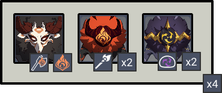
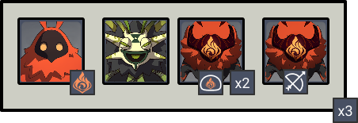
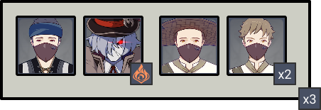
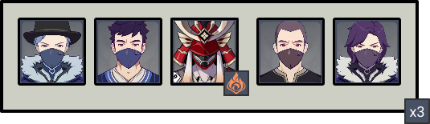
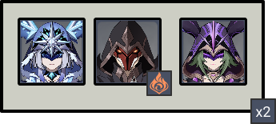
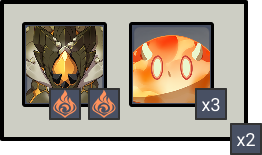

# Floor 11 (v2.1)

## Divergence

When opponents are defeated, all party members will be affected by the **"Corrosion"** status.

Characters being **Corroded** will lose a **% of their HP** every second. Active characters can be brought down by **Corrosion**. When a non-active character's HP is **less than 15%**, they will no longer lose HP due to **Corrosion**.

**Corrosion** lasts 10s and can stack. The duration of each stack is counted independently.

## General Tips

**Corrosion** will deal significant damage to your team. Make sure to have at least one healer for each side. You may even consider 2 healers if they are not particularly invested.

Enemies on each floor in general are fairly easy and **Corrosion** ends up being the most threatening thing. In most chambers, you'll want to simply aim for the enemy with the **Smoldering Flames** aura.

**Corrosion** builds up faster if you kill enemies faster. Take your time and kill enemies slowly to prevent quick buildup of **Corrosion**. Don't forget you also have 5 minutes for 3★ on the first chamber so you don't have to rush. The damage required to actually clear the floor is not very high - you're more likely to die from **Corrosion** than to run out of time.

Characters that can heal your entire team at once (like **Barbara, Jean**) or strong off-field healers (like **Bennett, Qiqi**) are preferred over characters that mostly rely on shields (like **Diona**).

It may help to bring characters than can **cleanse** the **Smoldering Flames** aura (see [Removing Debuffs](../../mechanics/debuffs/removing-debuffs.md)). There is an enemy in each chamber with this aura and when combined with **Corrosion** can cause a large amount of damage to the active character. If you only have access to one of these characters, but them on **Side 2**, as the enemies with the aura are tankier and you're less likely to be able to avoid it.

Avoid using characters like **Xiao** and **Hu Tao** that already drain their own **HP.**

## Corrosion


Killing an enemy adds a stack of Corrosion



Characters affected by Corrosion lose HP


Since each stack of **Corrosion** is independent, the faster you kill enemies, the faster your **HP** will drop.

Off-field characters will never die from **Corrosion**, so you if you can make sure your active character stays at good health then you can ignore healing the rest of your team.

**Corrosion** drains about **0.75% of Max HP** per second per stack. For some perspective, killing a wave in the first Chamber (5 enemies) will drain about **37.5% HP** from all characters over the **10 second** duration.

## Team Recommendations

|                            |                                                                                                                                                                                                                                                                     Side 1                                                                                                                                                                                                                                                                     |                                                                                                                                                                                                                                                                     Side 2                                                                                                                                                                                                                                                                     |
| -------------------------- | :--------------------------------------------------------------------------------------------------------------------------------------------------------------------------------------------------------------------------------------------------------------------------------------------------------------------------------------------------------------------------------------------------------------------------------------------------------------------------------------------------------------------------------------------: | :--------------------------------------------------------------------------------------------------------------------------------------------------------------------------------------------------------------------------------------------------------------------------------------------------------------------------------------------------------------------------------------------------------------------------------------------------------------------------------------------------------------------------------------------: |
| **Shieldbreakers**         |                                                                                                                                                                                                                                                                                                                                                                                                                                                           |                                                                                                                                                                                                                                                                                                                                                                                                                                                                                                     |
| **Preferred DPS Elements** |                                                                                                                                                                                                                                                                                                                                                                                                                                                                                                  |                                                                                                                                                                                                                                                                                                                                                                                                                                                           |
| **Avoid DPS Elements**     |                                                                                                                                                                                                                                                                                                                                                                                                                                                                                                      |                                                                                                                                                                                                                                                                                                                                                                                                                                                                                                      |
| **4**★ **Supports**        | 

 | 

 |
| **5★ Supports**            |                                                                                                                                                                                                                                                                            |                                                                                                                                                                                                                                                                             |

## Chamber 1

**Monster Level - 88**

### Side 1

|                                                        |                                                         |
| ------------------------------------------------------ | ------------------------------------------------------- |
| **In Depth Guide**                                     | Other Info                                              |
| Smoldering Flame ([Debuffs](../../mechanics/debuffs/)) | 684DMG / Tick |

Waves spawn in the Front > Back > Front > Left side of the arena, in that order.

Focus the **Blazing Axe Mitachurl** first and try to get it down before **Smoldering Flames** triggers (about **15 seconds**).

### Side 2

|                                                                  |            |                                                         |
| ---------------------------------------------------------------- | ---------- | ------------------------------------------------------- |
| **In Depth Guide**                                               | Other Info |                                                         |
| [Pyro Abyss Mage](../../monsters/abyss-order/pyro-abyss-mage.md) |            |                                                         |
| Smoldering Flame ([Debuffs](../../mechanics/debuffs/))           |            | 684DMG / Tick |

Waves spawn in the Front > Back > Front side of the arena, in that order.

It can be difficult to kill the **Pyro Abyss Mage** before it emits it's aura, so having a **cleanse** for **Smoldering Flames** is helpful here (see [Removing Debuffs](../../mechanics/debuffs/removing-debuffs.md)).

The **Dendro Samachurl** here is particularly dangerous, so try to take it out first. Not only will it block your path with thorns, but if it applieson you, all the remaining enemies can cause **Burning**, adding yet another DoT onto your active character.

## Chamber 2

**Monster Level - 90**

### Side 1

|                                                        |            |                                                         |
| ------------------------------------------------------ | ---------- | ------------------------------------------------------- |
| **In Depth Guide**                                     | Other Info |                                                         |
| [Pyroslinger](../../monsters/fatui/pyroslinger.md)     |            |                                                         |
| Smoldering Flame ([Debuffs](../../mechanics/debuffs/)) |            | 721DMG / Tick |

Waves spawn in the Front > Back > Front side of the arena, in that order.

Focus the **Pyroslinger** first. If you can stagger him effectively, you will not need to bringfor shieldbreaking on this team either.

### Side 2

|                                                        |                                                         |
| ------------------------------------------------------ | ------------------------------------------------------- |
| **In Depth Guide**                                     | Other Info                                              |
| [Kairagi](../../monsters/samurai/kairagi.md)           |                                                         |
| Smoldering Flame ([Debuffs](../../mechanics/debuffs/)) | 721DMG / Tick |

Waves spawn in the Front > Back > Front side of the arena, in that order.

It can be difficult to kill the **Fiery Might Kairagi** before it emits it's aura, so having a **cleanse** for **Smoldering Flames** is helpful here (see [Removing Debuffs](../../mechanics/debuffs/removing-debuffs.md)).

You can either go for the **Kairagi** first to make the fight easier, or go for the **Potioneers** first to group the enemies quicker, depending on your needs.

## Chamber 3

**Monster Level - 92**

### Side 1

|                                                                  |                                                         |
| ---------------------------------------------------------------- | ------------------------------------------------------- |
| **In Depth Guide**                                               | Other Info                                              |
| [Pyro Agent](../../monsters/fatui/pyro-agent.md)                 |                                                         |
| [Cryo Cicin Mage](../../monsters/fatui/cryo-cicin-mage.md)       |                                                         |
| [Electro Cicin Mage](../../monsters/fatui/electro-cicin-mage.md) |                                                         |
| Smoldering Flame ([Debuffs](../../mechanics/debuffs/))           | 758DMG / Tick |

Waves spawn in the Front > Back side of the arena, in that order.

The **Cicin** flies spawned by both the **Cryo/Electro Cicin Mages** will add to your **Corrosion** stacks. While you cannot prevent the **Electro Cicin Mage** from summoning flies, if you can stagger the **Cryo Cicin Mage** immediately it will prevent her from summoning flies.

**Crowd Control** effects are extremely effective here, as it prevents the **Cicin Mages** from teleporting and hurting your clear time. If you have access tounits like **Venti**, make sure they are on this side. You can also try to use **Freeze** teams around characters like **Ayaka** to keep them locked in place.

### Side 2

|                                                        |                                                         |
| ------------------------------------------------------ | ------------------------------------------------------- |
| **In Depth Guide**                                     | Other Info                                              |
| [Geovishap](../../monsters/animals/geovishap.md)       |                                                         |
| Smoldering Flame ([Debuffs](../../mechanics/debuffs/)) | 758DMG / Tick |

Waves spawn in the Front > Back side of the arena, in that order.

The enemies will naturally group in this chamber. When trying to go for stars, it's best to aim for the **Geovishap** as it has more HP and let the **Slimes** come to you. It also avoids **Corrosion** the longest.

Since enemies on this chamber areinfused, using /DPS is extremely effective.
