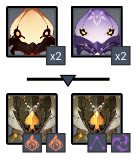
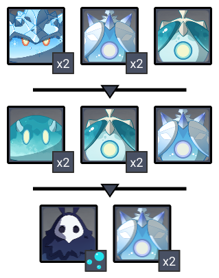
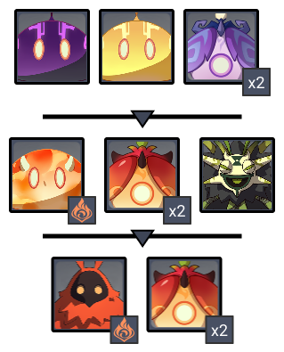
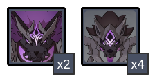
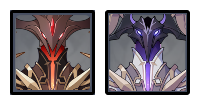

# Floor 11 (v2.5)

## Divergence

All characters in the party gain a **+60%** **DMG**

All party members gain **30% Healing Bonus**.

## General Tips

Whileis buffed on this floor, there are manyimmune enemies as well, which can make it difficult to run a comp based around it. In general it may be better to ignore the buff and run different teams

**Chamber 2** in particular has a mix of immune enemies on each side, making it difficult to build compositions for. You may find it easier to come back with teams built specifically for this chamber when going for stars.

## Team Recommendations

|                            |                                                                                    Side 1                                                                                   |                                                                                   Side 2                                                                                  |
| -------------------------- | :-------------------------------------------------------------------------------------------------------------------------------------------------------------------------: | :-----------------------------------------------------------------------------------------------------------------------------------------------------------------------: |
| **Shieldbreakers**         |                                                                                         |                                         |
| **Preferred DPS Elements** |  |  |
| **Avoid DPS Elements**     |                                                                                        |                                                                                    |
| **4**★ **Supports**        |      ​​     |                                                               |
| **5**★ **Supports**        |                                                                    |                                                                                                                      |

## Chamber 1

**Monster Level - 88**

### Side 1

| In Depth Guide                                                                                                                                                                                                                      | Other Info                      |
| ----------------------------------------------------------------------------------------------------------------------------------------------------------------------------------------------------------------------------------- | ------------------------------- |
| [abyss-herald.md](../../monsters/abyss-order/abyss-herald.md "mention")                                                                                                                                                             | 347K (278K before shielding) HP |
| 
<a data-mention href="../../monsters/abyss-order/cryo-abyss-mage.md">cryo-abyss-mage.md</a><strong></strong> <strong>></strong> <a data-mention href="../../mechanics/auras/ice-cage.md">ice-cage.md</a><strong></strong>
 | 87K HP                          |

Getting hit by attacks from both enemies will cause you to **Frozen**.

Focus the Cryo Abyss Mage first, since it is much easier to kill, gets rid of the Ice Cage aura, and also stops you from getting Frozen.

You will want both afor the Cryo Abyss Mage shield and afor the Abyss Herald shield. Other elements are far less effective.

Depending on your investments, you may not be able to build a team that can clear this with stars while also clearing **Chamber 3**, as the requirements are different. You can always clear without stars and then come back later with a team built specific to this chamber and also **Chamber 2**, which has similar requirements.

### Side 2

| In Depth Guide                                                                                                                                                                                                                                                                     | Other Info |
| ---------------------------------------------------------------------------------------------------------------------------------------------------------------------------------------------------------------------------------------------------------------------------------- | ---------- |
| [pyro-whopperflower.md](../../monsters/animals/pyro-whopperflower.md "mention")                                                                                                                                                                                                    | 130K HP    |
| [electro-whopperflower.md](../../monsters/animals/electro-whopperflower.md "mention")                                                                                                                                                                                              | 130K HP    |
| 
<a data-mention href="../../monsters/vishaps/geovishap.md">geovishap.md</a> > <a data-mention href="../../mechanics/debuffs/#aura-debuff">#aura-debuff</a>(Smoldering Flame) > <a data-mention href="../../mechanics/auras/lightning-stake.md">lightning-stake.md</a>
 | 347K HP    |

Having anfor the Whopperflowers will help keep them CC'd and grouped together.

You can run towards either pair of Whopperflowers to start. The others will burrow to where you are and naturally group together.

For the Geovishaps, focusing either is fine. While the **Smoldering Flames** is annoying, healing is also buffed on this floor making it easy to simply heal through the damage.

## Chamber 2

**Monster Level - 90**

### Side 1

| In Depth Guide                                                                                                                                                                                                                              | Other Info |
| ------------------------------------------------------------------------------------------------------------------------------------------------------------------------------------------------------------------------------------------- | ---------- |
| Cryo Slime                                                                                                                                                                                                                                  | 97K HP     |
| [cryo-specter.md](../../monsters/specters/cryo-specter.md "mention")                                                                                                                                                                        | 148K HP    |
| ****[hydro-specter.md](../../monsters/specters/hydro-specter.md "mention")****                                                                                                                                                              | 148K HP    |
| 
<a data-mention href="../../monsters/abyss-order/hydro-abyss-mage.md">hydro-abyss-mage.md</a><strong></strong> <strong>></strong> <a data-mention href="../../mechanics/auras/mist-bubble.md">mist-bubble.md</a><strong></strong>
 | 97K HP     |

In each wave, getting hit by attacks from both types of enemies will cause you to **Frozen**.

Focus on the non-specter enemy first as they go down easier and make you less likely to get **Frozen**.

Try to group together specters where possible. You can do this by running away from them briefly and letting any far ones come towards you.

You will want both afor the Cryo Slime shields and afor the Abyss Mage shield. Other elements are far less effective.

### Side 2

| In Depth Guide                                                                                                                                                                                         | Other Info |
| ------------------------------------------------------------------------------------------------------------------------------------------------------------------------------------------------------ | ---------- |
| Electro Slime                                                                                                                                                                                          | 97K HP     |
| [electro-specter.md](../../monsters/specters/electro-specter.md "mention")                                                                                                                             | 148K HP    |
| 
Pyro Slime > <a data-mention href="../../mechanics/debuffs/#aura-debuff">#aura-debuff</a>(Smoldering Flame)
                                                                                  | 97K HP     |
| [pyro-specter.md](../../monsters/specters/pyro-specter.md "mention")                                                                                                                                   | 148K HP    |
| [dendro-samachurl.md](../../monsters/hilichurls/samachurls/dendro-samachurl.md "mention")                                                                                                              | 49K HP     |
| 
<a data-mention href="../../monsters/abyss-order/pyro-abyss-mage.md">pyro-abyss-mage.md</a> > <a data-mention href="../../mechanics/debuffs/#aura-debuff">#aura-debuff</a>(Smoldering Flame)
 | 97K HP     |

In the second wave, getting debuffed by the Dendro Samachurl will cause you to get **Burning**. Run to it immediately when the second wave spawns and take it out first.

You should bring afor the Pyro Abyss Mage shields. You'll also need one for **Chamber 3** on this side anyway. Focus it first when it spawns so you don't have to deal with the Aura

## Chamber 3

**Monster Level - 92**

### Side 1

| In Depth Guide                                                               | Other Info |
| ---------------------------------------------------------------------------- | ---------- |
| [rifthound.md](../../monsters/rifthounds/rifthound.md "mention")             | 558K HP    |
| [rifthound-whelp.md](../../monsters/rifthounds/rifthound-whelp.md "mention") | 191K HP    |

If you have a goodteam, it will be the fastest at clearing since **Enraging** the Rifthounds causes theirresistance to drop. However, any damage type will work fine here.

Having good AoE here is important. Focus the large Rifthounds and you should hopefully kill the Rifthound Whelps with AoE damage in the process.

### Side 2

| In Depth Guide                                                                    | Other Info                    |
| --------------------------------------------------------------------------------- | ----------------------------- |
| [abyss-lector-pyro.md](../../monsters/abyss-order/abyss-lector-pyro.md "mention") | 409K HP (327K before shields) |
| [abyss-lector.md](../../monsters/abyss-order/abyss-lector.md "mention")           | 409K HP (327K before shields) |

You must bringon this side for the Pyro Abyss Lector as it is extremely difficult to get through it with any other element with enough time.

can also be effective against the Electro Abyss Lector shields in a pinch, but preferably also have/for it as well.

Lectors will not move much after they shield, so it is important to try and group them before they enter their shield phase. You can do this by running to the far side of the arena and letting one approach the other, or you can use attacks that stagger to push one back into the other one.

You can useskills to infuse the element from one Lector shield and damage the other one.

Focus on the Electro Abyss Lector first, as the energy drain can lower your effective damage.
