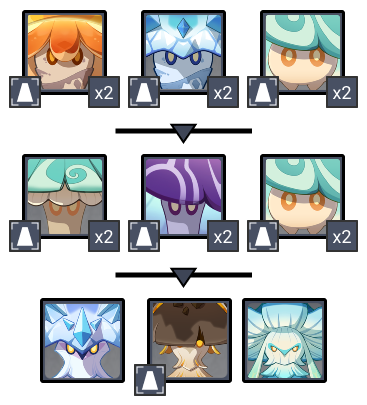
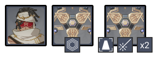
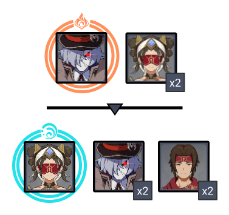
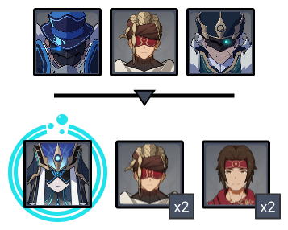
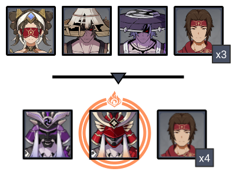

# Floor 11 (v3.1)

## Divergence

******DMG** increased by **75%**

## General Tips

Bring your best CC characters on the first side as there are several enemies, and your strongest single target on the second side.

## Team Recommendations

|                            |                                                   Side 1                                                  |                                           Side 2                                           |
| -------------------------- | :-------------------------------------------------------------------------------------------------------: | :----------------------------------------------------------------------------------------: |
| **Shieldbreakers**         |                                                                |                                               |
| **Preferred DPS Elements** |                                                                                                           |                                               |
| **Avoid DPS Elements**     |                                                                                                           |  |
| **4**★ **Supports**        |                                                     |                                                                                            |
| **5**★ **Supports**        |  |                                                                                            |

## Chamber 1

**Monster Level - 88**

### Side 1

<figure><figcaption></figcaption></figure>

| In Depth Guide                                                                        | Other Info |
| ------------------------------------------------------------------------------------- | ---------- |
| [winged-cryoshroom.md](../../monsters/mushrooms/winged-cryoshroom.md "mention")       |            |
| Geoshroom                                                                             |            |
| [grounded-hydroshroom.md](../../monsters/mushrooms/grounded-hydroshroom.md "mention") |            |

Most enemies will attack the Monolith, and they spawn different sides, making it hard to completely avoid damage. If possible, group the enemies near the center together and finish them with AoE. Otherwise do your best to clear each side as quickly as possible.

Some of the Fungi have projectile attacks. You can block this with Geo constructs if you lack damage.

In the last wave, aim for the Geoshroom first.

### Side 2

<figure><figcaption></figcaption></figure>

| In Depth Guide                                                             | Other Info |
| -------------------------------------------------------------------------- | ---------- |
| [stone-enchanter.md](../../monsters/eremites/stone-enchanter.md "mention") |            |
| Primal Construct                                                           |            |

Focus down the Reshapers (the ones without a shield) first as they target the monolith. There is no good way to group them so having good single target DPS helps.

## Chamber 2

**Monster Level - 90**

### Side 1

<figure><figcaption></figcaption></figure>

| In Depth Guide                                                                                                                                                                        | Other Info |
| ------------------------------------------------------------------------------------------------------------------------------------------------------------------------------------- | ---------- |
| 
<a data-mention href="../../monsters/fatui/pyroslinger.md">pyroslinger.md</a> > Smoldering Flame (<a data-mention href="../../mechanics/debuffs/">debuffs</a>)
              |            |
| 
<a data-mention href="../../monsters/eremites/desert-clearwater.md">desert-clearwater.md</a> > Slowing Waters (<a data-mention href="../../mechanics/debuffs/">debuffs</a>)
 |            |

Go for the Pyroslingers first as they are much weaker. Try to kill them before they shield to save time.

The Desert Clearwater in the second wave will increase your cooldowns. You can try to avoid it by running outside the circle, but she will often close in on you anyway. If you have enough damage, you can aim for her first before her debuff triggers.

### Side 2

<figure><figcaption></figcaption></figure>

| In Depth Guide                                                                                                                                                               | Other Info |
| ---------------------------------------------------------------------------------------------------------------------------------------------------------------------------- | ---------- |
| [hydrogunner-legionnaire.md](../../monsters/fatui/hydrogunner-legionnaire.md "mention")                                                                                      |            |
| [anemoboxer.md](../../monsters/fatui/anemoboxer.md "mention")                                                                                                                |            |
| [sunfrost.md](../../monsters/eremites/sunfrost.md "mention")                                                                                                                 |            |
| 
<a data-mention href="../../monsters/fatui/mirror-maiden.md">mirror-maiden.md</a> > <a data-mention href="../../mechanics/auras/mist-bubble.md">mist-bubble.md</a>
 |            |

The combination ofandenemies will leave you vulnerable to **Freeze**. Try to focus on the Hydrogunner and the Mirror Maiden first so you won't get locked down by this.

## Chamber 3

**Monster Level - 92**

### Side 1

<figure><figcaption></figcaption></figure>

| In Depth Guide                                                                                                                                                     | Other Info |
| ------------------------------------------------------------------------------------------------------------------------------------------------------------------ | ---------- |
| [desert-clearwater.md](../../monsters/eremites/desert-clearwater.md "mention")                                                                                     |            |
| [nobushi.md](../../monsters/samurai/nobushi.md "mention")                                                                                                          |            |
| 
<a data-mention href="../../monsters/samurai/kairagi.md">kairagi.md</a> > Smoldering Flame (<a data-mention href="../../mechanics/debuffs/">debuffs</a>)
 |            |

Run behind the Desert Clearwater at the start of the chamber so the crossbows will group up. Same applies for the Kairagi.

Remember to try and kill both Kairagi at the same time or the other will heal.

### Side 2

<figure><figcaption></figcaption></figure>

| In Depth Guide                                                                         | Other Info |
| -------------------------------------------------------------------------------------- | ---------- |
| [jadeplume-terrorshroom.md](../../monsters/elites/jadeplume-terrorshroom.md "mention") |            |

You can Enrage the boss by applyingrepeatedly. This will cause it to rampage for a short time, but afterwards it will be exhausted and have their resistance reduced to 0% for all elements other than.

Applyingwill **Scorch** the Terrorshroom, however while this is effective against other mushroom enemies, this has the effect of causing additional enemies to spawn and movesets that are harder to avoid.
