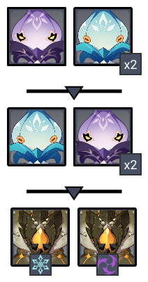
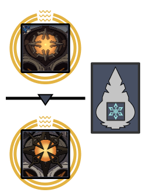
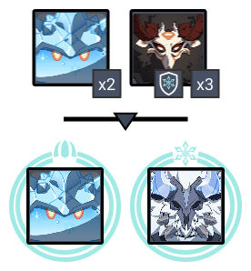
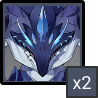

# Floor 12 (v2.7)

## Divergence 

None

## General Tips

This floor's cycle is a DPS check with much less of a need for AOE as the previous cycle. It is much more straightforward in terms of how players should build their teams (focus on maximizing 1-2 DPS characters with emphasis on shieldbreaking in side 1). In general, Cryo characters/teams should be avoided in entirety for side 1.

Remember you can always build a dedicated team for each Chamber and retry the floor when going for stars, though the requirements for each Chamber here are quite similar.

## Chamber 1

**Monster Level - 95**

|                            |                                          Side 1                                         |                                                        Side 2                                                       |
| -------------------------- | :-------------------------------------------------------------------------------------: | :-----------------------------------------------------------------------------------------------------------------: |
| **Shieldbreakers**         |                                                                                         |                                                                                                                     |
| **Preferred DPS Elements** |                                              |                                                                                                                     |
| **Avoid DPS Elements**     |  |  |

_\*For this chamber, while these elements suffer reduced damage, they may still be used as none of the enemies are completely immune to their elements._

### Side 1

| In Depth Guide                                                                                                                                                       | Other Info |
| -------------------------------------------------------------------------------------------------------------------------------------------------------------------- | ---------- |
| [geovishap.md](../../monsters/vishaps/geovishap.md "mention")                                                                                                        |            |
| [cryo-whopperflower.md](../../monsters/animals/cryo-whopperflower.md "mention")[electro-whopperflower.md](../../monsters/animals/electro-whopperflower.md "mention") |            |

#### Character Recommendations

| Character                                                                                                                                                       | Function            |
| --------------------------------------------------------------------------------------------------------------------------------------------------------------- | ------------------- |
|  | Grouping up enemies |
|                                                                                                                                                                 |                     |

Enemies spawn in waves. First Wave is two Cryo and one Electro Whopperflower that spawns in front. Second Wave is two Electro and One Cryo Whopperflower at the back. Third Wave lastly has two Geovishaps spawning in front. Left one infuses Cryo and Right one infuses Electro.

If not using an anemo to group the whopperflowers, you can go to the edge of the floor and they’ll teleport infront you, this prevents them from getting knockbacked too much.

## Side 2

| In Depth Guide                                                            | Other Info |
| ------------------------------------------------------------------------- | ---------- |
| [ruin-grader.md](../../monsters/ruin-constructs/ruin-grader.md "mention") |            |
| [ruin-guard.md](../../monsters/ruin-constructs/ruin-guard.md "mention")   |            |

#### Character Recommendations - Any character(s) that can deal high single target DPS

See: [building-a-composition](../../teambuilding/building-a-composition/ "mention")

Ruin Guard Spawns first and the Ruin Grader spawns once the Ruin Guard dies.

The Chamber has a cryo monolith in the middle that infuses them with cryo so its recommended to use pyro to remove this cryo aura from the enemies.

A shielder is recommended due to the Geo Aura they have causing the character on-field to take a lot of damage.

**Monster Level - 98**

## Chamber 2

|                            |                                          Side 1                                         |                    Side 2                   |
| -------------------------- | :-------------------------------------------------------------------------------------: | :-----------------------------------------: |
| **Shieldbreakers**         |                                               |                                             |
| **Preferred DPS Elements** |  |                                             |
| **Avoid DPS Elements**     |                                               |  |

### Side 1

| In Depth Guide                                                                                | Other Info                                              |
| --------------------------------------------------------------------------------------------- | ------------------------------------------------------- |
| [auras](../../mechanics/auras/ "mention")                                                     | Check Out Cryo Cage Auras to learn how to combat those. |
| [frostarm-lawachurl.md](../../monsters/hilichurls/lawachurls/frostarm-lawachurl.md "mention") |                                                         |
| [shields.md](../../mechanics/shields.md "mention")                                            | Check Out Breakable Cryo Shields                        |

#### Character Recommendations

| Character                                                                                                                                                                                                              | Function                                                                                                   |
| ---------------------------------------------------------------------------------------------------------------------------------------------------------------------------------------------------------------------- | ---------------------------------------------------------------------------------------------------------- |
|                                                                                                             | Grouping up enemies                                                                                        |
|  | Shieldbreaking characters (any character that can break cryo shields quickly which includes Geo/Claymores) |

Enemies spawn in two waves. First Wave is two Cryo Slimes and Three Cryo Mitachurls

Second Wave is a Cryo Slime in Front which has an Ice Cage Aura which spawns the cage every 12 seconds and lasts for 2 seconds  and Frostarm Lawachurl at the back also has a cryo aura that will debuff you with condensed Ice.

For the second wave, focus the the Cryo Slime first as the Ice Age wil prevent you from moving which might cause you to die.

### Side 2

| In Depth Guide                                              | Other Info |
| ----------------------------------------------------------- | ---------- |
| [maguu-kenki](../../monsters/elites/maguu-kenki/ "mention") |            |

#### Character Recommendations - Any character(s) that can deal high single target DPS

See: [building-a-composition](../../teambuilding/building-a-composition/ "mention")

Maguu Kenki half, use your best damage dealer team here.

Be aware that once he’s at \~70% health, he will stop taking damage and do a strong attack so either run away from this or iframe this using a dodge or a burst.

Be aware that some of his attacks will be cryo so bennett Q might accidentally kill as these attacks will be stronger due to melt.

## Chamber 3

**Monster Level - 100**

|                            |                   Side 1                   |                                          Side 2                                         |
| -------------------------- | :----------------------------------------: | :-------------------------------------------------------------------------------------: |
| **Shieldbreakers**         |                                            |                                                                                         |
| **Preferred DPS Elements** |                                            |                                                                                         |
| **Avoid DPS Elements**     |  |  |

### Side 1

| In Depth Guide                                                              | Other Info |
| --------------------------------------------------------------------------- | ---------- |
| [bathysmal-vishap.md](../../monsters/vishaps/bathysmal-vishap.md "mention") |            |

**Character Recommendations - Any Non-Cryo character(s) that can deal high single target DPS**

See: [building-a-composition](../../teambuilding/building-a-composition/ "mention")

\
Spawns with two Primordial Bathysmal Vishap Hatchling

They get knockbacked fairly easily so try to use AoE damage dealers to save time.

They have slightly higher electro and physical resistance but its still only 30% so just use either 4 piece viridescent to bring this down or superconduct with Physical Characters.

### Side 2

| In Depth Guide                                                                                 | Other Info |
| ---------------------------------------------------------------------------------------------- | ---------- |
| [perpetual-mechanical-array.md](../../monsters/elites/perpetual-mechanical-array.md "mention") |            |

**Character Recommendations - Any Non-Physical character(s) that can deal high single target DPS**

See: [building-a-composition](../../teambuilding/building-a-composition/ "mention")

\
Perpetual Mechanical Array. High DPS check for a lot of players due its high hp so use your best damage dealing team here.

Make sure to know about the Divide Phase and to attack the one with the circling around so it would be downed for 20 seconds after.

You can also reset until the enemy in the divide phase is a Ruin Cruiser or Destroyer as they have a bit of lower HP.

Avoid Physical as much possible as it has a 70% resistance to it.
