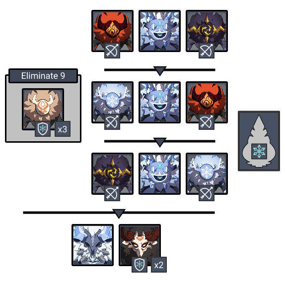
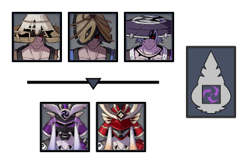
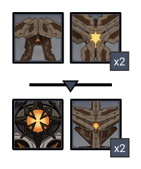
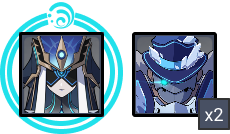

# Floor 12 (v2.8)

## Divergence 

None

## General Tips

Unless your teams are well invested, it's recommended you build teams for Chambers 2 & 3 separately. You want good single target on Side 1 and AoE on Side 2 for Chamber 2, but this is reversed on Chamber 3.

## Chamber 1

**Monster Level - 95**

|                            |                   Side 1                   |                                           Side 2                                           |
| -------------------------- | :----------------------------------------: | :----------------------------------------------------------------------------------------: |
| **Shieldbreakers**         |  | and/or |
| **Preferred DPS Elements** |                                            |                                              |

### Side 1

| In Depth Guide                                                                                | Other Info |
| --------------------------------------------------------------------------------------------- | ---------- |
| [cryo-samachurl.md](../../monsters/hilichurls/samachurls/cryo-samachurl.md "mention")         | 70K HP     |
| Ice Shield Mitachurl                                                                          | 210K HP    |
| [frostarm-lawachurl.md](../../monsters/hilichurls/lawachurls/frostarm-lawachurl.md "mention") | 624K HP    |

Enemies spawn very spread out, so havingto group units is recommended to clear faster.

There are many several enemies withshields in addition to ashield node in the middle of the arena. Bring one or morecharacters so you can break through these quickly. Off-field appliers like Xiangling are the best at this.

#### Character Recommendations

| Character                                                                                                                                                       | Function        |
| --------------------------------------------------------------------------------------------------------------------------------------------------------------- | --------------- |
|  | CC / Grouping   |
|                                                   | Shield-breaking |

### Side 2

| In Depth Guide                                            | Other Info |
| --------------------------------------------------------- | ---------- |
| [nobushi.md](../../monsters/samurai/nobushi.md "mention") | 227K HP    |
| [kairagi.md](../../monsters/samurai/kairagi.md "mention") | 545K HP    |

Kairagi thrust attacks will often cause them to separate. Fighting them close to the edge of the arena can help reduce the impact of this.

When the Kairagi's spawn, run to a far side of the arena and let them come to you rather than engaging directly. This puts them out of range of theshield node in the center as well as grouping them when they perform the thrust attack.

Remember that the remaining Kairagi will use a heal for 50% HP if you kill the other one and be immune to CC. You will want to kill them both at the same time. Prefer characters with high burst damage, or use Freeze to disable the Kairagi giving you a longer window to kill before it heals.

#### Character Recommendations

| Character                                                                                                                                                  | Function              |
| ---------------------------------------------------------------------------------------------------------------------------------------------------------- | --------------------- |
|  | High burst damage DPS |
|                                                    | Freeze Teams          |

## Chamber 2

**Monster Level - 98**

|                            |                        Side 1                        |                     Side 2                     |
| -------------------------- | :--------------------------------------------------: | :--------------------------------------------: |
| **Shieldbreakers**         | (optional) |                                                |
| **Preferred DPS Elements** |            |                                                |
| **Avoid DPS Elements**     |  (immune)  |  |

### Side 1

| In Depth Guide                                                           | Other Info |
| ------------------------------------------------------------------------ | ---------- |
| [cryo-hypostasis.md](../../monsters/elites/cryo-hypostasis.md "mention") | 536K HP    |

Make sure you're familiar with the mechanics, particularly the shielded phase. You can read up on it here: [#shield](../../monsters/elites/cryo-hypostasis.md#shield "mention")

Make sure you're familiar with the windows when the Cryo Hypostasis is vulnerable, as they are short and you want to be ready. Characters that require time to set up their damage are not advised, and you should prefer aDPS that can deal consistent damage.

#### Character Recommendations

| Character                                                                                                                                                                                                           | Function       |
| ------------------------------------------------------------------------------------------------------------------------------------------------------------------------------------------------------------------- | -------------- |
|  | Pyro based DPS |
|                                                                                                                                                                 | Shields / Heal |

### Side 2

| In Depth Guide                                                                  | Other Info |
| ------------------------------------------------------------------------------- | ---------- |
| [ruin-cruiser.md](../../monsters/ruin-constructs/ruin-cruiser.md "mention")     | 386K HP    |
| [ruin-scout.md](../../monsters/ruin-constructs/ruin-scout.md "mention")         | 541K HP    |
| [ruin-destroyer.md](../../monsters/ruin-constructs/ruin-destroyer.md "mention") | 386K HP    |
| [ruin-grader.md](../../monsters/ruin-constructs/ruin-grader.md "mention")       | 690K HP    |

In the first wave, run to either one of the Ruin Cruisers on the side, and start attacking one in the direction of the other. The Ruin Cruiser will often perform a dash/evasion attack that will group it closer to the second. You can repeat this for the other side if you'd like.

In the second wave, go for one of the Ruin Destroyers and hope the other one burrows next to you, although it's not guaranteed to happen. The Ruin Grader will come to you regardless.

## Chamber 3

**Monster Level - 100**

|                        |                   Side 1                   |                     Side 2                     |
| ---------------------- | :----------------------------------------: | :--------------------------------------------: |
| **Shieldbreakers**     |  |                                                |
| **Avoid DPS Elements** |                                            |  |

### Side 1

| In Depth Guide                                                                                                                                                                              | Other Info |
| ------------------------------------------------------------------------------------------------------------------------------------------------------------------------------------------- | ---------- |
| [cryogunner-legionnaire.md](../../monsters/fatui/cryogunner-legionnaire.md "mention")                                                                                                       | 368K HP    |
| 
<a data-mention href="../../monsters/fatui/mirror-maiden.md">mirror-maiden.md</a> > Slowing Waters (<a data-mention href="../../mechanics/debuffs/#aura-debuff">#aura-debuff</a>)
 | 832K HP    |

To clear this chamber quickly, you'll want to bringCC that can pick up and disable the Mirror Maiden while also grouping the Cryogunners.

The Mirror Maiden has a Slowing Waters debuff. This only affects skills when you use them, so you have a small window at the start of the chamber to use skills before being affected by increased cooldowns. Use this time to unleash all your skills/bursts for maximum damage.

If you can effectively clear the chamber in 2 skill rotations, you can safely ignore Slowing Waters debuff. However, if you need to take longer, consider bringing a character that can cleanse ([removing-debuffs.md](../../mechanics/debuffs/removing-debuffs.md "mention")) the debuff.

Taking out the Cryogunners first if you can or their attacks will combo with the Mirror Maiden to Freeze you.

#### Character Recommendations

| Character                                                                                                                                                       | Function       |
| --------------------------------------------------------------------------------------------------------------------------------------------------------------- | -------------- |
|  | CC / Grouping  |
|                                                        | Cleanse / Heal |

### Side 2

| In Depth Guide                                                     | Other Info |
| ------------------------------------------------------------------ | ---------- |
| [ruin-serpent.md](../../monsters/elites/ruin-serpent.md "mention") | 2.2M HP    |

The Abyss version of the serpent has less phases and attacks than the overworld, making it a bit easier of a fight with more time to do damage, so don't panic!

If you don't have enough DPS to clear the fight quickly, you should bring a Bow wielding character in order to interrupt the charging prism attack by attacking the weak points.

Avoid Physical DPS at all costs due to high resistance as well as large HP pool.
