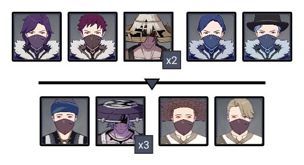
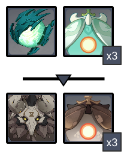
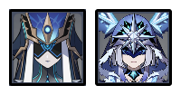
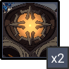

# Floor 12 (v2.1)

## Divergence

No Divergence

## Chamber 1

**Monster Level - 96**

### Team Recommendations

|                            |                                                                                 Side 1                                                                                |                                        Side 2                                        |
| -------------------------- | :-------------------------------------------------------------------------------------------------------------------------------------------------------------------: | :----------------------------------------------------------------------------------: |
| **Shieldbreakers**         |                                                                                                                                                                       |                                             |
| **Preferred DPS Elements** |                                                                                                                         |                                                                                      |
| **Avoid DPS Elements**     |                                                                                                                                                                       |  |
| **Recommended 4**★         |                                                                                                                 |                                                                                      |
| **Recommended 5**★         |  |                                |

### Side 1

|                                              |                |
| -------------------------------------------- | -------------- |
| **In Depth Guide**                           | Other Info     |
| [Nobushi](../../monsters/samurai/nobushi.md) | 227K HP        |
| Treasure Hoarders                            | 111K - 139K HP |


The **Samurai** enemies in this chamber **can be picked up with****skills**, but must be staggered first with other abilities.


is highly recommended to group the enemies on this side. If you do, then this chamber is not challenging.

If you're struggling to get stars with a team built for the later chambers, you should just aim for a clear first and come back later with a team specifically built for this side.

### Side 2

|                                                                                    |            |
| ---------------------------------------------------------------------------------- | ---------- |
| **In Depth Guide**                                                                 | Other Info |
| [Stonehide Lawachurl](../../monsters/hilichurls/lawachurls/stonehide-lawachurl.md) | 624K HP    |
| [Eye of the Storm](../../monsters/animals/eye-of-the-storm.md)                     | 347K HP    |
| [Anemo Specter](../../monsters/specters/anemo-specter.md)                          | 227K HP    |
| [Geo Specter](../../monsters/specters/geo-specter.md)                              | 227K HP    |

Run towards the **Eye of the Storm/Stonehide Lawachurl** in each wave to start. They have the higher HP pool, and the **Specters** will naturally move towards you.

Bringing a **Ranged DPS** against the **Eye of the Storm** is highly recommended, as it spends a lot of time floating off the ground which can lose you time. **Yoimiya** in particular is exceptionally good against it. If you don't, bring at least one **archer** as a support so you can interrupt it's airborne attacks.

The waves will not end until the death animation of **Specters** completes. Keep this in mind, as this can add extra seconds to your clears.

## Chamber 2

**Monster Level - 98**

### Team Recommendations

|                            |                                                   Side 1                                                   |                                                                             Side 2                                                                            |
| -------------------------- | :--------------------------------------------------------------------------------------------------------: | :-----------------------------------------------------------------------------------------------------------------------------------------------------------: |
| **Shieldbreakers**         |                                                                                                            |                                                                                                                     |
| **Preferred DPS Elements** |                                                                                                            |                                                                                                                 |
| **Avoid DPS Elements**     |                                                                                                            |                                                                          |
| **Recommended 4**★         |                                                                                                            |                                                 |
| **Recommended 5**★         |  |  |

### Side 1

|                                                     |            |
| --------------------------------------------------- | ---------- |
| **In Depth Guide**                                  | Other Info |
| [Maguu Kenki](../../monsters/elites/maguu-kenki.md) | 1.5M HP    |

This is a difficult fight if you're not familiar with the attacks and dodge timings. Check the in depth guide page and practice on the overworld version a few times to get used to it's attacks.

Remember once the **Maguu Kenki** reaches **75% HP** it will become **invulnerable** and perform an \*\*AoE \*\*attack. Make sure not to waste your damage on it during this time.

This is mostly a DPS check, so bring your most invested composition on this side when going for 3★.

### Side 2

|                                                            |            |
| ---------------------------------------------------------- | ---------- |
| **In Depth Guide**                                         | Other Info |
| [Mirror Maiden](../../monsters/fatui/mirror-maiden.md)     | 772K HP    |
| [Cryo Cicin Mage](../../monsters/fatui/cryo-cicin-mage.md) | 383K HP    |

While the **Mirror Maiden** has more HP, go for the **Cryo Cicin Mage** first, which spawns behind you. There is a high chance for the **Mirror Maiden** to teleport to you and group naturally, where the **Cryo Cicin Mage** will not teleport. This also gives you an opportunity to stagger her before she summons her Cicins which let her shield.

Getting **Frozen** can be dangerous, which makes focusing the **Cryo Cicin Mage** preferable as well.

Try your best to avoid **Mirror Maiden's** AoE attacks as long as possible, as this **Polarizes** her and improves her attacks as well as makes her more resistance to CC.

## Chamber 3

### Team Recommendations

|                        |                                                                               Side 1                                                                               |                                                   Side 2                                                   |
| ---------------------- | :----------------------------------------------------------------------------------------------------------------------------------------------------------------: | :--------------------------------------------------------------------------------------------------------: |
| **Avoid DPS Elements** |                                                                                                                      |                                                              |
| **Recommended 4**★     |                                                       |                                                                                                            |
| **Recommended 5**★     |  |  |

**Monster Level - 100**

### Side 1

|                                                            |            |
| ---------------------------------------------------------- | ---------- |
| **In Depth Guide**                                         | Other Info |
| [Ruin Guard](../../monsters/ruin-constructs/ruin-guard.md) | 643K HP    |

Run towards the **Ruin Guards** immediately. Staying at range will cause them to use **Missiles**, which delays their grouping.

Bring strong AoE characters on this side that can damage both **Ruin Guards** simultaneously. You will want to leave as much time as possible for the second half.

Try to kill both **Ruin Guards** before they go for a **Spin Attack** (roughly **30 seconds** into the fight). This causes a large time loss. If you cannot, consider using **Freeze** to delay this attack, and/or bring an **archer** to stagger them when they go for the attack.

### Side 2

|                                                                                                                                     |            |
| ----------------------------------------------------------------------------------------------------------------------------------- | ---------- |
| **In Depth Guide**                                                                                                                  | Other Info |
| [Perpetual Mechanical Array](../../monsters/elites/perpetual-mechanical-array.md)                                                   | 2.2M HP    |
| [Ruin Cruiser](../../monsters/ruin-constructs/ruin-cruiser.md) / [Ruin Destroyer](../../monsters/ruin-constructs/ruin-destroyer.md) | 416K HP    |
| [Ruin Scout](../../monsters/ruin-constructs/ruin-scout.md) / [Ruin Defender](../../monsters/ruin-constructs/ruin-defender.md)       | 582K HP    |

If you're not familiar with this boss, make sure to check out the **In Depth Guide** page ([Perpetual Mechanical Array](../../monsters/elites/perpetual-mechanical-array.md)) for tips. It is important to know which enemy to aim when it **Divides**.

The **Perpetual Mechanical Array** has reduced defenses when stunned. Use the **divide** phase to charge bursts and wait until it is **stunned** to unleash your damage.

You should try to stay close to it throughout the fight, as this limits the attack patterns.

Due to the high HP pool,**DMG** is highly discouraged. It will be very hard to get stars on this floor with a **PHYS** based DPS. Bring your best **Elemental** based team.
