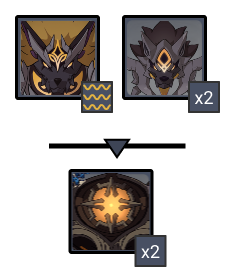

# Floor 12 (v2.3)

## Divergence 

None

## General Tips

## Rifthound FAQ 

### Do I use the matching element against them?

**Short answer** - opinions are mixed, but generally **not recommended** to use the matching element that enrages the Rifthounds.

**Long answer** - When Rifthounds are damaged by their matching element, it builds up their Rage and eventually triggers their **Devourer** state. This reduces their **RES** for that matching element, increases their **DMG**, but most importantly will also make them move around a lot more during their attacks.

If your composition primarily deals the damage of the matching element, then the **RES** reduction may be worth it. See below on tips for keeping them in place.

However in all other cases, it's best to avoid the matching element entirely and to not build up Rage.

For more details on this mechanic, check out [#devourer](../../monsters/rifthounds/rifthound.md#devourer "mention").

### How do I hit them when they move around so much?

Try one or more of the following tips

* Rifthounds are fairly susceptible to being **staggered**, so you can use these types of attacks to prevent the Rifthounds from attacking
* **Freeze** based compositions are a good way to keep them locked in place
* Try compositions that have good AoE capabilities so you are still reliably hitting them even as they move
* Use compositions that can attack at a range and don't require you to chase after Rifthounds

## Chamber 1

**Monster Level - 95**

### Side 1

| In Depth Guide                                                               | Other Info |
| ---------------------------------------------------------------------------- | ---------- |
| [rifthound-whelp.md](../../monsters/rifthounds/rifthound-whelp.md "mention") | 273K HP    |
| [rifthound.md](../../monsters/rifthounds/rifthound.md "mention")             | 795K HP    |

See [#rifthounds](floor-12-v23.md#rifthounds "mention")

**Corrosion** isn't particularly dangerous, but prefer healers that can heal an entire team if it is causing you issues.

### Side 2

| In Depth Guide                                                               | Other Info |
| ---------------------------------------------------------------------------- | ---------- |
| [rifthound-whelp.md](../../monsters/rifthounds/rifthound-whelp.md "mention") | 273K HP    |
| [rifthound.md](../../monsters/rifthounds/rifthound.md "mention")             | 795K HP    |

See [#rifthounds](floor-12-v23.md#rifthounds "mention")

**Corrosion** isn't particularly dangerous, but prefer healers that can heal an entire team if it is causing you issues.

**Rifthound Whelps** can be gathered with  skills. Since this side has more whelps, you can consider bringing a character to help group them.

## Chamber 2

**Monster Level - 98**

|                            |                                          Side 1                                         | Side 2 |
| -------------------------- | :-------------------------------------------------------------------------------------: | :----: |
| **Preferred DPS Elements** |                                                                                         |        |
| **Avoid DPS Elements**     |  |        |

### Side 1

| In Depth Guide                                                | Other Info |
| ------------------------------------------------------------- | ---------- |
| [geovishap.md](../../monsters/vishaps/geovishap.md "mention") | 613K HP    |

After infusion, both **Geovishaps** are immune to **Freeze**. Avoid these compositions unless can beat them before they infuse.

A composition that has a mix of  and  **DMG** will be able to **Melt/Vaporize** the **Geovishaps** after infusion.

### Side 2

| In Depth Guide                                                                                           | Other Info |
| -------------------------------------------------------------------------------------------------------- | ---------- |
| [maguu-kenki-split-version.md](../../monsters/elites/maguu-kenki/maguu-kenki-split-version.md "mention") | 1.2M HP    |

Each variant will attack **every 10 seconds**.

Trying to run outside the AoE attacks is not recommended as it wastes valuable time. If you can't reliably dodge these attacks, make sure to save a burst to i-frame through it. They tend to attack at the same time, so you can often dodge multiple attacks with just a burst or two.

Make sure you have a composition with good AoE damage on this side. It's important when going for stars to be hitting all the enemies at once. Grouping becomes very important here.

Be careful when using characters like **Bennett** that apply to your character. The **Cryo** variant's slam attack does significant damage, and this will cause it to **Melt** for increased damage.

Avoid getting hit as much as possible. If you get staggered by damage, you can often get comboed by the other attacks very quickly. Bring **shields** if you're not confident in your dodging.

#### Grouping Strategies

In general, the enemies will move towards you, but their attacks can send them far away. Avoid standing in the middle of them all, and keep them all on one side. This way they all walk towards you from the same direction.

Below is an example of a consistent strategy to start all 3 **Maguu Kenkis** together. Note how the **Cryo** variant slashes past the rest, but will run back and group provided you step back a bit.



After doing an initial grouping, try to stay close to the **Cryo** variant to prevent it from using the dash attack.

## Chamber 3

**Monster Level - 100**

|                           |                     Side 1                     |                     Side 2                     |
| ------------------------- | :--------------------------------------------: | :--------------------------------------------: |
| **Preferred DPS Element** |                                                |                                                |
| **Avoid DPS Elements**    |  |  |

### Side 1

| In Depth Guide                                                                | Other Info |
| ----------------------------------------------------------------------------- | ---------- |
| [ruin-defender.md](../../monsters/ruin-constructs/ruin-defender.md "mention") | 582K HP    |
| [ruin-cruiser.md](../../monsters/ruin-constructs/ruin-cruiser.md "mention")   | 416K HP    |
| [rifthound.md](../../monsters/rifthounds/rifthound.md "mention")              | 970K HP    |

Focus on the **Ruin Cruiser** (triangle) and the **Ruin Defender** will naturally group up.

When attacked, the **Ruin Cruiser** will dash backwards. Try to have it dash back into the **Ruin Defender** if possible.

For Rifthounds, see [#rifthounds](floor-12-v23.md#rifthounds "mention")

### Side 2

| In Depth Guide                                                                                                                                                                     | Other Info                    |
| ---------------------------------------------------------------------------------------------------------------------------------------------------------------------------------- | ----------------------------- |
| 
<a data-mention href="../../monsters/rifthounds/rifthound.md">rifthound.md</a>

> <a data-mention href="../../mechanics/auras/rumbling-stone.md">rumbling-stone.md</a>
 | 
970K HP

> ?? DMG
 |
| [rifthound-whelp.md](../../monsters/rifthounds/rifthound-whelp.md "mention")                                                                                                       | 333K HP                       |
| [ruin-guard.md](../../monsters/ruin-constructs/ruin-guard.md "mention")                                                                                                            | 643K HP                       |

The **Rumbling Stone** aura can do significant damage, particularly when your characters are already low from **Corrosion**. Bring strong **shields/heal** for this if you are having trouble.

Focus the **Rifthound**, as it has the higher pool. The **Rifthound Whelps** should die to collateral damage.

**Freeze** is recommended on this side since it prevents problematic attacks from **Rifthounds** and **Ruin Guards**.

Expect for the **Rifthound** wave to take longer than the **Ruin Guards**. For a well built team, you can clear the **Ruin Guards** in about 20 - 30s.

For Rifthounds, see [#rifthounds](floor-12-v23.md#rifthounds "mention")
