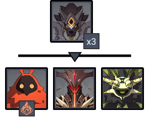
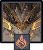
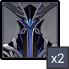
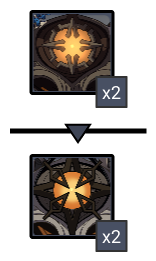

# Floor 12 (v2.4)

## Divergence 

Certain opponents in this challenge possess the **Honed Spirit** effect, which grants them 1**0% Physical and All Elemental RES**.

When opponents with Honed Spirit take hits from attacks that are considered **Normal Attack DMG**, they will lose **3% Physical and All Elemental RES**. A maximum of **30%** of each may be lost this way.&#x20;

The RES lost this way will be reset every 20s.

## General Tips

**Honed Spirit** affects all enemies **on Side 1**.

If you can use **Normal Attacks**, then this divergence is effectively a debuff on enemies, as it will result in a net **-20% RES** at max stacks on the enemy. **Spear** users in particular are good at getting a lot of stacks quickly.

Having strong single target damage on **Side 1** is important when trying to go for stars for Chambers 1 & 2, and **Side 2** for Chamber 3. As usual, if you're having trouble then build a different team for each chamber.

Bosses such as **Primo Geovishap** and **Maguu Kenki** have high damage resistance during their initial animation, however can still be hit with attacks to generate energy and buffs. You can use this time to set up certain effects before the fight begins.

## Chamber 1

**Monster Level - 95**

|                            |                     Side 1                     |                                        Side 2                                       |
| -------------------------- | :--------------------------------------------: | :---------------------------------------------------------------------------------: |
| **Shieldbreakers**         |                                                |                                          |
| **Preferred DPS Elements** |                                                |                                                                                     |
| **Avoid DPS Elements**     |  |  |

### Side 1

| In Depth Guide                                                                                 | Other Info                                                                    |
| ---------------------------------------------------------------------------------------------- | ----------------------------------------------------------------------------- |
| [perpetual-mechanical-array.md](../../monsters/elites/perpetual-mechanical-array.md "mention") | 
1.8M HP Cruiser/Destroy adds 341K HP Defender/Scout adds 477K HP
 |

Make sure you understand the mechanics behind the [#divide](../../monsters/elites/perpetual-mechanical-array.md#divide "mention") phase, otherwise you will struggle for damage.

Make sure you save some of your burst damage for when it goes down, as it takes additional damage during that time. You should aim to kill it during this first downed phase.

If you are close to being able to star, you can save a few seconds by resetting until the enemy in the [#divide](../../monsters/elites/perpetual-mechanical-array.md#divide "mention") is a [ruin-cruiser.md](../../monsters/ruin-constructs/ruin-cruiser.md "mention") or [ruin-destroyer.md](../../monsters/ruin-constructs/ruin-destroyer.md "mention"), as these have less HP.

See [perpetual-mechanical-array.md](../../monsters/elites/perpetual-mechanical-array.md "mention") for more tips.

### Side 2

| In Depth Guide                                                                                                                                                                                          | Other Info |
| ------------------------------------------------------------------------------------------------------------------------------------------------------------------------------------------------------- | ---------- |
| [rifthound-whelp.md](../../monsters/rifthounds/rifthound-whelp.md "mention")                                                                                                                            | 273K HP    |
| [dendro-samachurl.md](../../monsters/hilichurls/samachurls/dendro-samachurl.md "mention")                                                                                                               | 69K HP     |
| 
<a data-mention href="../../monsters/abyss-order/pyro-abyss-mage.md">pyro-abyss-mage.md</a> > <a data-mention href="../../mechanics/debuffs/#aura-debuff">#aura-debuff</a> (Smoldering Flame)
 | 139K HP    |
| [abyss-lector-pyro.md](../../monsters/abyss-order/abyss-lector-pyro.md "mention")                                                                                                                       | 555K HP    |

Bringing at least onecharacter is essential to break the[pyro-abyss-mage.md](../../monsters/abyss-order/pyro-abyss-mage.md "mention") and [abyss-lector-pyro.md](../../monsters/abyss-order/abyss-lector-pyro.md "mention") shields efficiently, two if possible. You can also useto break shields if you lack.

Aim for the [dendro-samachurl.md](../../monsters/hilichurls/samachurls/dendro-samachurl.md "mention") first in the second wave. Thedebuff can drain your health quickly when combined with the othereffects.

After that, go for the [pyro-abyss-mage.md](../../monsters/abyss-order/pyro-abyss-mage.md "mention") next to stop the **Smoldering Flames** aura.

## Chamber 2

**Monster Level - 98**

|                            |                                        Side 1                                       |                   Side 2                   |
| -------------------------- | :---------------------------------------------------------------------------------: | :----------------------------------------: |
| **Shieldbreakers**         |                                                                                     |  |
| **Preferred DPS Elements** |                                                                                     |                                            |
| **Avoid DPS Elements**     |  |                                            |

### Side 1

| In Depth Guide                                                           | Other Info |
| ------------------------------------------------------------------------ | ---------- |
| [primo-geovishap.md](../../monsters/elites/primo-geovishap.md "mention") | 2.3M HP    |

If you're having trouble with either damage or surviving, make sure to bring a **Shielder**, as it can both protect you from damage and also do additional damage by reflecting the [#primordial-shower](../../monsters/elites/primo-geovishap.md#primordial-shower "mention") attack.

The [primo-geovishap.md](../../monsters/elites/primo-geovishap.md "mention") will take greatly reduced damage while waking up, however you can still use skills to recharge energy, and also normal attacks to begin stacking **Honed Spirit** debuffs.

See [primo-geovishap.md](../../monsters/elites/primo-geovishap.md "mention") for more tips.

### Side 2

| In Depth Guide                                                          | Other Info |
| ----------------------------------------------------------------------- | ---------- |
| [abyss-herald.md](../../monsters/abyss-order/abyss-herald.md "mention") | 613K HP    |

Bringing at least onecharacter is essential to break the [abyss-herald.md](../../monsters/abyss-order/abyss-herald.md "mention") shield efficiently, two if possible. It is also much easier to keep them grouped while **Frozen**. can also work, but it is much less effective.

**Chongyun** in particular works well as he can infuse another character with, so he does not need to be invested at all.

The [#cross-slash](../../monsters/abyss-order/abyss-herald.md#cross-slash "mention") attack can increase ability cooldowns, making it harder to break their shields. Try to avoid this attack, or use a **Shield** to block the damage.

Staying close to a wall is a good method to keep them grouped, as they move around a lot with their attacks. This will make it easier to **Freeze** both together for long periods of time.

See [abyss-herald.md](../../monsters/abyss-order/abyss-herald.md "mention") for more tips.

## Chamber 3

**Monster Level - 100**

|                           |                     Side 1                     | Side 2 |
| ------------------------- | :--------------------------------------------: | :----: |
| **Preferred DPS Element** |                                                |        |
| **Avoid DPS Elements**    |  |        |

### Side 1

| In Depth Guide                                                            | Other Info |
| ------------------------------------------------------------------------- | ---------- |
| [ruin-guard.md](../../monsters/ruin-constructs/ruin-guard.md "mention")   | 643K HP    |
| [ruin-grader.md](../../monsters/ruin-constructs/ruin-grader.md "mention") | 827K HP    |

This side is straightforward if you have AoE to hit both enemies at once on each wave. They will naturally group.

You can bring a **Bow** character to stun them, but it is often not worth the time.

To group the [ruin-grader.md](../../monsters/ruin-constructs/ruin-grader.md "mention")s, try your best to be at one of them when they spawn. The other one should then [#charge](../../monsters/ruin-constructs/ruin-grader.md#charge "mention") towards you, grouping them. If you do not, they'll often charge in different directions and end up apart for longer.

### Side 2

| In Depth Guide                                              | Other Info |
| ----------------------------------------------------------- | ---------- |
| [maguu-kenki](../../monsters/elites/maguu-kenki/ "mention") | 1.8M HP    |

Make sure you're aware of the invincibility phases so you don't waste damage on it. There is one when it is waking up, and another when it reaches 75% HP.

See [maguu-kenki](../../monsters/elites/maguu-kenki/ "mention") for more tips.
