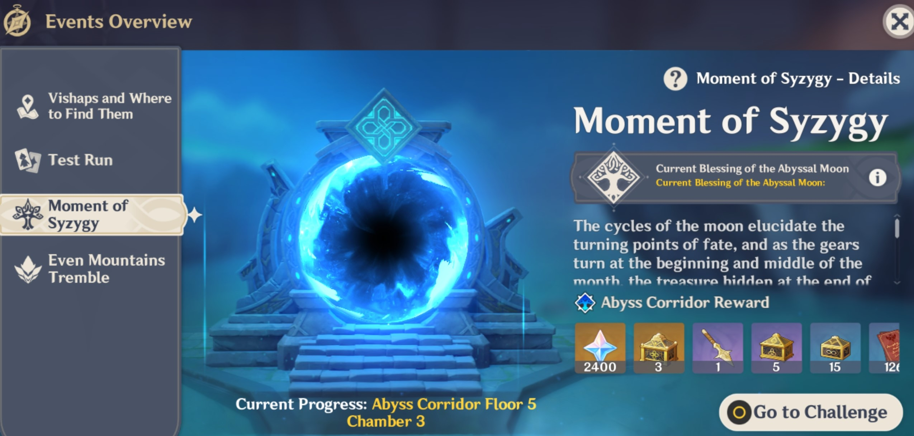

# FAQ

## Teambuilding

### What teams should I use for Abyss

While you could try to use a single team for all floors, Abyss teams tend to change per floor based on the Divergence \(floor buff\) and mobs on each floor. Here's a simple approach you can use:

1. Pick a **Main carry/DPS** to use. Check the build docs for recommendations on who can fit this role
2. Pick a **Healer** for the team. If possible, pick a character that synergizes with your main by providing buffs, reactions, or resonance.
3. If the floor contains **Elemental Shields**, add characters that can break those shields here. Check the individual Floor guides on what to bring
4. Fill in any remaining slots with **Supports** that help your main, often by providing buffs, reactions, or resonance

### What level should my characters be?

Always focus on levelling your **Main carry/DPS** first. The characters and their weapons should be **maxed out for your WL**. If your main carry is more than 10 levels below the mobs on the floor, it may be challenging to beat it.

**Support** characters do not need to be maxed out in the same way. Keep them **1-2 ascension levels lower than your Main carry/DPS**, up to their **60/70 ascension** \(meaning ascending from lvl 60, but not levelling them to 70\). This unlocks their last passive talent.

Characters only used for **shield breaking** do not need any levels at all. Their skills are equally effective at level 1 \(as long as you can keep them alive!\)

Once you get to the higher floors, you will always be lower level than the enemies on the floor. This is where investment into artifacts becomes important. Prioritize getting your main carries to **80/80** with levelled weapons/artifacts/talents. Supports can be kept at 60/70 unless you need their talents at lv 6, in which case bring them to 70/80.

It is not recommended you level characters past 80/90 as the damage boost is not worth it. It's often better to put the resources used to bring a character to 90 elsewhere.

## Spiral Abyss Reset

### What happens when Abyss resets?

All progress and rewards on **F9-12** will be reset. You will have to beat each floor again but you will be able to collect the reward for clearing each chamber as well as obtaining stars

### How often does Abyss reset?

Resets happen **twice a month**. Once on the **1st**, and again on the **16th**. You can always check the exact amount of time remaining by clicking on the Spiral Abyss portal on your map.

Note that resets **aren't tied to patches**! If a new version releases, Abyss won't update until the next reset period.

### What about Floors 1-8?

The progress and rewards for these floors do not reset, and can only be obtained once.

## Progression

### I cleared the 3rd chamber but it won't let me go to the next floor?

You need to get at least 6★ out of the 9 in order to go on to the next floor

### Should I 9★ each floor before moving on to the next one?

No! Your goal should be to reach Floor 9 as quickly as possible so you can access the resetting rewards from Floors 9-12. Just get the minimum 6★ needed to progress floors, and come back to Floors 1-8 later when you have more gear.

In general, it will be easier to 6★ the next floor than it will be to 9★ the current floor

### If I beat a chamber again with more ★'s than before, do I need to finish the floor for it to count?

No! Each Chamber tracks your best ★ rating separately. For example:

> You are currently 7/9 ★'s for the floor, and you only got 1★ in Chamber 1 the first time. Now, if you go back and beat Chamber 1 again with 3★, you can exit out of your run immediately and be at 9/9 ★'s. You do not need to beat the remaining chambers on the floor.

This also means you don't have to 9★ a floor in one run! You can build a team specifically for clearing a specific Chamber with 3★. Once you've done that, in future runs you can get no stars in that chamber and still get 9/9★. One useful way to use this is to deliberately take your time in a chamber you've already 3★'d in order to charge up Burst energy, so you can enter the next chamber with all your Bursts ready

### I cleared 8-3 but I didn't get the 2400 Primogems shown in the Event?

The rewards advertised in the **Moment of Syzygy** banner are **not a separate reward!** It's simply a summary of all the rewards you would normally get from **clearing and 9**★-**ing Floors 1-8**. There is no bonus after completing 8-3.

## Buff Cards

### Are buff cards the same for everyone?

No, buff cards are different for each player and change each day during reset. It is possible to get the same set of cards two days in a row though

### If I "Leave for now" on a chamber and come back the next day, will the buff cards be the same?

No! The buff cards will reset as usual and when you continue the chamber again the next day there will be new options. Any Floor buffs you took on previous Chambers will remain the same.

### I got the same 3 cards two days in a row. I thought it was meant to change?

The buff cards are completely random, so it's possible to get the same choices multiple days in a row.

### Does the same buff card stack?

Yes!

### Which buff card should I pick?

Check out the detailed section on buff cards below



### Does the 25% heal card revive dead characters?

No

## Other Mechanics

### There are no enemies left but the counter still has enemies remaining. Where are they?

This is a bug that can happen after co-op. Leave for now and restart the game. The enemies should appear property once you resume from the Chamber

### How come I don't deal any damage to the Fatui on floor 7?

Fatui gain massive damage resistance until their shield is broken with the right element.

See [Fatui Skirmishers](mechanics/video-guides/fatui-skirmishers.md) for Enviosity's guide on them

### How do I stop enemies from hitting the monolith?

Enemies will aggro you once they take enough hits/damage, so the best strategy is to keep attacking them as much as possible.

Check out the infographics on the floor if you need a hint on which enemies will target the monolith

### Why won't my Anemo MC/Jean/Venti pick up enemies properly?

Anemo characters need to be **within 20 levels** of an enemy to properly CC them. This means for example, on Floor 12-3 with level 100 mobs, your Anemo characters need to be at least level 80

### What characters can get rid of this elemental debuff \(cleanse\)?



### I keep dying to this Ice Cage/Vortex/Fireball and I don't know where it's coming from

Some enemies come with additional abilities that will activate periodically as long as they're alive \(usually referred to as **auras**\). You can tell these enemies part because they will have a swirly circle indicator below them. Killing the enemy is the only way to stop these abilities from happening.

See [Auras](mechanics/auras/) for details on each individual effect

### If I "Leave for now" on a chamber, update my stats, and then continue, will it use the new values?

No. Abyss will "snapshot" your stats whenever you start a run for the floor. If you updated your stats, you will have to restart your run in order to have the updates take effect

