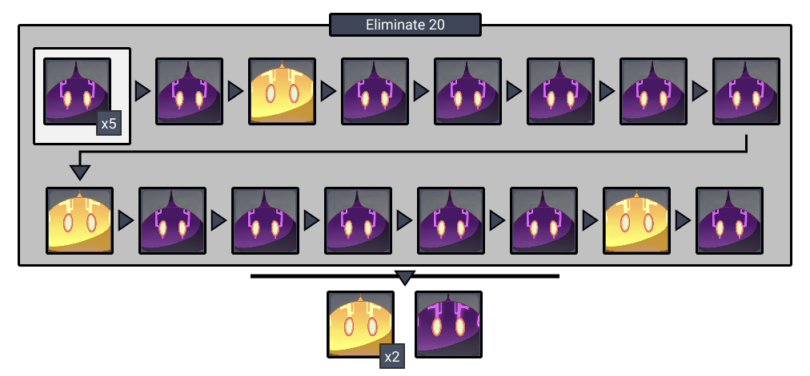
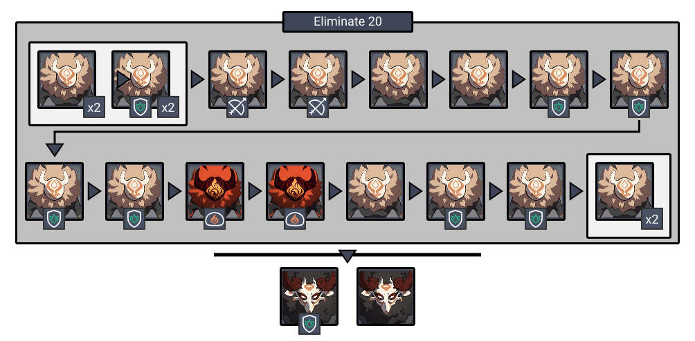
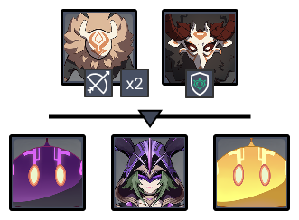

# Floor 1

## Divergence

*  **DMG** dealt by all party members increased by **75%**
* **Overload DMG** increased by **100%**

## Team Recommendations

|  |  |
| :--- | :---: |
| **Shieldbreakers** |   |
| **Preferred Damage** |   |
| **Avoid Damage** |   |
| **4**★ **Supports** |   |
| **5**★ **Supports** |  |

## Chamber 1

**Monster Level - 25**

**Mutant \(Yellow\) Electric Slimes** will cause **Purple slimes** to emit electric shocks. Prioritize killing them when they appear.

Useto trigger **Overload** and deal a lot of damage to slimes.

## **Chamber 2**

**Monster Level - 25**

Fighting near the **Ranged Hilichurls** will help group the mobs.

Use  to burn through the wooden shields.

## **Chamber 3**

**Monster Level - 25**

| **Monster** |
| :--- |
| \*\*\*\*[**Electro Cicin Mage**](../../monsters/fatui/electro-cicin-mage.md)\*\*\*\* |

Using ranged attacks on the **Electro Cicin Mage** can be difficult due to auto-aim targeting the flies. If you are using ranged attacks, get up close to the Cicin to help with targeting.

## Other Resources

Not sure what something means? Check the [Glossary](../glossary.md)

