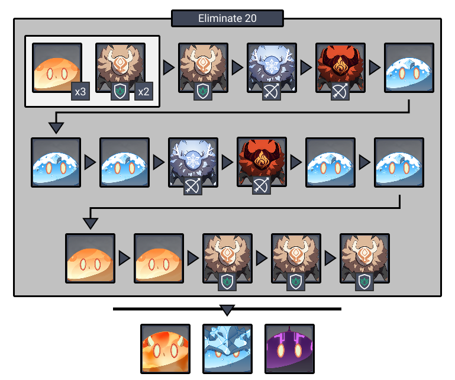
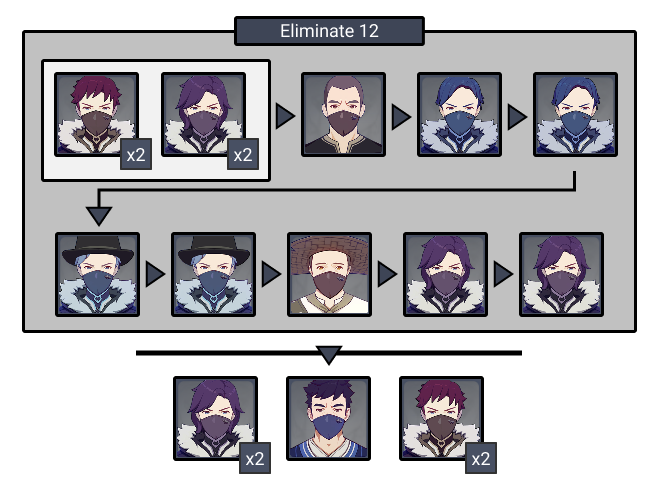

# Floor 3

## Divergence

*  **DMG** dealt by all party members increased by **75%**
* **Swirl** reaction **DMG** increased by **300%** and its **AoE** increased by **100%**

## General Tips

Bring a **Bow** user in order to stun the **Ruin Guard** in the third chamber.

**Sword charged attacks** are particularly useful at quickly throwing an enemy backwards off of a ledge.

## Team Recommendations

|  |  |
| :--- | :---: |
| **Shieldbreakers** |   |
| **Preferred Damage** |  |
| **Avoid Damage** |  **** |
| **4**★ **Supports** |    |
| 5★ **Supports** |     |

## Chamber 1

**Monster Level - 45**

 ****

This arena does not have edges. The **archers** spawn at the edge and can be knocked off the platform easily. Note that the **Pyro Archer** spawns right after the **Cryo Archer**, so stay in the area until you kill both archers to save time. Enemies can be knocked off easily by  skills or charged attacks.

You can use the slimes to **Swirl** elements to your advantage. For example, using it to swirl  from **Slimes** to burn **Hilichurl** shields. Doing this on the last group of 3 **Slimes** can be particularly effective, as they will all react with each other.

## **Chamber 2**

**Monster Level - 45**

This arena does not have edges, however enemies spawn closer to the middle of the arena. If you are low level, luring or pushing enemies to the edge may be faster than attacking them outright.

**Potioneers** will back away from you when approached, so you can use this to slowly move them to the edge, but this is much slower than just using other methods.

Watch out for the **Potioneers** attacks which leave Elemental AoE on the ground. These can cause annoying reactions like **Overload** and **Freeze**.

## **Chamber 3**

**Monster Level - 45**

| **Monster** |
| :--- |
| [**Ruin Guard**](../../monsters/ruin-constructs/ruin-guard.md)\*\*\*\* |

Use an archer to stun the **Ruin Guard**, and then focus it. The **Mitachurl** should come to you and group, allowing you to hit both at once.

If you rely on  **DMG**, make sure you have **Superconduct** \( + \) on the **Ruin Guard** because they have high  **RES.**

## Other Resources

Not sure what something means? Check the [Glossary](../glossary.md)

