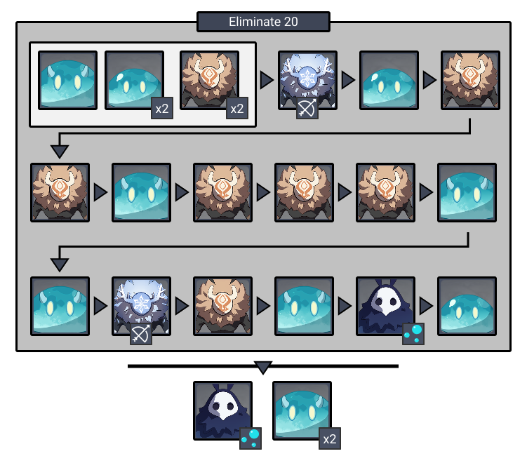
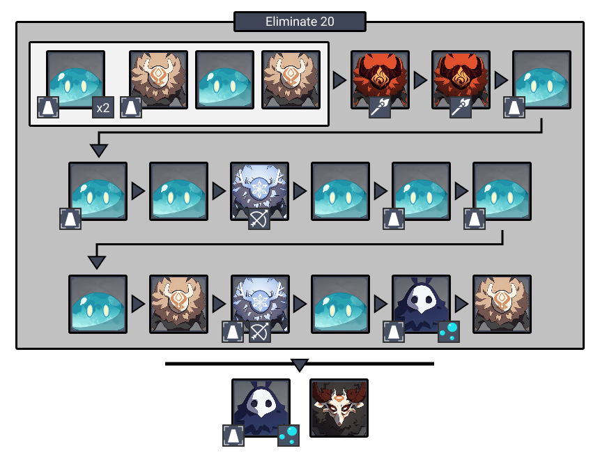

# Floor 4

## Divergence

*  **DMG **dealt by all party members increased by **75%**
* **Electrocharged DMG** increased by **150% **and it's **AoE** increased by **100%**

## Team Recommendations

|                            |                                                                                                                                                                                                                                                                                                                                 |
| -------------------------- | :-----------------------------------------------------------------------------------------------------------------------------------------------------------------------------------------------------------------------------------------------------------------------------------------------------------------------------: |
| **Shieldbreakers**         |                                                                                                                                                                                                                                                                                       |
| **Preferred DPS Elements** |                                                                                                                                                                                                |
| **Avoid DPS Elements**     |                                                                                                                                                                                                                                                                                      |
| **4**★ **Supports**        |  |
| **5**★ **Supports**        |                                                                                                                                                                                                                         |

## Chamber 1

**Monster Level - 50**

|                                                                                |
| ------------------------------------------------------------------------------ |
| **Monster**                                                                    |
| [**Hydro Abyss Mage**](../../monsters/abyss-order/hydro-abyss-mage.md) |

| Aura                                                        | DMG                                            |
| ----------------------------------------------------------- | ---------------------------------------------- |
| [**Bubbles**](../../mechanics/auras/mist-bubble.md) | 971 |

 is the best at dealing damage to **Hydro Slimes** on this floor.

Use  on the** Hydro Abyss Mages** so they stay frozen in place and cannot attack. Their **Aura **(Bubbles) will still spawn when frozen.

## **Chamber 2**

**Monster Level - 50**

**Monolith Defense**

|                                                                                |
| ------------------------------------------------------------------------------ |
| **Monster**                                                                    |
| [**Hydro Abyss Mage**](../../monsters/abyss-order/hydro-abyss-mage.md) |

| Aura                                                        | DMG                                            |
| ----------------------------------------------------------- | ---------------------------------------------- |
| [**Bubbles**](../../mechanics/auras/mist-bubble.md) | 971 |

Most of the enemies that attack the monolith will be  . Use  to **Freeze **them and prevent them from damaging the monolith.

If you fight too close to the monolith, **Hilichurls **may hit the pillar by accident. Try not to fight directly next to the monolith.

Both **Hydro Abyss Mages** target the monolith. Make sure you **Freeze **them as soon as possible. Avoid being near the monolith when the **Abyss Mages** are spawned as the **Bubbles **can damage it. You can also use characters with a **taunt** ability to distract enemies.

## **Chamber 3**

**Monster Level - 50**

|                                                                                |
| ------------------------------------------------------------------------------ |
| **Monster**                                                                    |
| [**Hydro Abyss Mage**](../../monsters/abyss-order/hydro-abyss-mage.md) |

| Aura                                                | DMG                                            |
| --------------------------------------------------- | ---------------------------------------------- |
| [**Bubbles**](../../mechanics/auras/mist-bubble.md) | 971 |

Target the **Hydro Samachurl** first as it can heal the other enemies.

In the second phase, target the **Hydro Abyss Mage** with the **Aura **to prevent bubbles from spawning. Make sure to continue attacking it after breaking it's shield, as they can recover the shield if left too long.

## Other Resources

Not sure what something means? Check the [Glossary](../glossary.md)
