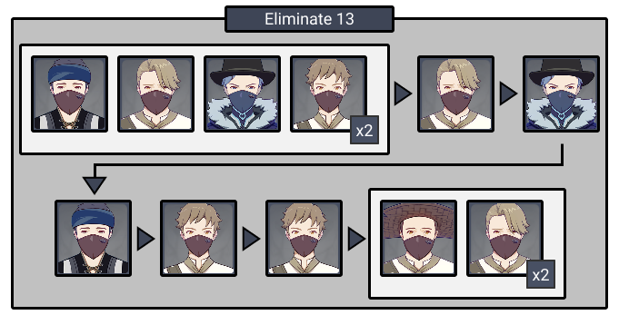
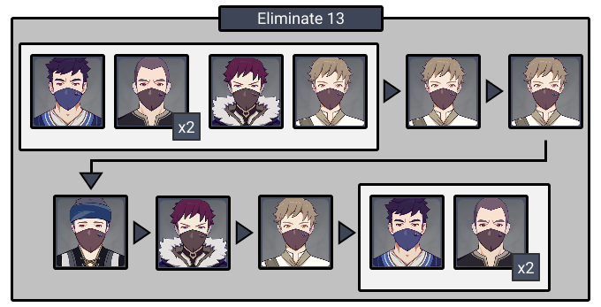
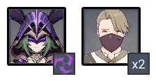
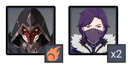

# Floor 5

## Divergence

* When **HP** is greater than **50%**, **ATK** and \*\*DEF \*\*are increased by **25%**
* When \*\*HP \*\*is greater than **80**%, **Normal Attack SPD** is increased by **20%**
* When \*\*HP \*\*is greater than **80%**, **Movement SPD** is increased by **20%**
* When \*\*HP \*\*is greater than **95%**, **CRIT Rate** is increased by **10%** and **CRIT DMG** is increased by **20%**

## General Tips

Keeping your **Main Carry** above **95% HP** is important to maximize damage on this floor. Make sure you bring characters with good healing/shielding on each team, and make an effort to avoid enemy attacks. If you are taking a lot of damage, consider bringing two supports per team if you have them.

## Team Recommendations

|                            |                                                                              Side 1                                                                              |                                                                               Side 2                                                                              |
| -------------------------- | :--------------------------------------------------------------------------------------------------------------------------------------------------------------: | :---------------------------------------------------------------------------------------------------------------------------------------------------------------: |
| **Shieldbreakers**         |                                                                                                                        |                                                                                                                        |
| **Preferred DPS Elements** |                                                                                                                        |                                                                                                                                                                   |
| **Avoid DPS Elements**     |                                                                           |                                                                                                                         |
| **4**★ **Supports**        |   |  |
| **5**★ **Supports**        |   |     |

## Chamber 1

**Monster Level - 55**

### Side 1

| Aura                                              | DMG                                            |
| ------------------------------------------------- | ---------------------------------------------- |
| [**Ice Cage**](../../mechanics/auras/ice-cage.md) | 1594 |

 is the most effective against **Cryo Slime** shields. Kill the **Cryo Slimes** before they can reshield.

Focus the **Large Cryo Slimes** as they are the most threatening followed by the **Archers** as they can disrupt your combos. The last **Large Cryo Slime** causes the **Ice Cage**. Prioritize it when it spawns.

### Side 2

|                                                                      |
| -------------------------------------------------------------------- |
| **Monster**                                                          |
| [**Pyro Abyss Mage**](../../monsters/abyss-order/pyro-abyss-mage.md) |

| Aura                 | DMG                                                          |
| -------------------- | ------------------------------------------------------------ |
| **Smoldering Flame** | 203/ Tick (?? DPS) |

Focus the **Pyro Abyss Mage** on the left that has the \*\*Aura \*\*to prevent getting debuffed by **Smoldering Flames.**

\*\* **is the most effective against** Pyro Abyss Mage\*\* shields. Kill the Abyss Mages before they can reshield.

Staggering the Abyss Mage when their shields are down can prevent their attacks.

## **Chamber 2**

**Monster Level - 55**

### Side 1

Enemies will periodically be buffed with a  shield, which reduces incoming damage. Use  to remove it.

Fight near ranged enemies when possible and let the melee enemies come to you.

### Side 2

Enemies will periodically be buffed with a shield. Use to remove it.

Fight near ranged enemies when possible and let the melee enemies come to you.

## **Chamber 3**

**Monster Level - 55**

### Side 1

|                                                                      |
| -------------------------------------------------------------------- |
| **Monster**                                                          |
| [**Electro Cicin Mage**](../../monsters/fatui/electro-cicin-mage.md) |

Avoid using ranged autoattacks (**Bow, Catalyst**) as **Cicin** \*\*Flies \*\*can easily draw autoaim.

Focus the **Cicin Mage** and let the melee \*\*Hoarders \*\*come to you.

The Cicin's \*\*Aura \*\*will drain your energy, so use bursts when they are up.

### Side 2

|                                                      |
| ---------------------------------------------------- |
| **Monster**                                          |
| [**Pyro Agent**](../../monsters/fatui/pyro-agent.md) |

| Aura                                                       | DMG                                                      |
| ---------------------------------------------------------- | -------------------------------------------------------- |
| [**Fireball**](../../mechanics/auras/pursuing-fireball.md) | 598/ Explosion |

Focus down the **Electro Potioneers** first to prevent being **Overloaded**. The **Pyro Agent** will come to you.

The **Fireball** Aura from the **Pyro Agent** is difficult to avoid. Make sure you bring healing.

## Other Resources

Not sure what something means? Check the [Glossary](../glossary.md)
