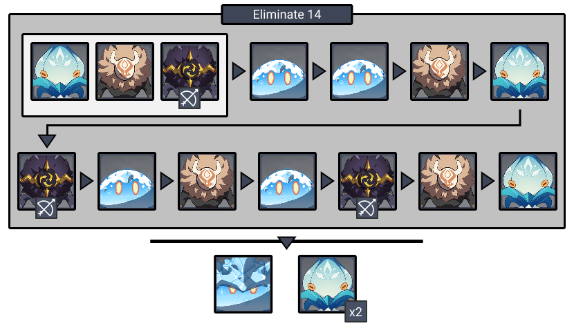
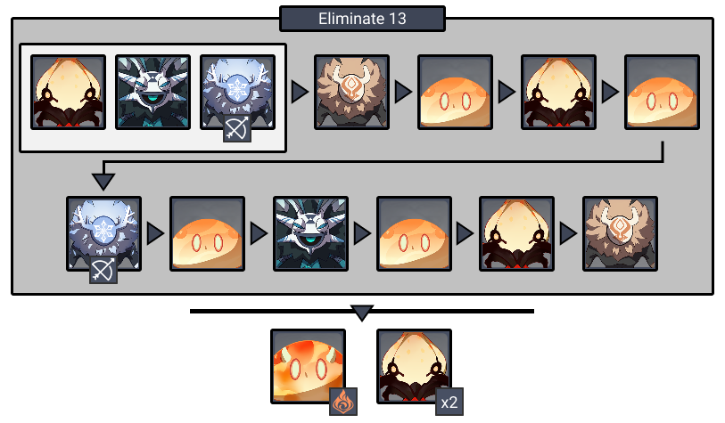
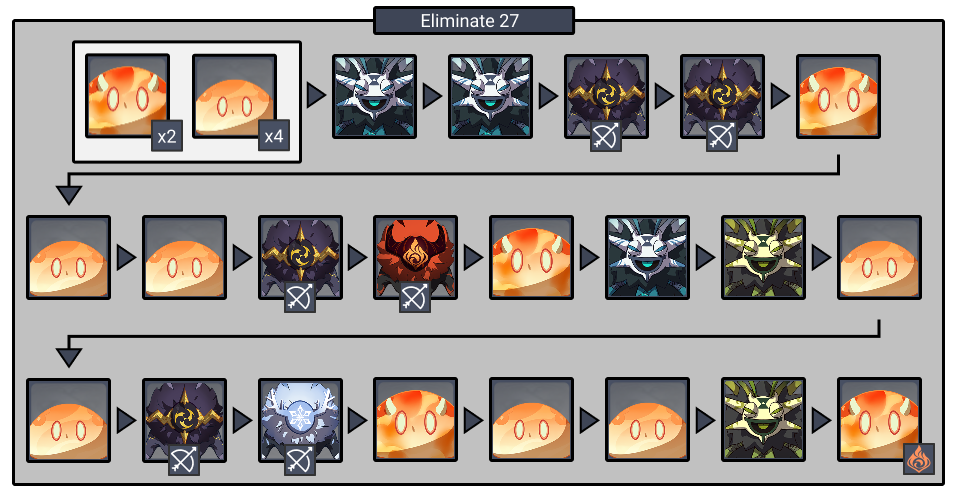
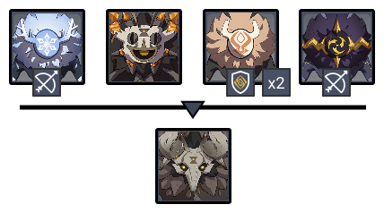
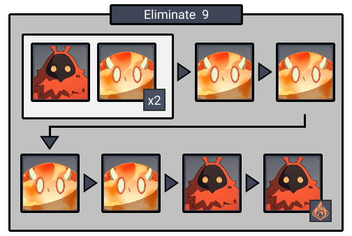

# Floor 6

## Divergence

* Using an **Elemental Burst** increases all party members' **ATK** and **DEF** by **6%**. Max 10 stacks. At **5 stacks** and above, increases character **Normal Attack SPD** and **Movement SPD** by an additional **30%**

## General Tips

Characters with **low cooldown/energy bursts** excel on this floor as supports. 

Outfitting these chars with **4pc Exile** is a great way to provide energy to let you spam their bursts and reach 5 stacks as quickly as possible.

## Team Recommendations

|  | Side 1 | Side 2 |
| :--- | :---: | :---: |
| **Shieldbreakers** |  ​​  |   |
| **Preferred Damage** |   |   |
| **Avoid Damage** |  ​​  |   |
| **4**★ **Supports** |  ​​ ​​​ |  ​​ ​ |
| **5**★ **Supports** |  ​​ ​​​ ​​ |  ​​  ​​​​ |

## Chamber 1

**Monster Level - 60**

### Side 1

Prioritize attacking **Whopperflowers** when they have their shield up to prevent their attacks.  is the most effective against their shields, but other elements and claymores will damage it as well. 

**Whopperflowers** become stunned if you break their shields. They take more damage while stunned, so make sure to focus them when this happens.

Fighting near the **archers** can help group enemies together.

### Side 2

Prioritize attacking **Whopperflowers** when they have their shield up to prevent their attacks.  is the most effective against their shields, but other elements and claymores will damage it as well. 

**Whopperflowers** become stunned if you break their shields. They take more damage while stunned, so make sure to focus them when this happens.

**Samachurls** can be annoying to deal with, so focus them first when they spawn.

## **Chamber 2**

**Monster Level - 60**

### Side 1

Fight near ranged units to group enemies easier.

Focus **Hydro** **Samachurls** when they spawn, as they can heal other enemies.

### Side 2

Fight near ranged units to group enemies easier.

Focus **Samachurls** when they spawn, as they can be annoying to deal with.

## **Chamber 3**

**Monster Level - 60**

### Side 1

Focus the **Geo Samachurl** immediately so that it doesn't get a chance to spawn it's pillar

Use  , Claymores, or Explosive Damage \(Klee, Overload\) to damage the **Stonehide Lawachurl's** shield. It's attacks are more powerful when shielded.

### Side 2

| Aura | DMG |
| :--- | :--- |
| **Smoldering Flame** | 295/ Tick \(?? DPS\) |

Focus **Pyro Abyss Mages** whenever you can. Use  on their shields.

## Other Resources

Not sure what something means? Check the [Glossary](../glossary.md)

