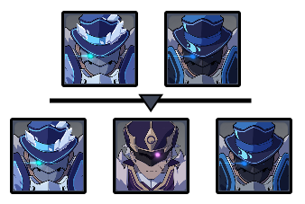
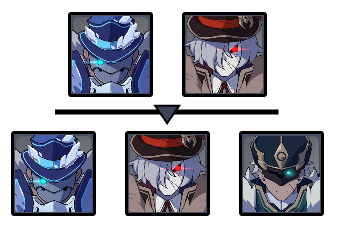
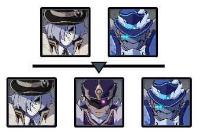
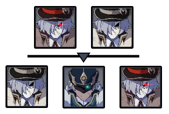

# Floor 7

## Divergence

* **CRIT** hits will generate **Elemental Particles and Orbs**. Can only occur once every 15s
* **CRIT DMG** dealt by all party members increased by **120%**

## General Tips

**Make sure you know how to deal with Fatui shields before attempting this floor!**


[fatui-skirmishers.md](../../mechanics/video-guides/fatui-skirmishers.md)


The floor has** very strict element requirements**. Each team must have the following:

|                                                              Side 1                                                              |                                                             Side 2                                                             |
| :------------------------------------------------------------------------------------------------------------------------------: | :----------------------------------------------------------------------------------------------------------------------------: |
|    |    |

Since **Kaeya** is the only guaranteed **Cryo** character, you may not have access to one Cryo per team. If that is the case, put him on **Team 1** and make sure to focus the **Electrohammer first** when you get to **Chamber 3 Side 2**.

Each team also requires a way to break shields. This can be specifically a **Geo **character, or a **Claymore** wielder. Note that you could skip doing this on **Team 1** by using **Overload** ( + ) to break shields, but this takes longer.

## Team Recommendations

|                            |                                                                                   Side 1                                                                                  |                                                                                Side 2                                                                                |
| -------------------------- | :-----------------------------------------------------------------------------------------------------------------------------------------------------------------------: | :------------------------------------------------------------------------------------------------------------------------------------------------------------------: |
| **Shieldbreakers**         |     |  |
| **Preferred DPS Elements** |                                                                                                                              |                                                                                                                         |
| **Avoid DPS Elements**     |                                                                                                                                                                           |                                                                                                                                                                      |
| **4**★ **Supports**        |                                                                                                                                                                           |                                                                                                                                                                      |
| **5**★ **Supports**        |                                                                                                                                                                           |                                                                                                                                                                      |

## Chamber 1

**Monster Level - 65**

### Side 1

Go for the **Hydrogunner **first as he is able to heal.

Dodge towards and behind the **Electrohammer **to easily evade all of his attacks.

| Enemy                                                                                  | Weak Element                                  |
| -------------------------------------------------------------------------------------- | --------------------------------------------- |
| ****[**Hydrogunner Legionnaire**](../../monsters/fatui/hydrogunner-legionnaire.md)**** |   |
| [**Electrohammer Vanguard**](../../monsters/fatui/electrohammer-vanguard.md)****       |      |
| ****[**Cryogunner Legionnaire**](../../monsters/fatui/cryogunner-legionnaire.md)****   |      |

### Side 2

Focusing the **Cryogunner **first will make the fight easier.

Focusing the **Pyrogunner **first will make the **Cryogunner **come to you, grouping them up for a faster clear.

Focus the **Anemoboxer** in the second half. They can revive allies that have their shield broken and cause them to reshield immediately.

| Enemy                                                                                | Weak Element                                |
| ------------------------------------------------------------------------------------ | ------------------------------------------- |
| **Pyrogunner**                                                                       |   |
| ****[**Cryogunner Legionnaire**](../../monsters/fatui/cryogunner-legionnaire.md)**** |    |

## **Chamber 2**

**Monster Level - 65**

### Side 1

Focusing the **Cryogunner **first will make the fight easier.

Focusing the **Geochanter **first will make the **Cryogunner **come to you, grouping them up for a faster clear.

Dodge towards and behind the **Electrohammer **to easily evade all of his attacks.

| Enemy                                                                                | Weak Element                               |
| ------------------------------------------------------------------------------------ | ------------------------------------------ |
| **Geochanter**                                                                       |    |
| [**Electrohammer Vanguard**](../../monsters/fatui/electrohammer-vanguard.md)****     |   |
| ****[**Cryogunner Legionnaire**](../../monsters/fatui/cryogunner-legionnaire.md)**** |   |

### Side 2

In the second phase, focus the **Anemoboxer **as he can recover knocked down Fatuis which lets them reshield immediately.

If you focus one of the ranged Fatuis, the **Anemoboxer **will come to you, grouping them up for a faster clear.

| Enemy          |                 Weak Element                |
| -------------- | :-----------------------------------------: |
| **Geochanter** |     |
| **Pyrogunner** |   |

## **Chamber 3**

**Monster Level - 65**

### Side 1

Go for the **Hydrogunner **first as he is able to heal, and do as much damage as you can before he shields. Next, focus the **Anemoboxer.**

| Enemy                                                                                  | Weak Element                                  |
| -------------------------------------------------------------------------------------- | --------------------------------------------- |
| ****[**Hydrogunner Legionnaire**](../../monsters/fatui/hydrogunner-legionnaire.md)**** |   |
| [**Electrohammer Vanguard**](../../monsters/fatui/electrohammer-vanguard.md)****       |      |

### Side 2

If you don't have a  on this team, aim for the **Electrohammer **first and try to kill him before he shields Otherwise, focus the **Anemoboxer.**

| Enemy                                                                            | Weak Element                                |
| -------------------------------------------------------------------------------- | ------------------------------------------- |
| **Pyrogunner**                                                                   |   |
| [**Electrohammer Vanguard**](../../monsters/fatui/electrohammer-vanguard.md)**** |    |

## Other Resources

Not sure what something means? Check the [Glossary](../glossary.md)
