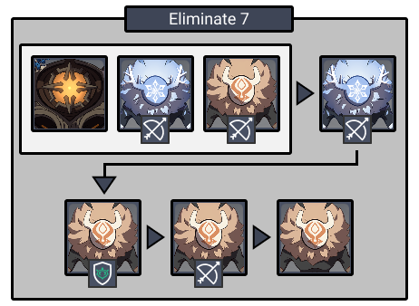
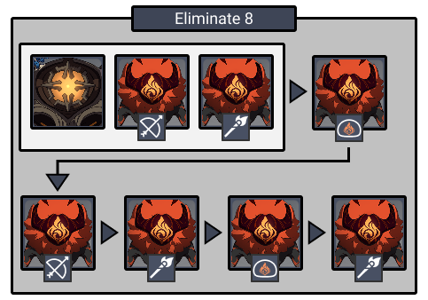
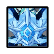
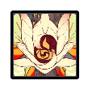

# Floor 8

## Divergence

* When **HP is less than 50%**, **ATK **and **DEF **are increased by **50%**
* When **HP **is less than **45%**, **Normal Attack SPD** is increased by **30%**
* When **HP **is less than **45%**, **Movement SPD** is increased by **20%**
* When **HP **is less than **30%**, **CRIT Rate** is increased by **20%** and **CRIT DMG** is increased by **40%**

## General Tips

Keeping your **Main Carry** **below 30% HP** is important to maximize damage on this floor. If possible, prefer characters with **shields **over characters that **heal**. This allows you to mitigate damage while still keeping the floor buff active.

Avoid relying on strong healers such as **Barbara, Bennet, Jean, Qiqi.**

**Chamber 2** also contains a **Ruin Guard** on each side. If you rely on  **DMG**, you must bring **Superconduct **(  +  ).

**Chamber 2** also is much harder than the rest. If it is your first time clearing this floor, aim for **6**★ with a distribution of** 3★/0★/3★**. This is often easier than trying to get stars on **Chamber 2**.

Bring a **Bow** character on each side with the correct element to disable the **Regisvine**. This also lets you disable the **Ruin Guards.**

## Team Recommendations

|                            |                                                                                                        Side 1                                                                                                       |                                                                                                          Side 2                                                                                                         |
| -------------------------- | :-----------------------------------------------------------------------------------------------------------------------------------------------------------------------------------------------------------------: | :---------------------------------------------------------------------------------------------------------------------------------------------------------------------------------------------------------------------: |
| **Shieldbreakers**         |                                                                                                                              |                                                                                                                                                                              |
| **Preferred DPS Elements** |                                                                                                                                                                           |                                                                                                                                    |
| **Avoid DPS Elements**     |                                                                                                                                                                           |                                                                                                                                                                               |
| **4**★ **Supports**        |  |  |
| **5**★ **Supports**        |                                                                                                          |                                                                                                              |

## Chamber 1

**Monster Level - 70**

### Side 1

|                                                                                |
| ------------------------------------------------------------------------------ |
| **Monster**                                                                    |
| [**Cryo Abyss Mage**](../../monsters/abyss-order/cryo-abyss-mage.md)           |
| [**Hydro Abyss Mage**](../../monsters/abyss-order/hydro-abyss-mage.md) |

**Cryo Abyss Mage** shield is much easier to break than the **Hydro Abyss Mage**. Focusing the **Cryo **first will prevent you from having to deal with being **Frozen**.

You can sometimes push the two Abyss Mages together with movement or abilities, allowing you to hit both shields at once.

### Side 2

|                                                                      |
| -------------------------------------------------------------------- |
| **Monster**                                                          |
| [**Pyro Abyss Mage**](../../monsters/abyss-order/pyro-abyss-mage.md) |

| Aura                                                       | DMG                                                       |
| ---------------------------------------------------------- | --------------------------------------------------------- |
| [**Fireball**](../../mechanics/auras/pursuing-fireball.md) | 1080/ Explosion |

Use  to bring down the **Pyro Abyss Mage** shield.

Focus the one with the **Fireball Aura **to stop it from spawning.

## **Chamber 2**

**Monster Level - 70**

### Side 1

|                                                                |
| -------------------------------------------------------------- |
| **Monster**                                                    |
| [**Ruin Guard**](../../monsters/ruin-constructs/ruin-guard.md) |

A pillar will periodically shield enemies with , reducing their damage taken. Use  to break the shield.

Focusing down the **Ruin Guard** first will save the most time.

### Side 2

|                                                                |
| -------------------------------------------------------------- |
| **Monster**                                                    |
| [**Ruin Guard**](../../monsters/ruin-constructs/ruin-guard.md) |

A pillar will periodically shield enemies with , reducing their damage taken. Use  to break the shield.

Focusing down the **Ruin Guard** first will save the most time.

## **Chamber 3**

**Monster Level - 70**

### Side 1

Use  to break the shield and stun the **Regisvine**.

The best way to star this chamber is to enter with low health to trigger the **divergence** buff, and kill it after staggering it the first time.

### Side 2

Use  to break the shield and stun the **Regisvine**.

The best way to star this chamber is to enter with low health to trigger the **divergence** buff, and kill it after staggering it the first time.

## Other Resources

Not sure what something means? Check the [Glossary](../glossary.md)
