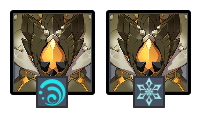

# Floor 12 \(Version A\)

## Divergence

* No Divergence

## General Tips

Avoid **Physical** based damage on this floor \(e.g. **Razor**\) and instead rely on **Elemental** damage. Both **Ruin Guards** and **Geovishaps** have high **PHYS RES**. If you need to use physical, make sure you bring **Electro + Cryo** for **Superconduct**

You may want a **Bow** user on each team in order to stun the **Ruin Gard/Ruin Grader** in Chamber 3

## Team Recommendations

|  | Side 1 | Side 2 |
| :--- | :---: | :---: |
| Required Shieldbreakers |   |  |
| Preferred Damage |   |  |
| Avoid Damage |   |  |
| Recommended Supports \(4★\) |  |  |
| Recommended Supports \(5★\) |  |  |

## Chambers



**Monster Level - 96**

Geovishaps will infuse about 35s into the fight on each side**.**

Once infused, Geovishaps will gain resistance to that element \(30%\)

<table>
  <thead>
    <tr>
      <th style="text-align:left">Side 1</th>
      <th style="text-align:left">Side 2</th>
    </tr>
  </thead>
  <tbody>
    <tr>
      <td style="text-align:left">
        
      </td>
      <td style="text-align:left">
        
      </td>
    </tr>
    <tr>
      <td style="text-align:left">Avoid bringing <b>Electro</b> and <b>Pyro</b> damage on this side</td>
      <td
      style="text-align:left">Avoid bringing <b>Hydro</b> and <b>Cryo</b> damage on this side</td>
    </tr>
    <tr>
      <td style="text-align:left"></td>
      <td style="text-align:left">
        
<b>Cryo</b> Geovishaps are immune to freeze

        
<b>Hydro</b> Geovishaps can be frozen with <b>Cryo</b>
        

      </td>
    </tr>
    <tr>
      <td style="text-align:left">Geovishap - ~400K HP</td>
      <td style="text-align:left">Geovishap - ~400K HP</td>
    </tr>
  </tbody>
</table>

### Tips for 3★

<table>
  <thead>
    <tr>
      <th style="text-align:left">Side 1</th>
      <th style="text-align:left">Side 2</th>
    </tr>
  </thead>
  <tbody>
    <tr>
      <td style="text-align:left">Avoid <b>Electro, Pyro, Geo, Phys</b> based carries</td>
      <td style="text-align:left">Avoid <b>Hydro, Cryo, Geo, Phys</b> based carries</td>
    </tr>
    <tr>
      <td style="text-align:left"><b>Hydro</b> based damage is particularl effect as you can trigger <b>Electrocharged/Vaporize</b> on
        the Geovishaps after they infuse</td>
      <td style="text-align:left"><b>Pyro</b> based damage is particularly effective as you easily trigger <b>Vaporize/Melt</b> on
        the Geovishaps after they infuse</td>
    </tr>
    <tr>
      <td style="text-align:left">
        
Recommended 4&#x2605;

        
<b>Beidou, Xinyan, Xingqiu</b>
        

      </td>
      <td style="text-align:left">
        
Recommended 4&#x2605;

        
<b>Bennet, Beidou, Diona, Kaeya, Fischl, Xiangling</b>
        

      </td>
    </tr>
    <tr>
      <td style="text-align:left">
        
Recommended 5&#x2605;

        
<b>Childe, Ganyu, Xiao, Zhong Li</b>
        

      </td>
      <td style="text-align:left">
        
Recommended 4&#x2605;

        
<b>Bennet, Beidou, Diona, Kaeya, Fischl, Xiangling</b>
        

      </td>
    </tr>
  </tbody>
</table>



**Monster Level - 98**

| Side 1 | Side 2 |
| :---: | :---: |
|  |  |
| [Electro Triangle](../mechanics/auras/electro-triangle.md) | [Fireball](../mechanics/auras/fireball.md) |
| Focus the **Electro Cicin** with the aura to stop the **Electro Triangle** | Focus the **Pyro Agent** with the aura to stop the **Fireball** |
| **Cryo Cicin** will regenerate her shield as long as her flies are live. Kill them to slow/stop the shield |  |
| Cicins - ~475K HP | Pyro Agent- ~475K HP |

### Tips for 3★

| Side 1 | Side 2 |
| :--- | :--- |

| Avoid **Electro, Cryo** based carries | Avoid **Pyro** based carries |
| :--- | :--- |

| Keeping the Cicins grouped can be difficult because they teleport. You will just need to fight them one at a time | **Pyro Agents** are very easy to stagger. Try to group the two together early and and attack them aggressively |
| :--- | :--- |

<table>
  <thead>
    <tr>
      <th style="text-align:left">
        
Recommended 4&#x2605;

        
<b>Bennet, Diona</b>
        

      </th>
      <th style="text-align:left">
        
Recommended 4&#x2605;

        
<b>Sucrose</b>
        

      </th>
    </tr>
  </thead>
  <tbody></tbody>
</table>

<table>
  <thead>
    <tr>
      <th style="text-align:left">
        
Recommended 5&#x2605;

        
<b>Venti, Jean</b>
        

      </th>
      <th style="text-align:left">
        
Recommended 5&#x2605;

        
<b>Venti, Jean</b>
        

      </th>
    </tr>
  </thead>
  <tbody></tbody>
</table>



**Monster Level - 100**

| Side 1 | Side 2 |
| :---: | :---: |
|  |  |
|  | [Ruin Grader](../monsters/ruin-grader.md) |
| [Shockwave](../mechanics/auras/shockwave.md) | [Ice Cage](../mechanics/auras/ice-cage.md) |
| The **Shockwave** aura deals a lot of damage. Prioritize the Ruin Guard with the Aura | Getting caught in **Ice Cage** during a **Ruin Grader** spin attack is lethal. Prioritize the Ruin Guard with the Aura |
| Shoot a Ruin Guard twice in the Eye to disable it, making the fight much easier. | While it's possible to disable the **Ruin Grader** completely, it's difficult to do in practice and isn't actually that helpful. It's often more effective to just keep attacking them if you stagger them to their knees instead of using that time to shoot their eyes |
| Ruin Guard - ~700K HP | Ruin Grader - ~800K HP |

### Tips for 3★

| Side 1 | Side 2 |
| :--- | :--- |

| Avoid **Phys** based carries | Avoid **Phys** based carries |
| :--- | :--- |

| The best way to group the Ruin Guards is to stay in the middle and let them come to you. If you approach either Ruin Guard, it will cause the other to pause and fire missiles | The best way to group the Ruin Graders is to approach one and hope the other performs a Charge attack, however this is completely random |
| :--- | :--- |

| Trying to avoid the **Shockwave** can be a big time loss. It is better to try and Shield/Heal through the damage and continue attacking | Ruin Graders stagger often because of the weak points on their legs. Don't be afraid to stay close and continue attacking them. Their attacks are fairly telegraphed and are best dodged at close range. |
| :--- | :--- |

|  | Letting a Ruin Grader perform the spin attack is a very large time loss due to how long it lasts. There is a brief window when they are winding up the attack that their legs are exposed. Hitting it during this time will interrupt the attack. |
| :--- | :--- |

<table>
  <thead>
    <tr>
      <th style="text-align:left">
        
Recommended 4&#x2605;

        
<b>Beidou, Bennet, Noelle</b>
        

      </th>
      <th style="text-align:left">
        
Recommended 4&#x2605;

        
<b>Beidou, Diona, Xiangling</b>
        

      </th>
    </tr>
  </thead>
  <tbody></tbody>
</table>

<table>
  <thead>
    <tr>
      <th style="text-align:left">
        
Recommended 5&#x2605;

        
<b>Ganyu, Qiqi, Zhong Li</b>
        

      </th>
      <th style="text-align:left">
        
Recommended 5&#x2605;

        
<b>Ganyu</b>
        

      </th>
    </tr>
  </thead>
  <tbody></tbody>
</table>



