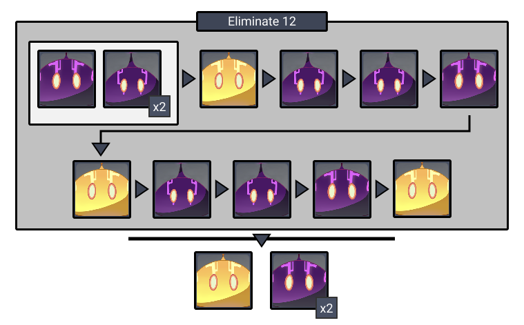
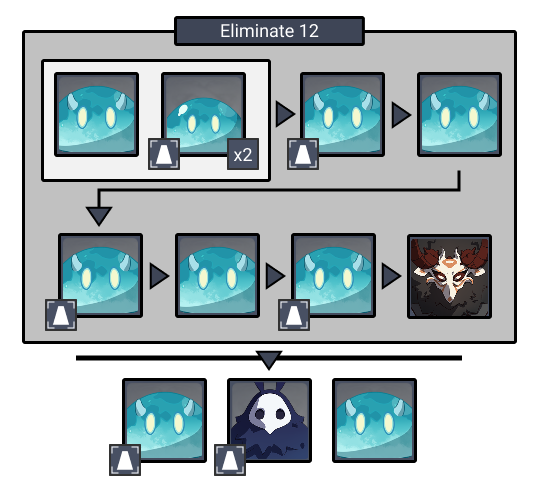
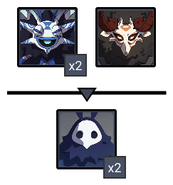

# Floor 2

## Divergence

*  **DMG** dealt by all party members increased by **75%**
* The duration of the **Frozen** status effect is greatly increased.

## Team Recommendations

|  |  |
| :--- | :---: |
| **Shieldbreakers** |  |
| **Preferred Damage** |   **** |
| **Avoid Damage** |    |
| **4**★ **Supports** |  |
| **5**★ **Supports** |   |

## Chamber 1

**Monster Level - 40** 

  
**Mutant \(Yellow\) Electric Slimes** will cause **Purple slimes** to emit electric shocks. Prioritize killing them when they appear.

## **Chamber 2**

**Monster Level - 40** 

**Monolith Defense**

Use  to freeze enemies and prevent them from attacking the monolith.

Be careful using  as the floor is water and can become **Electrocharged.**

## **Chamber 3**

**Monster Level - 40**

Focus the **Hydro Samachurls** first as they can heal each other.

Using  against **Hydro Abyss Mages** are effective at breaking their shields while also keeping them from attacking you.

