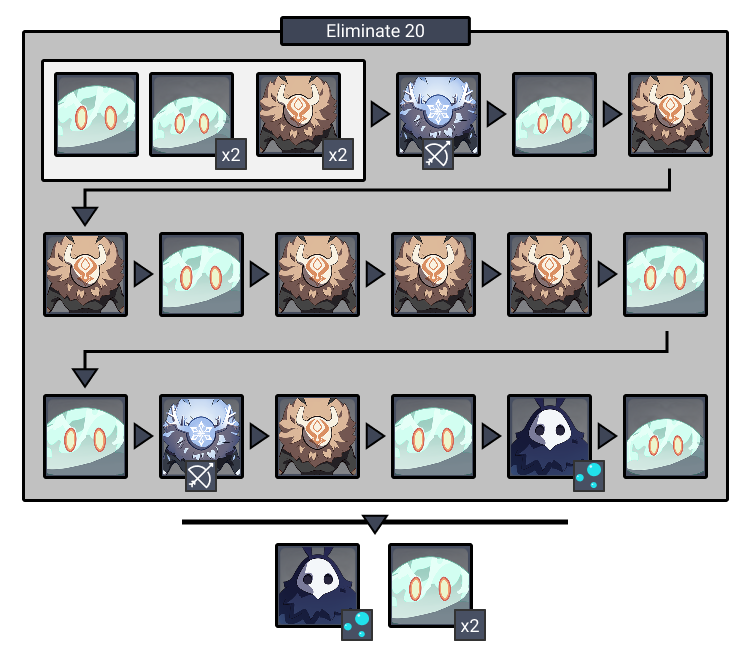
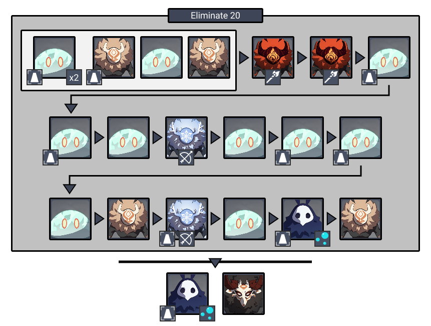
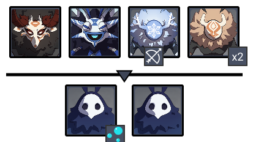

# Floor 4

## Divergence

*  **DMG** dealt by all party members increased by **75%**
* **Electrocharged DMG** increased by **150%** and it's **AoE** increased by **100%**

## General Tips

## Team Recommendations

|  |  |
| :--- | :---: |
| **Shieldbreakers** |   |
| **Preferred Damage** |     |
| **Avoid Damage** |   |
| **4**★ **Supports** |   |
| **5**★ **Supports** |   |

## Chamber 1

**Monster Level - 50**

 is the best at dealing damage to **Hydro Slimes** on this floor.

Use  on the **Hydro Abyss Mages** so they stay frozen in place and cannot attack. Their **Aura** \(Bubbles\) will still spawn when frozen

## **Chamber 2**

**Monster Level - 50**

**Monolith Defense**

Most of the enemies that attack the monolith will be  . Use  to **Freeze** them and prevent them from damaging the monolith.

If you fight too close to the monolith, **Hilichurls** may hit the pillar by accident. Try not to fight directly next to the monolith

Both **Hydro Abyss Mages** target the monolith. Make sure you **Freeze** them as soon as possible. Avoid being near the monolith when the **Abyss Mages** are spawned as the **Bubbles** can damage it. You can also use characters with a **taunt** ability to distract enemies.

## **Chamber 3**

**Monster Level - 50**

Target the **Hydro Samachurl** first as it can heal the other enemies.

In the second phase, target the **Hydro Abyss Mage** with the **Aura** to prevent bubbles from spawning. Make sure to continue attacking it after breaking it's shield, as they can recover the shield if left too long.

