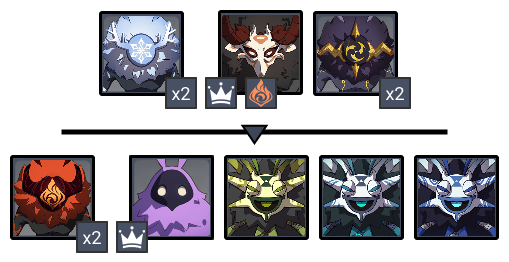
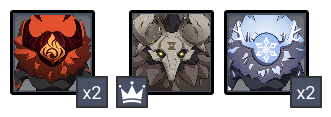
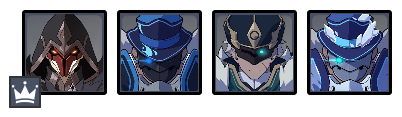
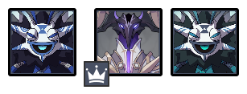
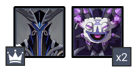

# Floor 10

## Divergence

There will be a **Leader **amongst the opponents present in each challenge on this floor. Its **Attendants **will also be present to provide it with enhancements and protection.

Each **Attendant **will increase the **Leader's All RES** by **10%**. The **Attendants **will **restore the Leader's HP** every **12s**, with each **Attendant **restoring **5% HP**.

When there are no Attendants, the Leader will not have any of the above enhancement and restoration effects.

## General Tips

Focus on the **Attendants** first. Enemies can be fairly spread out so characters with **CC **and/or **AoE Damage** are highly preferred.

## Team Recommendations

|                            |                                                                                                              Side 1                                                                                                              |                                                                                                                                       Side 2                                                                                                                                      |
| -------------------------- | :------------------------------------------------------------------------------------------------------------------------------------------------------------------------------------------------------------------------------: | :-------------------------------------------------------------------------------------------------------------------------------------------------------------------------------------------------------------------------------------------------------------------------------: |
| **Shieldbreakers**         |                                                                                                 |                                                                                                                                                     |
| **Preferred DPS Elements** |                                                                                                                                                                                                                                  |                                                                                                                                                                                                                                                                                   |
| **Avoid DPS Elements**     |                                                                                                                                                                                        |                                                                                                                                                                                                                                      |
| **4**★ **Supports**        |  |  |
| **5**★ **Supports**        |                                                                                                                         |                                                                |

## Chamber 1

**Monster Level - 80**

### Side 1

|                                                                        |            |
| ---------------------------------------------------------------------- | ---------- |
| **In Depth Guide**                                                     | Other Info |
| [Electro Abyss Mage](../../monsters/abyss-order/electro-abyss-mage.md) |            |

The **Archers** are spread out at the start of the first wave. Clear them out one at a time.

In the second wave, target the **Hydro Samachurl** first, as they can heal allies. The **Dendro Samachurl** should often go next since their abilities are annoying.

### Side 2

The **Archers** are spread out at the start. Try and group them with an ability.

While attacking the **Archers**, watch for the indicators on the ground for the **Stonehide Lawachurl's** attacks, and dodge accordingly.

## Chamber 2

**Monster Level - 82**

### Side 1

|                                                                            |            |
| -------------------------------------------------------------------------- | ---------- |
| **In Depth Guide**                                                         | Other Info |
| [Pyro Agent](../../monsters/fatui/pyro-agent.md)                           |            |
| [Hydrogunner Legionnaire](../../monsters/fatui/hydrogunner-legionnaire.md) |            |
| [Cryogunner Legionnaire](../../monsters/fatui/cryogunner-legionnaire.md)   |            |

Focus the **Hydrogunner** first as he will heal his allies. After that, deal with the **Attendants** as normal.

### Side 2

|                                                                          |            |
| ------------------------------------------------------------------------ | ---------- |
| **In Depth Guide**                                                       | Other Info |
| [Electro Cicin Mage](../../monsters/fatui/electro-cicin-mage.md)         |            |
| [Electrohammer Vanguard](../../monsters/fatui/electrohammer-vanguard.md) |            |

Having an​character on this side helps greatly, as their CC skills can pick up all enemies other than the **Electrohammer**.

## Chamber 3

**Monster Level - 84**

### Side 1

|                                                            |            |
| ---------------------------------------------------------- | ---------- |
| **In Depth Guide**                                         | Other Info |
| [Abyss Lector](../../monsters/abyss-order/abyss-lector.md) |            |

Fcous the **Hydro Samachurl** first, followed by the **Anemo Samachurl**.

### Side 2

|                                                            |            |
| ---------------------------------------------------------- | ---------- |
| **In Depth Guide**                                         | Other Info |
| [Abyss Herald](../../monsters/abyss-order/abyss-herald.md) |            |

It is highly recommended to bring one or morefor the **Abyss Herald's** shield phase.
