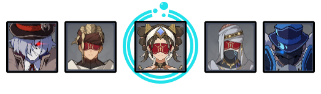

# Floor 10

## Divergence

When **Spread** or **Aggravate** reactions are triggered on opponents, DMG done by these reactions will be increased by **75%**.


In order to trigger these reactions, you will first need to trigger  **Quicken** by applying +

**Spread** is triggered by applyingto **Quickened** enemies

**Aggravate** is triggered by applyingto **Quickened** enemies


## General Tips

## Team Recommendations

|                            |                                          Side 1                                          |                                         Side 2                                         |
| -------------------------- | :--------------------------------------------------------------------------------------: | :------------------------------------------------------------------------------------: |
| **Shieldbreakers**         |  | or |
| **Preferred DPS Elements** |                                            |                                                                                        |
| **Avoid DPS Elements**     |                                                                                          |                                           |
| **4**★ **Supports**        |                                                                                          |                                                                                        |
| **5**★ **Supports**        |                                                                                          |                                                                                        |

## Chamber 1

**Monster Level - 80**

### Side 1

<figure><figcaption></figcaption></figure>

| In Depth Guide                                                                  | Other Info |
| ------------------------------------------------------------------------------- | ---------- |
| [winged-cryoshroom.md](../../monsters/mushrooms/winged-cryoshroom.md "mention") |            |

The Dendro mushrooms like to attack from range. Go to wards them first and the other enemies should naturally follow.

Bring ancharacter that can group enemies if possible.

### Side 2

<figure><figcaption></figcaption></figure>

| In Depth Guide                                                              | Other Info |
| --------------------------------------------------------------------------- | ---------- |
| [bathysmal-vishap.md](../../monsters/vishaps/bathysmal-vishap.md "mention") |            |

Fighting close to a wall will make it easier to keep the Vishaps grouped together.

## Chamber 2

**Monster Level - 82**

### Side 1

<figure><figcaption></figcaption></figure>

| In Depth Guide                                            | Other Info |
| --------------------------------------------------------- | ---------- |
| [kairagi.md](../../monsters/samurai/kairagi.md "mention") |            |
| Eremite Crossbow                                          |            |

Bring ancharacter that can group enemies if possible.

You can also group the enemies by running directly forward past the samurai at the start, letting the Eremite Crossbows move together.

Remember to try and kill the two Kairagis at the same time if possible, otherwise they will heal.

### Side 2

<figure><figcaption></figcaption></figure>

| In Depth Guide                                                                                                                                                                                              | Other Info |
| ----------------------------------------------------------------------------------------------------------------------------------------------------------------------------------------------------------- | ---------- |
| 
<a data-mention href="../../monsters/hilichurls/lawachurls/thunderhelm-lawachurl.md">thunderhelm-lawachurl.md</a> > Engulfing Storm (<a data-mention href="../../mechanics/debuffs/">debuffs</a>)
 |            |
| 
<a data-mention href="../../monsters/abyss-order/electro-abyss-mage.md">electro-abyss-mage.md</a> > <a data-mention href="../../mechanics/auras/lightning-stake.md">lightning-stake.md</a>
        |            |

If you lack damage, go for the Electro Abyss mage first as it has less HP and you won't have to deal with two Auras at the same time.

If your team is well invested however, go for the Lawachurl first as it is much tankier, and start doing damage. The Abyss mage will teleport to you.

## Chamber 3

**Monster Level - 84**

### Side 1

<figure><figcaption></figcaption></figure>

| In Depth Guide                                                                                                       | Other Info |
| -------------------------------------------------------------------------------------------------------------------- | ---------- |
| 
Eremite Desert Clearwater > <a data-mention href="../../mechanics/auras/mist-bubble.md">mist-bubble.md</a>
 |            |
| Eremite Sunfrost                                                                                                     |            |
| Eremite Daythunder                                                                                                   |            |
| [hydrogunner-legionnaire.md](../../monsters/fatui/hydrogunner-legionnaire.md "mention")                              |            |
| [pyroslinger.md](../../monsters/fatui/pyroslinger.md "mention")                                                      |            |

Go for the Hydrogunner first to prevent it from healing and also so you don't have to deal with shields.

Next, aim for the Pyroslinger and try to kill it before he shields as well.

The Eremite elites will power up when they reach half HP, so avoid doing too much damage to them as you're finishing off the Fatui if you have a hard time with their attacks.

Bring ancharacter that can group enemies if possible.

### Side 2

<figure><figcaption></figcaption></figure>

| In Depth Guide                                                                                                                                                             | Other Info |
| -------------------------------------------------------------------------------------------------------------------------------------------------------------------------- | ---------- |
| 
<a data-mention href="../../monsters/fatui/mirror-maiden.md">mirror-maiden.md</a> > Slowing Waters (<a data-mention href="../../mechanics/debuffs/">debuffs</a>)
 |            |
| [electro-cicin-mage.md](../../monsters/fatui/electro-cicin-mage.md "mention")                                                                                              |            |

Run directly towards the Mirror Maiden to start and let the Cicin mages come to you.

Characters that can disable the mages so they don't teleport can be very helpful here. Somecharacters can do this with bursts, otherwise you may want to use a Freeze team to keep them grouped together longer.
