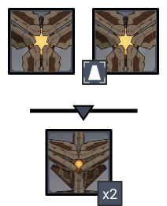
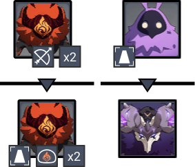
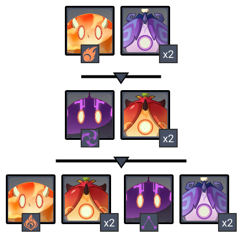
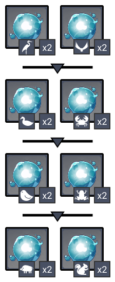

# Floor 11

## Divergence

**Normal Attack DMG** dealt by all party members increased by **50%.**

## General Tips

Using a different team and focusing on starring one chamber at a time is recommended, especially if you're limited in your character options. There are a lot of mobs that have elemental immunities.

## Team Recommendations

|                            |                                          Side 1                                         |                                          Side 2                                          |
| -------------------------- | :-------------------------------------------------------------------------------------: | :--------------------------------------------------------------------------------------: |
| **Shieldbreakers**         |                                                                                         |   /  |
| **Preferred DPS Elements** |    |      |
| **Avoid DPS Elements**     |  |  |
| **4**★ **Supports**        |                                            ​​                                           |                                      |
| **5**★ **Supports**        |                                                                                         |                                    |

## Chamber 1

**Monster Level - 88**

### Side 1

| In Depth Guide                                                                  | Other Info |
| ------------------------------------------------------------------------------- | ---------- |
| [ruin-cruiser.md](../../monsters/ruin-constructs/ruin-cruiser.md "mention")     | 204K HP    |
| [ruin-destroyer.md](../../monsters/ruin-constructs/ruin-destroyer.md "mention") | 204K HP    |

The Ruin Cruiser on the right aggros the Monolith. Focus that one first.

In the second wave, the Ruin Destroyers spawn on the left/right sides of the monolith. Try and lure both of them by moving to the front. If you place the monolith between you and a Ruin Destroyer, it might take incidental damage.

Avoid fighting near the Monolith as both enemies have AoE attacks which can cause splash damage.

### Side 2

| In Depth Guide                                                                                      | Other Info |
| --------------------------------------------------------------------------------------------------- | ---------- |
| Hilichurl Archer                                                                                    | 35K HP     |
| Hilichurl Bomber                                                                                    | 43K HP     |
| [electro-abyss-mage.md](../../monsters/abyss-order/electro-abyss-mage.md "mention")                 | 87K HP     |
| [thunderhelm-lawachurl.md](../../monsters/hilichurls/lawachurls/thunderhelm-lawachurl.md "mention") | 391K HP    |

Focus order:

* Electro Abyss Mage
* Hilichurl Archer x2
* Hilichurl Bomber x2
* Thunderhelm Lawachurl

Focus the Electro Abyss Mage immediately. If you do not, it will teleport to the Monolith and likely use it's AoE skill which will damage the Monolith. Fighting near the Monolith will also let the Hilichurl Archers deal damage.

Once the Lawachurl spawns, try to keep well away from the Monolith, as it can do large AoE attacks that will splash onto the Monolith.

## Chamber 2

**Monster Level - 90**

### Side 1

| In Depth Guide                                                                                                                                                                                                                                                                                                                                    | Other Info |
| ------------------------------------------------------------------------------------------------------------------------------------------------------------------------------------------------------------------------------------------------------------------------------------------------------------------------------------------------- | ---------- |
| 
Slimes > <a data-mention href="../../mechanics/auras/pursuing-fireball.md">pursuing-fireball.md</a> > <a data-mention href="../../mechanics/debuffs/#aura-debuff">#aura-debuff</a> (Engulfing Storm, Smoldering flames) > <a data-mention href="../../mechanics/auras/lightning-stake.md">lightning-stake.md</a><strong></strong>
 | 97K HP     |
| ****[pyro-specter.md](../../monsters/specters/pyro-specter.md "mention")****                                                                                                                                                                                                                                                                      | 148K HP    |
| [electro-specter.md](../../monsters/specters/electro-specter.md "mention")                                                                                                                                                                                                                                                                        | 148K HP    |

Highly recommended to useordamage.

It's possible to use a mix of​​and​​damage still by being careful to hit the correct units, however you may be limiting your damage potential.

### Side 2

| In Depth Guide                             | Other Info                                                                                                                     |
| ------------------------------------------ | ------------------------------------------------------------------------------------------------------------------------------ |
| [mimics](../../monsters/mimics/ "mention") | 
39K HP (Crane, Raptor) 68K HP (Ferret/Squirrel) 78K HP (Crab, Mallard) 146K HP (Frog, Finch) 165K HP (Boar)
 |

Avoid using **Bennett** on this side as a support. Infusing yourself withallows Mimics to **Vaporize** their attacks on you for 2x damage.

Usingis highly recommended to **Freeze** the Mimics, making this side much easier.

Make sure you have something that can hit the **Raptor** Mimics that fly in the air.

The 3rd wave can be particularly deadly, as the enemies each will explode on death. If you kill them at the same time, their combined explosions can easily take out a character. Either try to space out killing them, or use a Elemental Burst to i-frame the explosions all at once.

## Chamber 3

**Monster Level - 92**

### Side 1

| In Depth Guide                                                      | Other Info |
| ------------------------------------------------------------------- | ---------- |
| [mirror-maiden.md](../../monsters/fatui/mirror-maiden.md "mention") | 478K HP    |
| [kairagi.md](../../monsters/samurai/kairagi.md "mention")           | 382K HP    |

Killing one Kairagi will cause the other to heal and become resistance to CC. Try to kill both at the same time if possible.

Focus the Mirror Maiden first so you have an easier time with killing Kairagi at the same time.

You can also run past the enemies closer to the front edge of the arena and the Kairagi's will do a lunging attack towards you and group.

### Side 2

| In Depth Guide                                                                       | Other Info |
| ------------------------------------------------------------------------------------ | ---------- |
| [thunder-manifestation.md](../../monsters/elites/thunder-manifestation.md "mention") | 1.1M       |

Using ranged characters are preferred as the enemy moves around a lot.

The Thunder Manifestation will lead off with a [#charging-blast](../../monsters/elites/thunder-manifestation.md#charging-blast "mention") attack. If you stay in this AoE, the rage meter will charge immediately and make it much harder to hit. It's recommended to avoid this attack (shown below). You don't have to move so far back though, just avoid the circle around it.



See [thunder-manifestation.md](../../monsters/elites/thunder-manifestation.md "mention") for more tips on this enemy.
