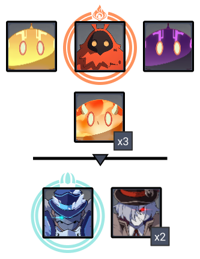

# Floor 11

## Divergence

All characters in the party gain a **+75%** **DMG**

## General Tips

CC skills are very helpful on both sides, so try to include one on each team. Othercharacters like **Jean, Anemo MC** are less effective than the suggested below, but will work if needed.

**Freeze** based teams are very strong here for either side on all chambers, particularly if you are struggling with the Monolith Defense on Chamber 1.

Being able to kill the Fatui with the Aura in Chamber 2 before they shield will make it easier to meet shieldbreaking requirements for teams. If you can do that, then you only needfor Side 1 and for Side 2.

## Team Recommendations

|                            |                                                   Side 1                                                  |                                                                                                                                                                                                   Side 2                                                                                                                                                                                                  |
| -------------------------- | :-------------------------------------------------------------------------------------------------------: | :-------------------------------------------------------------------------------------------------------------------------------------------------------------------------------------------------------------------------------------------------------------------------------------------------------------------------------------------------------------------------------------------------------: |
| **Shieldbreakers**         |                      |                                                                                                                                                                                                                                                                                                                    |
| **Preferred DPS Elements** |                                                                 |                                                                                                                                                                                                                                                                                                                                                                 |
| **Avoid DPS Elements**     |                    |                                                                                                                                                                                                                                                                                                                   |
| **4**★ **Supports**        |                                                     |                                                                                                                                                                                                                                                                                                                                                     |
| **5**★ **Supports**        |  | ​​​​ |

## Chamber 1

**Monster Level - 88**

### Side 1

| In Depth Guide                                                                          | Other Info |
| --------------------------------------------------------------------------------------- | ---------- |
| [classic-hilichurls.md](../../monsters/hilichurls/classic-hilichurls.md "mention")      | 43K HP     |
| [anemo-samachurl.md](../../monsters/hilichurls/samachurls/anemo-samachurl.md "mention") | 43K HP     |
| [hydro-samachurl.md](../../monsters/hilichurls/samachurls/hydro-samachurl.md "mention") | 43K HP     |
| Mitachurls                                                                              | 130K HP    |

Attack order

* Go for the **Anemo Samachurl** first, as it can CC you
  * This spawns the **Hydro Samachurl**, but it will not damage the monolith, but may heal other enemies
* Go for the **Hilichurl Grenadiers**
  * This spawns two **Hilichurl Archers** who attack you, but their attacks often will splash onto the monolith
* Go for the **Hilichurl Fighters** clustered around the Monolith
  * This spawns **Hilichurl Berserkers** that attack you
* Go for the **Hilichurl Archers**
* Go for the **Hilichurl Grenadiers** that spawn
* Now, there should only be **3 Hilichurl Berserkers** that are going for you. Each time you kill one, a **Hilichurl Fighter** will spawn and run at the monolith. Switch focus to it each time that happens.
* Last, two **Mitachurls** will spawn that go straight for the monolith. Kill them as quickly as possible.

If you only have one recommended, use it on the other side and put your weaker CC on this side.

### Side 2

| In Depth Guide              | Other Info |
| --------------------------- | ---------- |
| Treasure Hoarder Marksmen   | 52K HP     |
| Treasure Hoarder Potioneers | 70K HP     |
| Treasure Hoarders (Melee)   | 87K HP     |

Attack Order

* Go for the **Potioneers** first
* Attack the **Crushers** next. They should be grouped together, so using CC on them is effective
* Go for the **Gravedigger** last
* In the next wave, go for the **Potioneers** again
* Followed by the **Puglisists**
* Then the **Marksmen** last
* In the final wave, go for the **Potioneers** again
  * They are fairly spread out. This is where havinghelps a lot
* Go for the **Oarsmen** last

If you only have one recommended, use it on this side and put your weaker CC on Side 1.

## Chamber 2

**Monster Level - 90**

### Side 1

| In Depth Guide                                                                                                                                                                                                             | Other Info |
| -------------------------------------------------------------------------------------------------------------------------------------------------------------------------------------------------------------------------- | ---------- |
| Slimes                                                                                                                                                                                                                     | 97K HP     |
| 
<a data-mention href="../../monsters/abyss-order/pyro-abyss-mage.md">pyro-abyss-mage.md</a> > Smoldering Flame (<a data-mention href="../../mechanics/debuffs/">debuffs</a>)
                                     | 97K HP     |
| 
<a data-mention href="../../monsters/fatui/cryogunner-legionnaire.md">cryogunner-legionnaire.md</a><strong></strong> <strong></strong>> <a data-mention href="../../mechanics/auras/ice-cage.md">ice-cage.md</a>
 | 195K HP    |
| ****[pyroslinger.md](../../monsters/fatui/pyroslinger.md "mention")                                                                                                                                                        | 146K HP    |

Go for the **Pyro Abyss Mage** first, as the slimes will naturally group. This also gets rid of the Aura.

In the next wave, try and focus the **Cryogunner** down before he can shield, and so you don't have to deal with **Ice Cage**.

If you can kill the **Cryogunner** before shields, you can skip bringingfor shieldbreaking on this side.

### Side 2

| In Depth Guide                                                                                                                                                                                                                     | Other Info |
| ---------------------------------------------------------------------------------------------------------------------------------------------------------------------------------------------------------------------------------- | ---------- |
| Slimes                                                                                                                                                                                                                             | 97K HP     |
| 
<a data-mention href="../../monsters/abyss-order/hydro-abyss-mage.md">hydro-abyss-mage.md</a> > Slowing Waters (<a data-mention href="../../mechanics/debuffs/">debuffs</a>)
                                             | 97K HP     |
| 
<a data-mention href="../../monsters/fatui/hydrogunner-legionnaire.md">hydrogunner-legionnaire.md</a><strong></strong> <strong></strong>> <a data-mention href="../../mechanics/auras/mist-bubble.md">mist-bubble.md</a>
 | 146K HP    |
| [electrohammer-vanguard.md](../../monsters/fatui/electrohammer-vanguard.md "mention")                                                                                                                                              | 195K HP    |

Go for the **Hydro Abyss Mage** first, as the slimes will naturally group. This also gets rid of the Aura.

In the next wave, try and focus the **Hydrogunner** down before he can shield.

If you can kill the **Cryogunner** before shields, you can skip bringingfor shieldbreaking on this side.

## Chamber 3

**Monster Level - 92**

### Side 1

| In Depth Guide                                                                                                                                                         | Other Info |
| ---------------------------------------------------------------------------------------------------------------------------------------------------------------------- | ---------- |
| [rifthound-whelp.md](../../monsters/rifthounds/rifthound-whelp.md "mention")                                                                                           | 191K HP    |
| 
<a data-mention href="../../monsters/fatui/pyro-agent.md">pyro-agent.md</a> > Smoldering Flame (<a data-mention href="../../mechanics/debuffs/">debuffs</a>)
 | 256K HP    |

**Freeze** comps work well here as the enemies are very mobile.

CC skills also work well here to keep the **Pyro Agents** disabled.

Make sure you have good AoE for dealing with the **Rifthounds**.

Try to save a burstCC immediately for the second wave. This will group the Agents the quickest, while also preventing them from going invisible.

### Side 2

| In Depth Guide                                                                                                                                                             | Other Info |
| -------------------------------------------------------------------------------------------------------------------------------------------------------------------------- | ---------- |
| [rifthound-whelp.md](../../monsters/rifthounds/rifthound-whelp.md "mention")                                                                                               | 191K HP    |
| 
<a data-mention href="../../monsters/fatui/mirror-maiden.md">mirror-maiden.md</a> > Slowing Waters (<a data-mention href="../../mechanics/debuffs/">debuffs</a>)
 | 478K HP    |
| [electro-cicin-mage.md](../../monsters/fatui/electro-cicin-mage.md "mention")                                                                                              | 256K HP    |

**Freeze** comps work well here as the enemies are very mobile.

CC skills also work well here to keep the **Mages** disabled.

Make sure you have good AoE for dealing with the **Rifthounds**.

Aim for the **Mirror Maiden** first in the second wave, as the **Slowing Waters** aura will increase you CDs and hurt your DPS if you leave it too long.

Move towards the top/north side of the Arena and let the wolves group on you. This is where the **Mirror Maiden** will spawn. Try to save a burstCC immediately for her as she teleports and her attacks can be hard to avoid.
