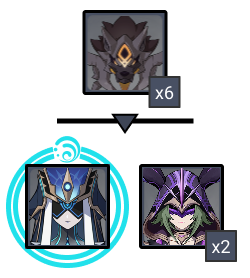

# Floor 11

## Divergence

All characters in the party gain a **+75%** **DMG**

## General Tips

## Team Recommendations

|                            | Side 1 | Side 2 |
| -------------------------- | :----: | :----: |
| **Shieldbreakers**         |        |        |
| **Preferred DPS Elements** |        |        |
| **Avoid DPS Elements**     |        |        |
| **4**★ **Supports**        |        |        |
| **5**★ **Supports**        |        |        |

## Chamber 1

**Monster Level - 88**

### Side 1

| In Depth Guide                                                                          | Other Info |
| --------------------------------------------------------------------------------------- | ---------- |
| [classic-hilichurls.md](../../monsters/hilichurls/classic-hilichurls.md "mention")      | 43K HP     |
| [anemo-samachurl.md](../../monsters/hilichurls/samachurls/anemo-samachurl.md "mention") | 43K HP     |
| [hydro-samachurl.md](../../monsters/hilichurls/samachurls/hydro-samachurl.md "mention") | 43K HP     |
| Mitachurls                                                                              | 130K HP    |

### Side 2

| In Depth Guide              | Other Info |
| --------------------------- | ---------- |
| Treasure Hoarder Marksmen   | 52K HP     |
| Treasure Hoarder Potioneers | 70K HP     |
| Treasure Hoarders (Melee)   | 87K HP     |

## Chamber 2

**Monster Level - 90**

### Side 1

| In Depth Guide                                                                                                                                                                                                             | Other Info |
| -------------------------------------------------------------------------------------------------------------------------------------------------------------------------------------------------------------------------- | ---------- |
| Slimes                                                                                                                                                                                                                     | 97K HP     |
| 
<a data-mention href="../../monsters/abyss-order/pyro-abyss-mage.md">pyro-abyss-mage.md</a> > Smoldering Flame (<a data-mention href="../../mechanics/debuffs/">debuffs</a>)
                                     | 97K HP     |
| 
<a data-mention href="../../monsters/fatui/cryogunner-legionnaire.md">cryogunner-legionnaire.md</a><strong></strong> <strong></strong>> <a data-mention href="../../mechanics/auras/ice-cage.md">ice-cage.md</a>
 | 195K HP    |
| ****[pyroslinger.md](../../monsters/fatui/pyroslinger.md "mention")                                                                                                                                                        | 146K HP    |

### Side 2

| In Depth Guide                                                                                                                                                                                                                     | Other Info |
| ---------------------------------------------------------------------------------------------------------------------------------------------------------------------------------------------------------------------------------- | ---------- |
| Slimes                                                                                                                                                                                                                             | 97K HP     |
| 
<a data-mention href="../../monsters/abyss-order/hydro-abyss-mage.md">hydro-abyss-mage.md</a> > Slowing Waters (<a data-mention href="../../mechanics/debuffs/">debuffs</a>)
                                             | 97K HP     |
| 
<a data-mention href="../../monsters/fatui/hydrogunner-legionnaire.md">hydrogunner-legionnaire.md</a><strong></strong> <strong></strong>> <a data-mention href="../../mechanics/auras/mist-bubble.md">mist-bubble.md</a>
 | 146K HP    |
| [electrohammer-vanguard.md](../../monsters/fatui/electrohammer-vanguard.md "mention")                                                                                                                                              | 195K HP    |

## Chamber 3

**Monster Level - 92**

### Side 1

| In Depth Guide                                                                                                                                                         | Other Info |
| ---------------------------------------------------------------------------------------------------------------------------------------------------------------------- | ---------- |
| [rifthound-whelp.md](../../monsters/rifthounds/rifthound-whelp.md "mention")                                                                                           | 191K HP    |
| 
<a data-mention href="../../monsters/fatui/pyro-agent.md">pyro-agent.md</a> > Smoldering Flame (<a data-mention href="../../mechanics/debuffs/">debuffs</a>)
 | 256K HP    |

### Side 2

| In Depth Guide                                                                                                                                                             | Other Info |
| -------------------------------------------------------------------------------------------------------------------------------------------------------------------------- | ---------- |
| [rifthound-whelp.md](../../monsters/rifthounds/rifthound-whelp.md "mention")                                                                                               | 191K HP    |
| 
<a data-mention href="../../monsters/fatui/mirror-maiden.md">mirror-maiden.md</a> > Slowing Waters (<a data-mention href="../../mechanics/debuffs/">debuffs</a>)
 | 478K HP    |
| [electro-cicin-mage.md](../../monsters/fatui/electro-cicin-mage.md "mention")                                                                                              | 256K HP    |

