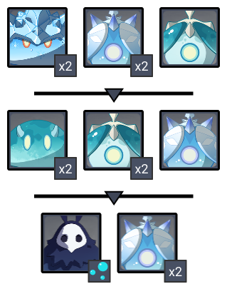
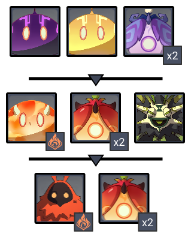

# Floor 11

## Divergence

All characters in the party gain a **+60%** **DMG**

All party members gain **30% Healing Bonus**.

## General Tips

## Team Recommendations

|                            | Side 1 | Side 2 |
| -------------------------- | :----: | :----: |
| **Shieldbreakers**         |        |        |
| **Preferred DPS Elements** |        |        |
| **Avoid DPS Elements**     |        |        |
| **4**★ **Supports**        |   ​​   |        |
| **5**★ **Supports**        |        |        |

## Chamber 1

**Monster Level - 88**

### Side 1

| In Depth Guide                                                                                                                                                                                                                      | Other Info                      |
| ----------------------------------------------------------------------------------------------------------------------------------------------------------------------------------------------------------------------------------- | ------------------------------- |
| [abyss-herald.md](../../monsters/abyss-order/abyss-herald.md "mention")                                                                                                                                                             | 347K (278K before shielding) HP |
| 
<a data-mention href="../../monsters/abyss-order/cryo-abyss-mage.md">cryo-abyss-mage.md</a><strong></strong> <strong>></strong> <a data-mention href="../../mechanics/auras/ice-cage.md">ice-cage.md</a><strong></strong>
 | 87K HP                          |

### Side 2

| In Depth Guide                                                                                                                                                                                                                                                                     | Other Info |
| ---------------------------------------------------------------------------------------------------------------------------------------------------------------------------------------------------------------------------------------------------------------------------------- | ---------- |
| [pyro-whopperflower.md](../../monsters/animals/pyro-whopperflower.md "mention")                                                                                                                                                                                                    | 130K HP    |
| [electro-whopperflower.md](../../monsters/animals/electro-whopperflower.md "mention")                                                                                                                                                                                              | 130K HP    |
| 
<a data-mention href="../../monsters/vishaps/geovishap.md">geovishap.md</a> > <a data-mention href="../../mechanics/debuffs/#aura-debuff">#aura-debuff</a>(Smoldering Flame) > <a data-mention href="../../mechanics/auras/lightning-stake.md">lightning-stake.md</a>
 | 347K HP    |

## Chamber 2

**Monster Level - 90**

### Side 1

| In Depth Guide                                                                                                                                                                                                                              | Other Info |
| ------------------------------------------------------------------------------------------------------------------------------------------------------------------------------------------------------------------------------------------- | ---------- |
| Cryo Slime                                                                                                                                                                                                                                  | 97K HP     |
| [cryo-specter.md](../../monsters/specters/cryo-specter.md "mention")                                                                                                                                                                        | 148K HP    |
| ****[hydro-specter.md](../../monsters/specters/hydro-specter.md "mention")****                                                                                                                                                              | 148K HP    |
| 
<a data-mention href="../../monsters/abyss-order/hydro-abyss-mage.md">hydro-abyss-mage.md</a><strong></strong> <strong>></strong> <a data-mention href="../../mechanics/auras/mist-bubble.md">mist-bubble.md</a><strong></strong>
 | 97K HP     |

### Side 2

| In Depth Guide                                                                                                                                                                                        | Other Info |
| ----------------------------------------------------------------------------------------------------------------------------------------------------------------------------------------------------- | ---------- |
| Electro Slime                                                                                                                                                                                         | 97K HP     |
| [electro-specter.md](../../monsters/specters/electro-specter.md "mention")                                                                                                                            | 148K HP    |
| 
Pyro Slime > <a data-mention href="../../mechanics/debuffs/#aura-debuff">#aura-debuff</a>(Smoldering Flame)
                                                                                 | 97K HP     |
| [pyro-specter.md](../../monsters/specters/pyro-specter.md "mention")                                                                                                                                  | 148K HP    |
| [dendro-samachurl.md](../../monsters/hilichurls/samachurls/dendro-samachurl.md "mention")                                                                                                             | 49K HP     |
| 
<a data-mention href="../../monsters/abyss-order/pyro-abyss-mage.md">pyro-abyss-mage.md</a> > <a data-mention href="../../mechanics/debuffs/#aura-debuff">#aura-debuff</a>(Smoldering Flame
 | 97K HP     |

## Chamber 3

**Monster Level - 92**

### Side 1

| In Depth Guide                                                               | Other Info |
| ---------------------------------------------------------------------------- | ---------- |
| [rifthound.md](../../monsters/rifthounds/rifthound.md "mention")             | 558K HP    |
| [rifthound-whelp.md](../../monsters/rifthounds/rifthound-whelp.md "mention") | 191K HP    |

### Side 2

| In Depth Guide                                                                    | Other Info                    |
| --------------------------------------------------------------------------------- | ----------------------------- |
| [abyss-lector-pyro.md](../../monsters/abyss-order/abyss-lector-pyro.md "mention") | 409K HP (327K before shields) |
| [abyss-lector.md](../../monsters/abyss-order/abyss-lector.md "mention")           | 409K HP (327K before shields) |

