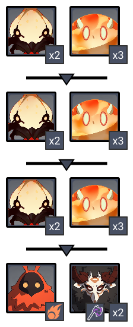
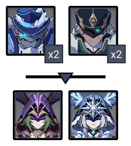
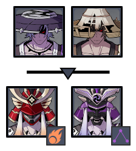

# Floor 11 (v2.2)

## Divergence

**DMG** dealt by all party members increased by **60%.**

**DMG** dealt by all party members increased by **60%.**

## General Tips

Try to build teams to take advantage of the divergence buffs. In particular,is very favored Side 1 andis very favored Side 2.

Having the correct elements for each side is crucial here, as there are immune enemies for each side. Do not useDPS Side 1 and do not useDPS Side 2.

## Team Recommendations

|                            |                                                                                                                                    Side 1                                                                                                                                   |                                                                             Side 2                                                                             |
| -------------------------- | :-------------------------------------------------------------------------------------------------------------------------------------------------------------------------------------------------------------------------------------------------------------------------: | :------------------------------------------------------------------------------------------------------------------------------------------------------------: |
| **Shieldbreakers**         |                                                                                                                                                                                         |                                                                                                                     |
| **Preferred DPS Elements** |                                                                                                                                                                                                                                   |                                                                           |
| **Avoid DPS Elements**     |                                                                                                                                                                                                                                  |                                                                                                                      |
| **4**★ **Supports**        |  |                                                    |
| **5**★ **Supports**        |                                                                                                                 |  |

## Chamber 1

**Monster Level - 80**

### Side 1

| In Depth Guide                                                                                                                                                                              | Other Info |
| ------------------------------------------------------------------------------------------------------------------------------------------------------------------------------------------- | ---------- |
| [electro-whopperflower.md](../../monsters/animals/electro-whopperflower.md "mention")                                                                                                       | 130K HP    |
| 
<a data-mention href="../../monsters/abyss-order/hydro-abyss-mage.md">hydro-abyss-mage.md</a>

> <a data-mention href="../../mechanics/auras/mist-bubble.md">mist-bubble.md</a>
 | 87K HP     |
| [electro-abyss-mage.md](../../monsters/abyss-order/electro-abyss-mage.md "mention")****                                                                                                     | 87K HP     |

**Bringing a crowd controller** can help beat the slimes and whopper flowers faster, however enemies here will naturally group no matter who you focus.

Target the **Hydro Abyss Mage** first in order to stop the **Mist Bubbles** Aura.

### Side 2

****

| In Depth Guide                                                                                                                                                                              | Other Info |
| ------------------------------------------------------------------------------------------------------------------------------------------------------------------------------------------- | ---------- |
| [electro-whopperflower.md](../../monsters/animals/electro-whopperflower.md "mention")                                                                                                       | 130K HP    |
| 
<a data-mention href="../../monsters/abyss-order/hydro-abyss-mage.md">hydro-abyss-mage.md</a>

> <a data-mention href="../../mechanics/auras/mist-bubble.md">mist-bubble.md</a>
 | 87K HP     |
| [electro-abyss-mage.md](../../monsters/abyss-order/electro-abyss-mage.md "mention")****                                                                                                     | 87K HP     |

Target the **Pyro Abyss Mage** first in order to stop the **Pursuing Fireball** Aura.

## Chamber 2

**Monster Level - 82**

### Side 1

| In Depth Guide                                                                        | Other Info |
| ------------------------------------------------------------------------------------- | ---------- |
| [cryogunner-legionnaire.md](../../monsters/fatui/cryogunner-legionnaire.md "mention") | 195K HP    |
| [anemoboxer.md](../../monsters/fatui/anemoboxer.md "mention")                         | 146K HP    |
| [cryo-cicin-mage.md](../../monsters/fatui/cryo-cicin-mage.md "mention")               | 244K HP    |
| [electro-cicin-mage.md](../../monsters/fatui/electro-cicin-mage.md "mention")         | 244K HP    |

Aim for the **Cryo Cicin Mage** first and try to stagger her before she summons cicins. The **Electro Cicin Mage** will usually come towards you.

Using CC to keep the Cicins grouped can save time, as it prevents them from teleporting.

### Side 2

| In Depth Guide                                                                                                                                                                                                                                                                   | Other Info |
| -------------------------------------------------------------------------------------------------------------------------------------------------------------------------------------------------------------------------------------------------------------------------------- | ---------- |
| [nobushi.md](../../monsters/samurai/nobushi.md "mention")                                                                                                                                                                                                                        | 148K HP    |
| 
<a data-mention href="../../monsters/samurai/kairagi.md">kairagi.md</a>

> <a data-mention href="../../mechanics/auras/pursuing-fireball.md">pursuing-fireball.md</a>

> <a data-mention href="../../mechanics/auras/lightning-stake.md">lightning-stake.md</a>
 | 356K HP    |

Killing one of the **Kairagis** causes the other to heal and become resistant to CC. Try your best to group them and kill them at the same time.

To group them together, you can either run between them along the side of the arena, or stay on one of the **Kairagi** and let the other come to you.

## Chamber 3

**Monster Level - 84**

### Side 1

| In Depth Guide                                                             | Other Info |
| -------------------------------------------------------------------------- | ---------- |
| [hydro-hypostasis.md](../../monsters/elites/hydro-hypostasis.md "mention") | 358K HP    |

See the in depth guide for tips.

Bringing based damage withfor Slime shields gives the best chance to destroy the cube in a single phase.

### Side 2

| In Depth Guide                                                           | Other Info |
| ------------------------------------------------------------------------ | ---------- |
| [pyro-hypostasis.md](../../monsters/elites/pyro-hypostasis.md "mention") | 358K HP    |

See the in depth guide for tips.

Bringingbased damage withfor shields gives the best chance to destroy the cube in a single phase.
