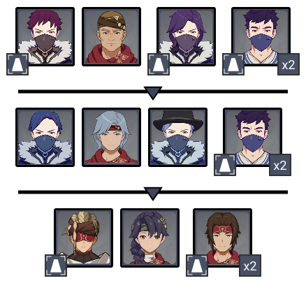
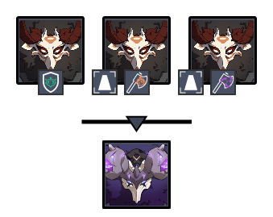
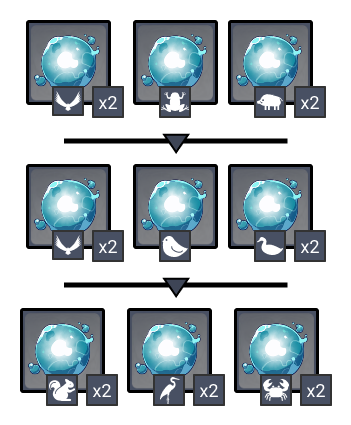
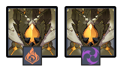
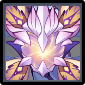

# Floor 11

## Divergence

******DMG** increased by **75%**

## General Tips

## Team Recommendations

|                            |                                                   Side 1                                                   |                                                               Side 2                                                               |
| -------------------------- | :--------------------------------------------------------------------------------------------------------: | :--------------------------------------------------------------------------------------------------------------------------------: |
| **Shieldbreakers**         |                                                                                                            | // |
| **Preferred DPS Elements** |                        |                                                                                                                                    |
| **Avoid DPS Elements**     |                                                                 |                                             |
| **4**★ **Supports**        |  |                                                                                                                                    |
| **5**★ **Supports**        |   |                                                                                                                                    |

## Chamber 1

**Monster Level - 88**

### Side 1

<figure><figcaption></figcaption></figure>

| In Depth Guide     | Other Info |
| ------------------ | ---------- |
| Eremite Sunbreaker |            |

Attack order

* Go for the melee **Crushers** first, as they do more damage to the monolith
* Next, go for the **Potioneers**
* Aim for the **Eremite** last
* Next wave, go for the melee **Crushers** first again
* Move away from the monolith and clean up the rest of the enemies
* Go for the **Eremite Crossbows** first as they are weaker
* Next, focus on the **Sunbreaker**. If you do enough damage, it should draw aggro away from the monolith
* Clean up any remaining enemies

Having a powerfulcharacter will help greatly as the enemies are spread out and easily to disable. Try to center the ability on the monolith if possible.

The **Eremite Sunbreaker** in the last wave can be quite strong. Try to save some bursts so you can quickly get rid of it.

### Side 2

<figure><figcaption></figcaption></figure>

| In Depth Guide                                                                                      | Other Info |
| --------------------------------------------------------------------------------------------------- | ---------- |
| [thunderhelm-lawachurl.md](../../monsters/hilichurls/lawachurls/thunderhelm-lawachurl.md "mention") |            |

Attack order

* Go for the two **Axe Mitachurls** first
* Move away from the monolith and go for the remaining Mitachurl
* Stay far away from the monolith and deal with the Lawachurl

## Chamber 2

**Monster Level - 90**

### Side 1

<figure><figcaption></figcaption></figure>

| In Depth Guide                             | Other Info |
| ------------------------------------------ | ---------- |
| [mimics](../../monsters/mimics/ "mention") |            |

Avoid using **Bennett** on this side as a support. Infusing yourself withallows Mimics to **Vaporize** their attacks on you for 2x damage.

Usingis highly recommended to **Freeze** the Mimics, making this side much easier.

Make sure you have something that can hit the **Raptor** Mimics that fly in the air.

### Side 2

<figure><figcaption></figcaption></figure>

| In Depth Guide                                                | Other Info |
| ------------------------------------------------------------- | ---------- |
| [geovishap.md](../../monsters/vishaps/geovishap.md "mention") |            |

Characters with shields are helpful as they can interrupt the rolling attack and briefly disable the Geovishaps.

Characters that dealdamage will be able to trigger **Melt/Vaporize** on theGeovishap consistently, which can help deal additional damage.

## Chamber 3

**Monster Level - 92**

### Side 1

<figure><figcaption></figcaption></figure>

| In Depth Guide                                                                                                                                                                     | Other Info |
| ---------------------------------------------------------------------------------------------------------------------------------------------------------------------------------- | ---------- |
| 
<a data-mention href="../../monsters/fatui/pyro-agent.md">pyro-agent.md</a> > <a data-mention href="../../mechanics/auras/pursuing-fireball.md">pursuing-fireball.md</a>
 |            |
| 
<a data-mention href="../../monsters/fatui/pyroslinger.md">pyroslinger.md</a> > Smoldering Flame (<a data-mention href="../../mechanics/debuffs/">debuffs</a>)
           |            |
| Eremite Desert Clearwater                                                                                                                                                          |            |
| Eremite Daythunder                                                                                                                                                                 |            |

Having a powerfulcharacter will help greatly as the enemies here can be easily picked up.

Aim for the enemies with the Aura effects first.

### Side 2

<figure><figcaption></figcaption></figure>

| In Depth Guide                                                               | Other Info |
| ---------------------------------------------------------------------------- | ---------- |
| [electro-regisvine.md](../../monsters/elites/electro-regisvine.md "mention") |            |

The Regisvine has greatly increased resistances until the core is broken. Focus on doing that first.

The Core will always start in the **Corolla** (head) first, so you may want to bring a Bow character in order to break it more consistently.

core is surprisingly tanky as it has no elemental weakness, and are all equally effective. If you cannot break the core quick enough before it moves, make sure you destroy the Flower that spawns at the start of the fight.

Check the [electro-regisvine.md](../../monsters/elites/electro-regisvine.md "mention") for in-depth tips.
