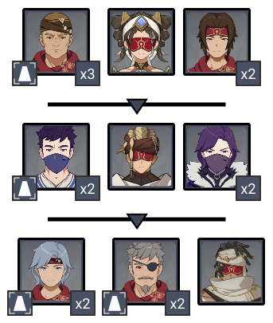
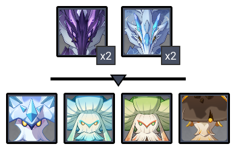
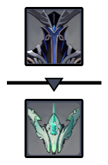
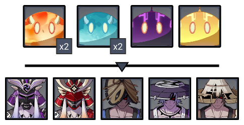

# Floor 11

## Divergence

**+75%**  **DMG**

## General Tips

Bringing  for crowd control is recommended on Side 1, and strong single target damage on Side 2.

Bringing  to break the  shields is recommended, as it is easier to deal with the Abyss Herald.

## Team Recommendations

|                            |                                                               Side 1                                                               |                                             Side 2                                            |
| -------------------------- | :--------------------------------------------------------------------------------------------------------------------------------: | :-------------------------------------------------------------------------------------------: |
| **Shieldbreakers**         |                                                                                                                                    | (and/or ) |
| **Preferred DPS Elements** |                                           (CC)                                          |    or     |
| **Avoid DPS Elements**     |  |                                                  |

## Chamber 1

**Monster Level - 88**

### Side 1

<figure><figcaption></figcaption></figure>

| In Depth Guide                                                                 | Other Info |
| ------------------------------------------------------------------------------ | ---------- |
| [desert-clearwater.md](../../monsters/eremites/desert-clearwater.md "mention") |            |
| [sunfrost.md](../../monsters/eremites/sunfrost.md "mention")                   |            |
| [daythunder.md](../../monsters/eremites/daythunder.md "mention")               |            |

Kill order:

* Focus the **3 melee Eremites**. They will group together on the monolith and will be vulnerable to CC
* Clear out the remaining enemies
* In the second wave, again focus the **2 melee Treasure Hoarders**.&#x20;
* Clear out the remaining enemies
* In the last wave, focus the **4 melee Eremites**

Melee enemies can hit quite hard, but they clump up and are vulnerable to CC. Bringing  is highly recommended.

### Side 2

<figure><figcaption></figcaption></figure>

| In Depth Guide                                                                                      | Other Info |
| --------------------------------------------------------------------------------------------------- | ---------- |
| [thunderhelm-lawachurl.md](../../monsters/hilichurls/lawachurls/thunderhelm-lawachurl.md "mention") |            |

The first wave of Mitachurls all focus the monolith, and can be quite tanky. If you have trouble killing them quickly, use skills that draw aggro. AoE skills that hit multiple times repeatedly are good for this.

The Electro Lawachurl focuses you, but make sure it's attacks don't go towards the monolith. Try to stand with your back to the edge of the arena.

## Chamber 2

**Monster Level - 90**

### Side 1

<figure><figcaption></figcaption></figure>

| In Depth Guide                                                                        | Other Info |
| ------------------------------------------------------------------------------------- | ---------- |
| [bathysmal-vishap.md](../../monsters/vishaps/bathysmal-vishap.md "mention")           |            |
| [winged-cryoshroom.md](../../monsters/mushrooms/winged-cryoshroom.md "mention")       |            |
| [grounded-hydroshroom.md](../../monsters/mushrooms/grounded-hydroshroom.md "mention") |            |
| [winged-dendroshroom.md](../../monsters/mushrooms/winged-dendroshroom.md "mention")   |            |
| [grounded-geoshroom.md](../../monsters/mushrooms/grounded-geoshroom.md "mention")     |            |

Use  to Scorch the mushroom enemies to make the fight easier.

### Side 2

<figure><figcaption></figcaption></figure>

| In Depth Guide                                                          | Other Info |
| ----------------------------------------------------------------------- | ---------- |
| [abyss-herald.md](../../monsters/abyss-order/abyss-herald.md "mention") |            |
| Consecrated Flying Serpent                                              |            |

Bringing a character than can consistently apply  is recommended for taking down the Abyss Herald shield, as it will freeze him. If you struggle for time however, you may want to bring  as it will break the shield faster.

Using  is the quickest way to get rid of the Consecrated Flying Serpent's orb, weakening it. Otherwise the fight is fairly straightforward.

## Chamber 3

**Monster Level - 92**

### Side 1

<figure><figcaption></figcaption></figure>

| In Depth Guide                                            | Other Info |
| --------------------------------------------------------- | ---------- |
| [nobushi.md](../../monsters/samurai/nobushi.md "mention") |            |
| [kairagi.md](../../monsters/samurai/kairagi.md "mention") |            |

While  can't CC the Kairagi, it can help keep the Nobushi together.

Remember to try to kill both Kairagi at the same time, otherwise the remaining one will heal.

### Side 2

<figure><figcaption></figcaption></figure>

| In Depth Guide                                                               | Other Info |
| ---------------------------------------------------------------------------- | ---------- |
| [electro-regisvine.md](../../monsters/elites/electro-regisvine.md "mention") |            |

The Regisvine has greatly increased resistances until the core is broken. Focus on doing that first.

The Core will always start in the **Corolla** (head) first, so you may want to bring a Bow character in order to break it more consistently.

core is surprisingly tanky as it has no elemental weakness, and are all equally effective. If you cannot break the core quick enough before it moves, make sure you destroy the Flower that spawns at the start of the fight.

Check the [electro-regisvine.md](../../monsters/elites/electro-regisvine.md "mention") for in-depth tips.
