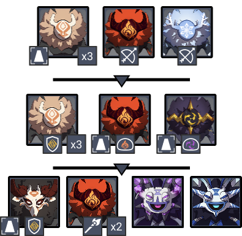
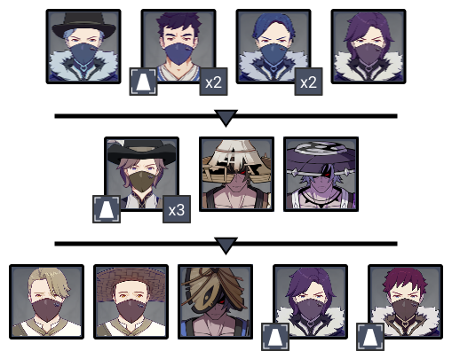
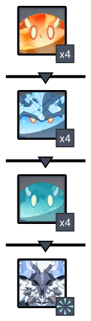
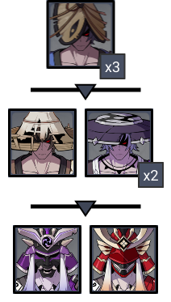
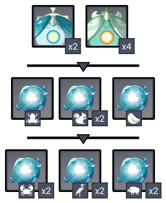
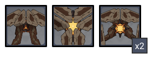

# Floor 11

## Divergence

**DMG** dealt by all party members increased by **60%.**

**DMG** dealt by all party members increased by **60%.**

## General Tips

While  /  are boosted, neither are particularly good for any chamber. You can just run your normal best compositions on either side.

## Team Recommendations

|                            |                                                                                                                                        Side 1                                                                                                                                       |                                                                                                                                                                                                                                                                                                         Side 2                                                                                                                                                                                                                                                                                                        |
| -------------------------- | :---------------------------------------------------------------------------------------------------------------------------------------------------------------------------------------------------------------------------------------------------------------------------------: | :-------------------------------------------------------------------------------------------------------------------------------------------------------------------------------------------------------------------------------------------------------------------------------------------------------------------------------------------------------------------------------------------------------------------------------------------------------------------------------------------------------------------------------------------------------------------------------------------------------------------: |
| **Shieldbreakers**         |                                                                                                                                                                                                                                           |                                                                                                                                                                                                                                                                                                                                                                                                                                                                                                                                                                                                                       |
| **Preferred DPS Elements** |                                                                                                                                                                                                 |                                                                                                                                                                                                                                                                                                                                                                                                                                                                                                                                                                                                                       |
| **Avoid DPS Elements**     |                                                                                                                                                                                                                                          |                                                                                                                                                                                                                                                                                                                                                                                                                                                                                                                                                                         |
| **4**★ **Supports**        | ​​​​ |                                                                                                                                                                                                                                                                                                                                                                                                                                                                                                                                                                 |
| **5**★ **Supports**        |                                                                                                                | ​​​​​​ |

## Chamber 1

**Monster Level - 80**

### Side 1

| In Depth Guide                                                                              | Other Info    |
| ------------------------------------------------------------------------------------------- | ------------- |
| [classic-hilichurls.md](../../monsters/hilichurls/classic-hilichurls.md "mention")          | 35K \~ 43K HP |
| [electro-samachurl.md](../../monsters/hilichurls/samachurls/electro-samachurl.md "mention") | 43K HP        |
| [hydro-samachurl.md](../../monsters/hilichurls/samachurls/hydro-samachurl.md "mention")     | 43K HP        |
| **Rockshield Mitachurl**                                                                    | 130K HP       |

Bringing an  character that can group the enemies makes this chamber fairly trivial.

For a kill order:

* First, target the **Hilichurl Fighters**
* Next, kill the remaining **Hilichurl Archers**, making sure they fire away from the monolith
* In the next wave, target the **Hilichurl Grenadiers**
* Kill the **Rockshield Hilichurls**
* In the last wave, target the **Rockshield Mitachurl**. Hitting it's shield will immediately interrupt it's path to the monolith
* Finish off the rest of the enemies, starting with the **Samachurls**

### Side 2

| In Depth Guide                                            | Other Info    |
| --------------------------------------------------------- | ------------- |
| **Treasure Hoarders**                                     | 52K \~ 87K HP |
| [nobushi.md](../../monsters/samurai/nobushi.md "mention") | 136K HP       |

Bringing an  character that can group the enemies makes this chamber fairly trivial.

For a kill order:

* First, rush immediately for the **Crushers** (melee Treasure hoarder). Fight them away from the monolith to prevent the **Potioneers** from hitting it with splash damage
* Kill the remaining enemies
* In the next wave, target the **Treasure Hoarder Archers**
* Kill the remaining enemies
* In the next wave, target the **Treasure Hoarder Potioneers**
* Kill the remaining enemies

## Chamber 2

**Monster Level - 82**

### Side 1

| In Depth Guide                                                                                                                                                                                                    | Other Info                    |
| ----------------------------------------------------------------------------------------------------------------------------------------------------------------------------------------------------------------- | ----------------------------- |
| **Slimes**                                                                                                                                                                                                        | 97K HP                        |
| 
<a data-mention href="../../monsters/hilichurls/lawachurls/frostarm-lawachurl.md">frostarm-lawachurl.md</a>

> <a data-mention href="../../mechanics/auras/elemental-blast.md">elemental-blast.md</a>
 | 
438K HP

> ?? DMG
 |

With many different **Slime** types, compositions with varied elements (such as **National**) tend to work well.

**DMG** is effective against the most enemies, but you will need another damage type for the **Pyro Slimes**.

### Side 2

| In Depth Guide                                            | Other Info |
| --------------------------------------------------------- | ---------- |
| [nobushi.md](../../monsters/samurai/nobushi.md "mention") | 148K HP    |
| [kairagi.md](../../monsters/samurai/kairagi.md "mention") | 356K HP    |

Killing one **Kairagi** will cause the other to heal if still alive (see [#tips-and-mechanics](../../monsters/samurai/kairagi.md#tips-and-mechanics "mention")). Characters with high burst damage (such as **Hu Tao** or **Eula**) are most effective as they can kill both at the same time. **Freeze** can also be used to extend how long you have to kill the second **Kairagi** before it heals.

## Chamber 3

**Monster Level - 84**

### Side 1

| In Depth Guide                                                         | Other Info |
| ---------------------------------------------------------------------- | ---------- |
| [hydro-specter.md](../../monsters/specters/hydro-specter.md "mention") | 159K HP    |
| [anemo-specter.md](../../monsters/specters/anemo-specter.md "mention") | 159K HP    |
| [hydro-frog.md](../../monsters/mimics/hydro-frog.md "mention")         | 153K HP    |
| [hydro-chick.md](../../monsters/mimics/hydro-chick.md "mention")       | 153K HP    |
| [hydro-ferret.md](../../monsters/mimics/hydro-ferret.md "mention")     | 72K HP     |
| [hydro-crab.md](../../monsters/mimics/hydro-crab.md "mention")         | 81K HP     |
| [hydro-crane.md](../../monsters/mimics/hydro-crane.md "mention")       | 41K HP     |
| [hydro-boar.md](../../monsters/mimics/hydro-boar.md "mention")         | 82K HP     |

**Spectres** spawn very spread out. If you lack damage, grouping them will save a lot of time. TO do this, run sideways (left/right) to the edge after initiating the stage, then run either up/down into a corner. This will get them to all group together.

The **Hydro Spectre** will attack you with an AoE skill that can heal allies. Be careful using compositions that put you in melee range of **Spectres**, as they can get healed this way.

Bringso you can **Freeze** the **Hydro Mimics** and deal with them easier.

The **Hydro Finch** and **Hydro Frog** in the first mimic wave will explode on death. Getting hit by both can quickly kill the active character, so be careful. You can dodge the explosion, or run out of the AoE, but the most effective strategy is simply to save an **Elemental Burst** and avoid it that way.

In the first mimic wave, the enemies will naturally group. Focus whatever is the weakest.

In the second mimic wave, go for the **Crane**, then **Crab**, then **Boars**.

### Side 2

| In Depth Guide                                                                | Other Info |
| ----------------------------------------------------------------------------- | ---------- |
| [ruin-scout.md](../../monsters/ruin-constructs/ruin-scout.md "mention")       | 335K HP    |
| [ruin-cruiser.md](../../monsters/ruin-constructs/ruin-cruiser.md "mention")   | 239K HP    |
| [ruin-defender.md](../../monsters/ruin-constructs/ruin-defender.md "mention") | 335K HP    |

There's no special strategy here aside from having good AoE damage. Focusing the **Ruin Cruiser** (triangle enemy) will naturally cause the enemies to group.
