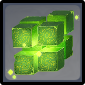

# Floor 11

## Divergence

* **+200 EM**

## General Tips

* Side 2 benefits greatly from having ancharacter to CC and group enemies (with the exception of the last chamber).
* Make sure you bring at least oneunit for the Hypostasis in 11-3-2, as it is required to be able to defeat this boss. Characters that can consistently outputlike **Collei** should be preferred over ones that rely on only skills.
* If including both for Side 2 is difficult for your composition, remember you can always beat 11-1-2 and 11-2-2 with one team, then try again with a team specific to the Dendro Hypostasis. This way you no longer have to worry about time on the first 2 chambers.

## Team Recommendations

|                            |                                                                                                          Side 1                                                                                                         |                     Side 2                    |
| -------------------------- | :---------------------------------------------------------------------------------------------------------------------------------------------------------------------------------------------------------------------: | :-------------------------------------------: |
| **Shieldbreakers**         |                                                                                                                                                                                                                         |   |
| **Preferred DPS Elements** |                                                                                                                                                                               |  |
| **Avoid DPS Elements**     |  |   |

## Chamber 1

**Monster Level - 88**

### Side 1

<figure><figcaption></figcaption></figure>

| In Depth Guide                                 | Other Info |
| ---------------------------------------------- | ---------- |
| [specters](../../monsters/specters/ "mention") |            |

Spectres spawn close together so it is not extremely important to group them if you have enough damage. However bringing anthat can group will speed up clearing this floor.

Remember Spectres are immune to their element, so make sure you bring a damage other than the 4 types of spectres on this floor.

### Side 2

<figure><figcaption></figcaption></figure>

| In Depth Guide                                                                                                                                                                     | Other Info |
| ---------------------------------------------------------------------------------------------------------------------------------------------------------------------------------- | ---------- |
| [daythunder.md](../../monsters/eremites/daythunder.md "mention")                                                                                                                   |            |
| 
<a data-mention href="../../monsters/fatui/pyro-agent.md">pyro-agent.md</a> > <a data-mention href="../../mechanics/auras/pursuing-fireball.md">pursuing-fireball.md</a>
 |            |

Make sure you bring anthat can group enemies on this side. The crossbow eremites spawn on the outside of the arena and are otherwise hard to group.

## Chamber 2

**Monster Level - 90**

### Side 1

<figure><figcaption></figcaption></figure>

| In Depth Guide                                                                            | Other Info |
| ----------------------------------------------------------------------------------------- | ---------- |
| [ruin-drake-skywatch.md](../../monsters/ruin-constructs/ruin-drake-skywatch.md "mention") |            |

Make sure to bring a **Bow** user here if you are lacking damage. You will need it to interrupt their Elemental Absorption

### Side 2

<figure><figcaption></figcaption></figure>

| In Depth Guide                                                                                                                                                               | Other Info |
| ---------------------------------------------------------------------------------------------------------------------------------------------------------------------------- | ---------- |
| [nobushi.md](../../monsters/samurai/nobushi.md "mention")                                                                                                                    |            |
| 
<a data-mention href="../../monsters/fatui/mirror-maiden.md">mirror-maiden.md</a> > <a data-mention href="../../mechanics/auras/mist-bubble.md">mist-bubble.md</a>
 |            |

Make sure you bring anthat can group enemies on this side. The crossbow eremites spawn on the outside of the arena and are otherwise hard to group.

The Potioneers in the second wave spawn apart. You can group them easier by running directly behind the Mirror Maiden. This should have them walk forward a little towards the middle.

## Chamber 3

**Monster Level - 92**

### Side 1

<figure><figcaption></figcaption></figure>

| In Depth Guide                                                | Other Info |
| ------------------------------------------------------------- | ---------- |
| [geovishap.md](../../monsters/vishaps/geovishap.md "mention") |            |

### Side 2

<figure><figcaption></figcaption></figure>

| In Depth Guide                                                               | Other Info |
| ---------------------------------------------------------------------------- | ---------- |
| [dendro-hypostasis.md](../../monsters/elites/dendro-hypostasis.md "mention") |            |

Make sure your'e familiar with the mechanics.

You need to bring at least onecharacter in order to defeat the hypostasis.

If you have ateam, using it here can be a good idea. Since the Hypostasis is infused with, it is easy to apply **Quicken** and the subsequently **Aggravate** for extra damage.
