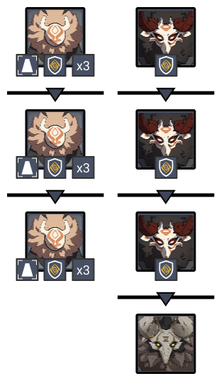
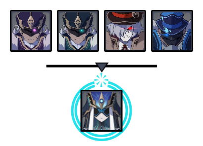

# Floor 11

## Divergence

**DMG** dealt by claymore-wielding characters increased by **75%**

## General Tips

## Team Recommendations

|                            | Side 1 | Side 2 |
| -------------------------- | :----: | :----: |
| **Shieldbreakers**         |        |        |
| **Preferred DPS Elements** |        |        |
| **Avoid DPS Elements**     |        |        |
| **4**★ **Supports**        |        |        |
| **5**★ **Supports**        |        |        |

## Chamber 1

**Monster Level - 88**

### Side 1

| In Depth Guide | Other Info |
| -------------- | ---------- |
|                |            |
|                |            |

### Side 2

| In Depth Guide | Other Info |
| -------------- | ---------- |
|                |            |
|                |            |
|                |            |
|                |            |

## Chamber 2

**Monster Level - 90**

### Side 1

| In Depth Guide | Other Info |
| -------------- | ---------- |
|                |            |
|                |            |
| \*\*\*\*       |            |
|                |            |

### Side 2

| In Depth Guide | Other Info |
| -------------- | ---------- |
|                |            |
|                |            |
|                |            |
|                |            |

## Chamber 3

**Monster Level - 92**

### Side 1

| In Depth Guide | Other Info |
| -------------- | ---------- |
|                |            |
|                |            |

### Side 2

| In Depth Guide | Other Info |
| -------------- | ---------- |
|                |            |
|                |            |
