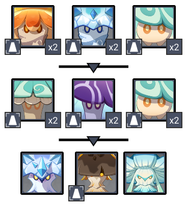
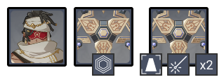

# Floor 11

## Divergence

******DMG** increased by **75%**

## General Tips

## Team Recommendations

|                            | Side 1 | Side 2 |
| -------------------------- | :----: | :----: |
| **Shieldbreakers**         |        |        |
| **Preferred DPS Elements** |        |        |
| **Avoid DPS Elements**     |        |        |
| **4**★ **Supports**        |        |        |
| **5**★ **Supports**        |        |        |

## Chamber 1

**Monster Level - 88**

### Side 1

<figure><figcaption></figcaption></figure>

| In Depth Guide | Other Info |
| -------------- | ---------- |
|                |            |

### Side 2

<figure><figcaption></figcaption></figure>

| In Depth Guide | Other Info |
| -------------- | ---------- |
|                |            |

## Chamber 2

**Monster Level - 90**

### Side 1

<figure><figcaption></figcaption></figure>

| In Depth Guide | Other Info |
| -------------- | ---------- |
|                |            |

### Side 2

<figure><figcaption></figcaption></figure>

| In Depth Guide | Other Info |
| -------------- | ---------- |
|                |            |

## Chamber 3

**Monster Level - 92**

### Side 1

<figure><figcaption></figcaption></figure>

| In Depth Guide | Other Info |
| -------------- | ---------- |
|                |            |
|                |            |
|                |            |

### Side 2

<figure><figcaption></figcaption></figure>

| In Depth Guide                                                                         | Other Info |
| -------------------------------------------------------------------------------------- | ---------- |
| [jadeplume-terrorshroom.md](../../monsters/elites/jadeplume-terrorshroom.md "mention") |            |

You can Enrage the boss by applyingrepeatedly. This will cause it to rampage for a short time, but afterwards it will be exhausted and have their resistance reduced to 0% for all elements other than.

Applyingwill **Scorch** the Terrorshroom, however while this is effective against other mushroom enemies, this has the effect of causing additional enemies to spawn and movesets that are harder to avoid.
