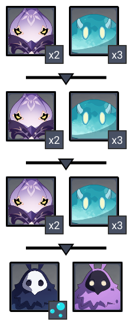

# Floor 11

## Divergence

**DMG **dealt by all party members increased by **60%.**

**DMG** dealt by all party members increased by **60%.**

## General Tips

Try to build teams to take advantage of the divergence buffs. In particular,is very favored Side 1 andis very favored Side 2.

Having the correct elements for each side is crucial here, as there are immune enemies for each side. Do not bringSide 1 and do not bringSide 2.

## Team Recommendations

|                            |                                                                                                                                                                                         Side 1                                                                                                                                                                                         |                                                                               Side 2                                                                              |
| -------------------------- | :------------------------------------------------------------------------------------------------------------------------------------------------------------------------------------------------------------------------------------------------------------------------------------------------------------------------------------------------------------------------------------: | :---------------------------------------------------------------------------------------------------------------------------------------------------------------: |
| **Shieldbreakers**         |                                                                                                                                                                                                                                                                                                    |                                                                                                                        |
| **Preferred DPS Elements** |                                                                                                                                                                                                                                                                                                                                              |                                                                              |
| **Avoid DPS Elements**     |                                                                                                                                                                                                                                                                                                                                             |                                                                                                                         |
| **4**★ **Supports**        |  |  |
| **5**★ **Supports**        |                                                                                                                                                                                                                            |     |

## Chamber 1

**Monster Level - 80**

### Side 1

| In Depth Guide                                                                                                                                                                              | Other Info |
| ------------------------------------------------------------------------------------------------------------------------------------------------------------------------------------------- | ---------- |
| [electro-whopperflower.md](../../monsters/animals/electro-whopperflower.md "mention")                                                                                                       |            |
| 
<a data-mention href="../../monsters/abyss-order/hydro-abyss-mage.md">hydro-abyss-mage.md</a>

> <a data-mention href="../../mechanics/auras/mist-bubble.md">mist-bubble.md</a>
 |            |
| [electro-abyss-mage.md](../../monsters/abyss-order/electro-abyss-mage.md "mention")****                                                                                                     |            |

**Bringing a crowd controller** can help beat the slimes and whopper flowers faster, however enemies here will naturally group no matter who you focus.

Target the **Hydro Abyss Mage** first in order to stop the **Mist Bubbles** Aura.

### Side 2

****

| In Depth Guide                                                                                                                                                                              | Other Info |
| ------------------------------------------------------------------------------------------------------------------------------------------------------------------------------------------- | ---------- |
| [electro-whopperflower.md](../../monsters/animals/electro-whopperflower.md "mention")                                                                                                       |            |
| 
<a data-mention href="../../monsters/abyss-order/hydro-abyss-mage.md">hydro-abyss-mage.md</a>

> <a data-mention href="../../mechanics/auras/mist-bubble.md">mist-bubble.md</a>
 |            |
| [electro-abyss-mage.md](../../monsters/abyss-order/electro-abyss-mage.md "mention")****                                                                                                     |            |

**Bringing a hydro unit** is needed to break the pyro abyss mage shield.** **Also **target the pyro abyss mage first **in order to stop the pyro disorder.

## Chamber 2

**Monster Level - 82**

### Side 1

| In Depth Guide                                                                                                                                                                              | Other Info |
| ------------------------------------------------------------------------------------------------------------------------------------------------------------------------------------------- | ---------- |
| [electro-whopperflower.md](../../monsters/animals/electro-whopperflower.md "mention")                                                                                                       |            |
| 
<a data-mention href="../../monsters/abyss-order/hydro-abyss-mage.md">hydro-abyss-mage.md</a>

> <a data-mention href="../../mechanics/auras/mist-bubble.md">mist-bubble.md</a>
 |            |
| [electro-abyss-mage.md](../../monsters/abyss-order/electro-abyss-mage.md "mention")                                                                                                         |            |

**Crowd control **is strong to keep the cicins together.

### Side 2

| **In Depth Guide**                                                       | Other Info |
| ------------------------------------------------------------------------ | ---------- |
| [Electro Cicin Mage](../../monsters/fatui/electro-cicin-mage.md)         |            |
| [Electrohammer Vanguard](../../monsters/fatui/electrohammer-vanguard.md) |            |

**Ensure the 2 Kaigiri's are together **before killing to prevent regeneration.

## Chamber 3

**Monster Level - 84**

### Side 1

| **In Depth Guide**                                         | Other Info |
| ---------------------------------------------------------- | ---------- |
| [Abyss Lector](../../monsters/abyss-order/abyss-lector.md) |            |

Ensure that you **kill the healing slimes.**

### Side 2

| **In Depth Guide**                                         | Other Info |
| ---------------------------------------------------------- | ---------- |
| [Abyss Herald](../../monsters/abyss-order/abyss-herald.md) |            |
