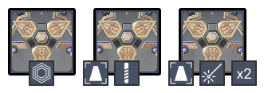

# Floor 11

## Divergence

**+75%**  **DMG**

## General Tips

**Side 1** contains several element immune enemies with Slimes and Specters. Make sure to keep this in mind when building your teams.

 works particularly well on Side 1 as you can swirl elements from one enemy onto others, and contains several enemies weak to CC.

**Side 2** contains mostly Ruin type enemies, so make sure you rely on Elemental DMG and not physical.

## Team Recommendations

|                            |                                                                                     Side 1                                                                                    |                     Side 2                     |
| -------------------------- | :---------------------------------------------------------------------------------------------------------------------------------------------------------------------------: | :--------------------------------------------: |
| **Shieldbreakers**         |                                                                                          |   |
| **Preferred DPS Elements** |  |                                                |
| **Avoid DPS Elements**     |                                                |  |

## Chamber 1

**Monster Level - 88**

### Side 1

<figure><figcaption></figcaption></figure>

| In Depth Guide                                 | Other Info |
| ---------------------------------------------- | ---------- |
| [specters](../../monsters/specters/ "mention") |            |

Kill order:

* All enemies target the pillar in the first wave. Try to group them together and finish them off quickly
* In the next 2 waves, aim for the Pyro enemies first as they target the pillar

Since the Specters and Pyro Slimes explode on death, it's very important to prioritize keeping them off pillars as soon as possible.  abilities come in handy to draw them away from the pillar.

### Side 2

<figure><figcaption></figcaption></figure>

| In Depth Guide                                                                        | Other Info |
| ------------------------------------------------------------------------------------- | ---------- |
| [primal-constructs.md](../../monsters/ruin-constructs/primal-constructs.md "mention") |            |

Most of the primal constructs here will target the pillar and they spawn spread out, making this a fairly difficult chamber if you are low on DPS.&#x20;

Make sure you have an  character in order to break them out of invisibility. Bringing  too enables you to trigger **Quicken** which breaks invisibility immediately without having to destroy parts, which can be useful if you are low on DPS.

## Chamber 2

**Monster Level - 90**

### Side 1

<figure><figcaption></figcaption></figure>

| In Depth Guide                                                                    | Other Info |
| --------------------------------------------------------------------------------- | ---------- |
| [pyro-abyss-mage.md](../../monsters/abyss-order/pyro-abyss-mage.md "mention")     |            |
| [cryo-abyss-mage.md](../../monsters/abyss-order/cryo-abyss-mage.md "mention")     |            |
| [hydro-abyss-mage.md](../../monsters/abyss-order/hydro-abyss-mage.md "mention")   |            |
| [abyss-lector-pyro.md](../../monsters/abyss-order/abyss-lector-pyro.md "mention") |            |

Make sure you bring  for the lector. You can use  to swirl the Hydro Abyss Mage shields, however this means you have to keep both of them alive while you attack the Lector. It's much easier to just deal with them first and bring down their shields with AoE.

Remember that  is also effective against  shields, and will be much more effective on the previous chamber than.

### Side 2

<figure><figcaption></figcaption></figure>

| In Depth Guide                                                                                | Other Info |
| --------------------------------------------------------------------------------------------- | ---------- |
| [ruin-destroyer.md](../../monsters/ruin-constructs/ruin-destroyer.md "mention")               |            |
| [ruin-drake-earthguard.md](../../monsters/ruin-constructs/ruin-drake-earthguard.md "mention") |            |

All the enemies spawn at once, so make sure you have a good AoE team on this side to damage everything at once, or you may find yourself running low on time.

## Chamber 3

**Monster Level - 92**

### Side 1

<figure><figcaption></figcaption></figure>

| In Depth Guide                                                                                                                                                                           | Other Info |
| ---------------------------------------------------------------------------------------------------------------------------------------------------------------------------------------- | ---------- |
| [mirror-maiden.md](../../monsters/fatui/mirror-maiden.md "mention")                                                                                                                      |            |
| 
<a data-mention href="../../monsters/fatui/cryogunner-legionnaire.md">cryogunner-legionnaire.md</a> > <a data-mention href="../../mechanics/auras/ice-cage.md">ice-cage.md</a>
 |            |
| [pyroslinger.md](../../monsters/fatui/pyroslinger.md "mention")                                                                                                                          |            |
| 
<a data-mention href="../../monsters/mushrooms/">mushrooms</a> > <a data-mention href="../../mechanics/auras/rumbling-stone.md">rumbling-stone.md</a>
                          |            |

Focus the Cryogunner first as he has the Ice Cage aura and is relatively weak.

Similarly, focus down the Geoshroom as its aura is particularly damaging.

### Side 2

<figure><figcaption></figcaption></figure>

| In Depth Guide                                                                            | Other Info |
| ----------------------------------------------------------------------------------------- | ---------- |
| [ruin-drake-skywatch.md](../../monsters/ruin-constructs/ruin-drake-skywatch.md "mention") |            |

Similar to the previous chamber, all enemies spawn at once and this is a DPS check. Make sure you are using a team with strong AoE and hitting multiple Ruin Drakes at the same time.
