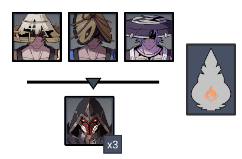
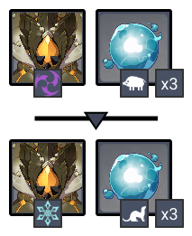
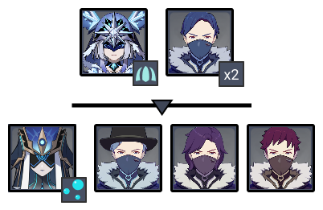
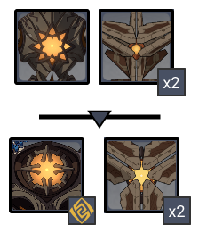
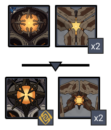

# Floor 12

## Divergence 

None

## General Tips

Most chambers don't have any strict element requirements. As usual, it's best to try to build teams for each chamber one at a time when going for stars.

characters in particular are better on Side 1 for Chamber 1, but Side 2 for Chamber 2. You will often want to change setups for each chamber.

## Chamber 1

**Monster Level - 90**

|                            |                     Side 1                     |                   Side 2                   |
| -------------------------- | :--------------------------------------------: | :----------------------------------------: |
| **Shieldbreakers**         |     |                                            |
| **Preferred DPS Elements** |  |  |
| **Avoid DPS Elements**     |      |  |

### Side 1

| In Depth Guide                                                | Other Info |
| ------------------------------------------------------------- | ---------- |
| [nobushi.md](../../monsters/untitled/nobushi.md "mention")    | 227K HP    |
| [pyro-agent.md](../../monsters/fatui/pyro-agent.md "mention") | 347K HP    |

Make sure to bring **Crowd Control** on this side to stagger the mobs. The **Pyro Agents** can quickly combo you  charactersout if left alone. characters that can pick up enemies are particularly effective here.

Try to save some burst damage for when the** Pyro Agent**s spawn. If you can hit them with enough damage early, it will stagger them and break them out of invisibility, making them much easier to deal with.

### Side 2

| In Depth Guide                                                        | Other Info |
| --------------------------------------------------------------------- | ---------- |
| ****[geovishap.md](../../monsters/animals/geovishap.md "mention")**** | 555K HP    |
| Hydro Mimic (Boar)                                                    | 111K HP    |
| Hydro Mimic (Ferret)                                                  | 97K HP     |

In the first wave, aim for the **Boars **first, and let the **Geovishap **come to you. **Boars **tend to stay at range, and will heal over time.

In the second wave, aim for the **Geovishap **first. **Ferrets **will naturally group up and will usually go down to AoE damage.

DPS works the best here, as it is effective against all the enemies. Build a team around that if possible.

The mimics should go down fairly easily to AoE damage, however if you're struggling with them then bring to **Freeze **them.

**Geovishaps **will **Infuse **once they reach 50% HP, adding Elemental attacks which make the particularly annoying with the **Hydro Mimics**. Try to kill the Mimics before Geovishaps infuse.

## Chamber 2

**Monster Level - 92**

|                            | Side 1 |                                         Side 2                                        |
| -------------------------- | :----: | :-----------------------------------------------------------------------------------: |
| **Shieldbreakers**         |        |                                             |
| **Preferred DPS Elements** |        |                                         |
| **Avoid DPS Elements**     |        |  |

### Side 1

| In Depth Guide                                                   | Other Info |
| ---------------------------------------------------------------- | ---------- |
| [maguu-kenki.md](../../monsters/elites/maguu-kenki.md "mention") | 1.5M HP    |

This is a difficult fight if you're not familiar with the attacks and dodge timings. Check the in depth guide page and practice on the overworld version a few times to get used to it's attacks.

Remember once the **Maguu Kenki** reaches **75% HP** it will become **invulnerable** and perform an **AoE **attack. Make sure not to waste your damage on it during this time.

This is mostly a DPS check, so bring your most invested composition on this side when going for 3★.

Characters with strong single target damage (e.g. **Hu Tao** or **Yoimiya**) are highly recommended.

### Side 2

| In Depth Guide                                                                                                                                                                  | Other Info |
| ------------------------------------------------------------------------------------------------------------------------------------------------------------------------------- | ---------- |
| 
<a data-mention href="../../monsters/fatui/cryo-cicin-mage.md">cryo-cicin-mage.md</a>

> <a data-mention href="../../mechanics/auras/ice-cage.md">ice-cage.md</a>
   | 383K HP    |
| 
<a data-mention href="../../monsters/fatui/mirror-maiden.md">mirror-maiden.md</a>

> <a data-mention href="../../mechanics/auras/mist-bubble.md">mist-bubble.md</a>
 | 772K HP    |

Make sure to bring **Crowd Control** on this side to stagger the mobs.characters that can pick up enemies are particularly effective here.

When going for stars, focus the Fatui Mages first, as they have the most HP and have Auras. Try to kill the Hoarders using AoE damage.

If you find yourself dying, you may want to focus the Hoarders first, as they are set up to trigger Elemental Reactions on you along with the Mages. Watch out for **Freeze **in particular in the first wave. Doing this may lose you time, but make the fight easier to deal with.

## Chamber 3

**Monster Level - 100**

|                           |                     Side 1                     |                     Side 2                     |
| ------------------------- | :--------------------------------------------: | :--------------------------------------------: |
| **Preferred DPS Element** |                                                |                                                |
| **Avoid DPS Elements**    |  |  |

### Side 1

| In Depth Guide                                                                                                                                                                            | Other Info                                                                                   |
| ----------------------------------------------------------------------------------------------------------------------------------------------------------------------------------------- | -------------------------------------------------------------------------------------------- |
| [ruin-hunter.md](../../monsters/ruin-constructs/ruin-hunter.md "mention")                                                                                                                 | 551K HP                                                                                      |
| [ruin-destroyer.md](../../monsters/ruin-constructs/ruin-destroyer.md "mention")                                                                                                           | 416K HP                                                                                      |
| 
<a data-mention href="../../monsters/ruin-constructs/ruin-guard.md">ruin-guard.md</a>

> <a data-mention href="../../mechanics/auras/rumbling-stone.md">rumbling-stone.md</a>
 | 
643K HP

> 3349 DMG / Wave
 |
| [ruin-cruiser.md](../../monsters/ruin-constructs/ruin-cruiser.md "mention")                                                                                                               | 416K HP                                                                                      |

Try to make sure enemies are grouped and you're hitting at least 2 targets at the same time. Only hitting one enemy at a time makes this a much harder DPS check for 3★.

For each wave, attack the small **Ruin Machine**s first and let the large one come to you.

The **Ruin Destroyers** on the first wave will sometimes start with a tunneling attack, which quickly groups them together, but this is random. It may be worth resetting this chamber until you get a good attack pattern for grouping.

The **Ruin Cruisers** on the second wave usually stay at range, and are harder to group. Occasionally they will perform a backwards dash, so try to line it up so that one Cruiser is behind the one you're attacking.

The **Rumbling Stone** Aura deals a significant amount of damage, so having Shields or strong healers are recommended.

### Side 2

| In Depth Guide                                                                                                                                                                              | Other Info                                                                                   |
| ------------------------------------------------------------------------------------------------------------------------------------------------------------------------------------------- | -------------------------------------------------------------------------------------------- |
| [ruin-guard.md](../../monsters/ruin-constructs/ruin-guard.md "mention")                                                                                                                     | 643K HP                                                                                      |
| [ruin-cruiser.md](../../monsters/ruin-constructs/ruin-cruiser.md "mention")                                                                                                                 | 416K HP                                                                                      |
| 
<a data-mention href="../../monsters/ruin-constructs/ruin-grader.md">ruin-grader.md</a>

> <a data-mention href="../../mechanics/auras/rumbling-stone.md">rumbling-stone.md</a>
 | 
827K HP

> 3349 DMG / Wave
 |
| [ruin-defender.md](../../monsters/ruin-constructs/ruin-defender.md "mention")                                                                                                               | 582K HP                                                                                      |

The **Ruin Cruisers** on the first wave usually stay at range, and are harder to group. Occasionally they will perform a backwards dash, so try to line it up so that one Cruiser is behind the one you're attacking.

Rush for the **Ruin Grader** in the second wave. The **Ruin Defenders** will move towards you, and staying close to the Grader prevents it using the Charge attack and splitting away from the rest of the enemies.

The **Rumbling Stone** Aura deals a significant amount of damage, so having Shields or strong healers are recommended.
