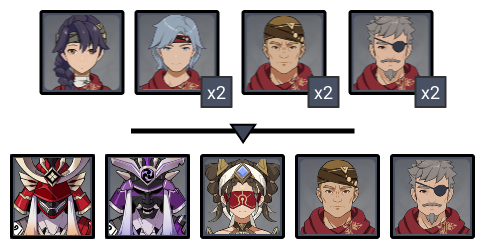
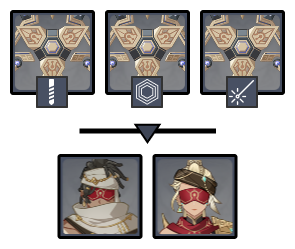
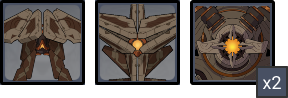
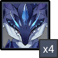

# Floor 12

## Divergence 

None

## General Tips

Freeze teams are a good option on the first side as there are enemies susceptible to it and it helps keep them grouped.

You want to bring plenty of AoE on the first half, and put your strong single target on the second.

Most of this floor will be making sure you have enough damage, and there are few enemy mechanics overall.

## Chamber 1

**Monster Level - 95**

|                            |                     Side 1                     | Side 2 |
| -------------------------- | :--------------------------------------------: | :----: |
| **Preferred DPS Elements** |  |        |
| **Avoid DPS Elements**     |                                                |        |

### Side 1

<figure><figcaption></figcaption></figure>

| In Depth Guide                                                                 | Other Info |
| ------------------------------------------------------------------------------ | ---------- |
| [desert-clearwater.md](../../monsters/eremites/desert-clearwater.md "mention") | 408K HP    |
| [kairagi.md](../../monsters/samurai/kairagi.md "mention")                      | 545K HP    |

Enemies are fairly spread out, but if you run directly towards the front enemies, the others will naturally group around you.

In the second wave, try to run behind the two Kairagi and let them use their dash attack towards you and close to the edge. This will keep them grouped the longest.

Remember that killing one Kairagi will cause the other to attempt to heal. Try to kill both at the same time, or utilize Freeze in order to delay the Heal and give you more time, or other abilities that disable.

#### Character Recommendations

| Character                                                                                                 | Function              |
| --------------------------------------------------------------------------------------------------------- | --------------------- |
|  | CC                    |
|                                                        | Physical Damage/Burst |

### Side 2

<figure><figcaption></figcaption></figure>

| In Depth Guide                                                             | Other Info |
| -------------------------------------------------------------------------- | ---------- |
| Primal Constructs                                                          | 386K HP    |
| [stone-enchanter.md](../../monsters/eremites/stone-enchanter.md "mention") | 568K HP    |
| Galehunter                                                                 | 500K HP    |

Primal constructs will attack from a range, so there is no great way to group them. Try to hit at least two with AoE if possible.

In the second wave, both Eremites will summon an extra enemy once they drop below 70% HP. When that happens, focus the summoned enemy first. This will stun the Eremite momentarily and make them take more damage.

## Chamber 2

**Monster Level - 98**

|                            |                     Side 1                     | Side 2 |
| -------------------------- | :--------------------------------------------: | :----: |
| **Preferred DPS Elements** |                                                |        |
| **Avoid DPS Elements**     |  |        |

### Side 1

<figure><figcaption></figcaption></figure>

| In Depth Guide                                                                                | Other Info |
| --------------------------------------------------------------------------------------------- | ---------- |
| [ruin-scout.md](../../monsters/ruin-constructs/ruin-scout.md "mention")                       | 541K HP    |
| [ruin-destroyer.md](../../monsters/ruin-constructs/ruin-destroyer.md "mention")               | 386K HP    |
| [ruin-drake-earthguard.md](../../monsters/ruin-constructs/ruin-drake-earthguard.md "mention") | 901K HP    |

All enemies spawn at once, and this chamber is fairly simple so it is mostly a DPS check.

Make sure you bring AoE damage, as the enemies have quite a large total health pool.

### Side 2

<figure><figcaption></figcaption></figure>

| In Depth Guide                                              | Other Info |
| ----------------------------------------------------------- | ---------- |
| [maguu-kenki](../../monsters/elites/maguu-kenki/ "mention") | 1.5M HP    |

This is a difficult fight if you're not familiar with the attacks and dodge timings. Check the in depth guide page and practice on the overworld version a few times to get used to it's attacks.&#x20;

Remember once the Maguu Kenki reaches 75% HP it will become invulnerable and perform an AoE attack. Make sure not to waste your damage on it during this time.

Characters with strong single target damage (e.g. Hu Tao or Yoimiya) are highly recommended.

Be aware that some of his attacks will be cryo at this phase and bennett Q might accidentally kill you due to maguu proccing melt on you during these attacks

#### Character Recommendations

| Character                                                                                                  | Function          |
| ---------------------------------------------------------------------------------------------------------- | ----------------- |
|  | Single Target DPS |

## Chamber 3

**Monster Level - 100**

|                            | Side 1 |                                                 Side 2                                                |
| -------------------------- | :----: | :---------------------------------------------------------------------------------------------------: |
| **Shieldbreakers**         |        |  ( optional) |
| **Preferred DPS Elements** |        |                                                                                                       |
| **Avoid DPS Elements**     |        |                                                                                                       |

### Side 1

<figure><figcaption></figcaption></figure>

| In Depth Guide                                                                          | Other Info |
| --------------------------------------------------------------------------------------- | ---------- |
| [bathysmal-vishap.md](../../monsters/vishaps/bathysmal-vishap.md "mention") (hatchling) | 555K HP    |

All enemies spawn at once, and this chamber is fairly simple so it is mostly a DPS check.

Make sure you bring AoE damage, as the enemies have quite a large total health pool.

Some of their attacks can drain energy from you, which may mess up your rotations. Try to be mindful of that and dodge the ball attack when you can.

### Character Recommendations

| Character                                                                                                 | Function |
| --------------------------------------------------------------------------------------------------------- | -------- |
|  | CC       |

### Side 2

<figure><figcaption></figcaption></figure>

| In Depth Guide                                         | Other Info |
| ------------------------------------------------------ | ---------- |
| [asimon.md](../../monsters/elites/asimon.md "mention") | 2.2M HP    |

It is highly recommended to bring ancharacter or else you may lose a lot of time to the invisibility phase. Note that this character doesn't need to be built for damage, though that can help.

See [#invisibility](../../monsters/elites/asimon.md#invisibility "mention")for in depth explanation of ASIMON's invisibility mechanic. It is important to understand this before heading into the fight. As long as you're familiar with this, you can mostly ignore the rest of the boss mechanics.

If your team composition allows it, you can bring both+as using **Quicken** is the fastest way to break invisibility, however this may not be worth lowering your damage for, as usually justwill be enough.

If you skip bringing, then you can simply deal damage to the boss during windows when it is repairing the components you destroyed. However this allows it to unleash additional attacks after repairing the components which may make the fight more difficult.
