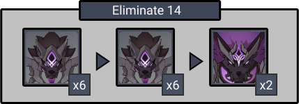
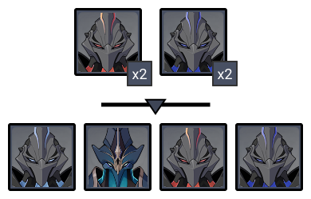
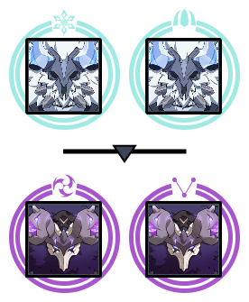
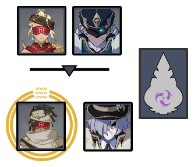

# Floor 12

## Divergence 

None

## General Tips

* Chamber 1 Second half and Chamber 3 First Half have bosses. It's recommended you build towards individual teams for specific chambers.

## Chamber 1

**Monster Level - 95**

|                            |                     Side 1                    |                     Side 2                    |
| -------------------------- | :-------------------------------------------: | :-------------------------------------------: |
| **Preferred DPS Elements** |  |     |
| **Avoid DPS Elements**     |                                               |  |

### Side 1

<figure><figcaption></figcaption></figure>

| In Depth Guide                                                               | Other Info |
| ---------------------------------------------------------------------------- | ---------- |
| [rifthound-whelp.md](../../monsters/rifthounds/rifthound-whelp.md "mention") | 273K HP    |
| [rifthound.md](../../monsters/rifthounds/rifthound.md "mention")             | 795K HP    |

Electro is a great choice against the Rifthounds as they’ll have less electro resistance after accumulating enough fury.

However, as they’re easily knock-backed, freeze teams with an Anemo CC are still one of the best options to clear the chamber.

Be wary of bleeding, as it’ll affect off-field characters which may kill them as soon as you swap characters.

#### Character Recommendations

| Character                                                                                                                                                       | Function     |
| --------------------------------------------------------------------------------------------------------------------------------------------------------------- | ------------ |
|                                                        | Team Healing |
|  | Anemo CC     |

### Side 2

<figure><figcaption></figcaption></figure>

| In Depth Guide                                                                       | Other Info |
| ------------------------------------------------------------------------------------ | ---------- |
| [thunder-manifestation.md](../../monsters/elites/thunder-manifestation.md "mention") | 1.6M HP    |

Ranged characters work best here to give you more windows to do damage.

Use strong single target DPS characters if possible.

Bringing a strong shield unit will help you tank some of the annoying attacks and give you more windows for damage. Consider this particularly if you are using a melee character.

Budget about 2 minutes for this half, as Side 2 is much easier.

If you are using aDPS, you should still bringfor Vaporize based teams. Applyingwon't cause any Electrocharged damage on the Thunder Manifestation due to immunity, but it will still let you Vaporize (and Overload) attacks.

For more general tips about this boss, see the [thunder-manifestation.md](../../monsters/elites/thunder-manifestation.md "mention")in depth guide.

#### Character Recommendations

| Character                                              | Function                 |
| ------------------------------------------------------ | ------------------------ |
|  | Ranged single target DPS |

## Chamber 2

**Monster Level - 98**

|                            |                     Side 1                     |                                            Side 2                                            |
| -------------------------- | :--------------------------------------------: | :------------------------------------------------------------------------------------------: |
| **Shieldbreakers**         |                                                | (and/or) |
| **Preferred DPS Elements** |                                                |                                                                                              |
| **Avoid DPS Elements**     |  |       |

### Side 1

<figure><figcaption></figcaption></figure>

| In Depth Guide                   | Other Info     |
| -------------------------------- | -------------- |
| Shadowy Husks                    | 515K - 772K HP |
| Black Serpent Knight: Windcutter | 901K HP        |

The Black Serpents are easy to move withand stagger. Using a freeze team or just bringing an anemo will help with grouping them.

When Husks hit a shielded character, their damage will be buffed but they will consume a % of their HP. If you don't have survivability issues, you can use this to your advantage to speed up the chamber.

### Side 2

<figure><figcaption></figcaption></figure>

| In Depth Guide                                                                                                                                                                                                                                                                                         | Other Info                                                                             |
| ------------------------------------------------------------------------------------------------------------------------------------------------------------------------------------------------------------------------------------------------------------------------------------------------------ | -------------------------------------------------------------------------------------- |
| 
<a data-mention href="../../monsters/hilichurls/lawachurls/frostarm-lawachurl.md">frostarm-lawachurl.md</a> > <a data-mention href="../../mechanics/debuffs/">debuffs</a>(Condensed Ice) > <a data-mention href="../../mechanics/auras/ice-cage.md">ice-cage.md</a>
                       | 
690K HP  6308DMG
   |
| 
<a data-mention href="../../monsters/hilichurls/lawachurls/thunderhelm-lawachurl.md">thunderhelm-lawachurl.md</a> > <a data-mention href="../../mechanics/debuffs/">debuffs</a>(Engulfing Storm) > <a data-mention href="../../mechanics/auras/lightning-stake.md">lightning-stake.md</a>
 | 
690K HP  946DPS
 |

You can group the Thunderarm Lawachurls by going to the front or the back, as they’ll make a dash attack after they spawn.

The Lawachurls have a 70% resistance to the element they have, so either don’t bring these two elements or bring a 4 Viridescent Venerer User to help with the damage.

Be wary of their auras. It may be best to focus down one Lawachurl so you only have to deal with one at a time. Condensed Ice in particular can be dangerous as it may quickly drain your stamina, leaving you unable to dodge attacks as often as you're used to.

## Chamber 3

**Monster Level - 100**

|                            |                     Side 1                     |                                                               Side 2                                                              |
| -------------------------- | :--------------------------------------------: | :-------------------------------------------------------------------------------------------------------------------------------: |
| **Shieldbreakers**         |                                                | (or) |
| **Preferred DPS Elements** |                                                |                                                                                     |
| **Avoid DPS Elements**     |  |                                               |

### Side 1

<figure><figcaption></figcaption></figure>

| In Depth Guide                                                             | Other Info |
| -------------------------------------------------------------------------- | ---------- |
| [aeonblight-drake.md](../../monsters/elites/aeonblight-drake.md "mention") | 2.3M HP    |

The Boss works similarly to [ruin-drake-skywatch.md](../../monsters/ruin-constructs/ruin-drake-skywatch.md "mention")

Unlike the overworld version, the abyss version of this boss has it start flying immediately. You need to either use long-range attacks to damage the boss or use a bow user to shoot the glowing spots on its wings.

After a while, the boss will start to charge, and its eye will glow. Make sure to hit this as if it finishes the attack. It will gain resistance to the element from which it took most of the damage since the fight started. Use your best single-target damage-dealing team here.

Avoid physical damage-dealing characters as it has increased resistance to it like most Ruin Machines.

### Character Recommendations

| Character                                                                                                  | Function   |
| ---------------------------------------------------------------------------------------------------------- | ---------- |
|  | Ranged DPS |

### Side 2

<figure><figcaption></figcaption></figure>

| In Depth Guide                                                                                                                                                                            | Other Info                                                                             |
| ----------------------------------------------------------------------------------------------------------------------------------------------------------------------------------------- | -------------------------------------------------------------------------------------- |
| [galehunter.md](../../monsters/eremites/galehunter.md "mention")                                                                                                                          | 610K HP                                                                                |
| [anemoboxer.md](../../monsters/fatui/anemoboxer.md "mention")                                                                                                                             | 276K HP                                                                                |
| 
<a data-mention href="../../monsters/eremites/stone-enchanter.md">stone-enchanter.md</a> > <a data-mention href="../../mechanics/auras/rumbling-stone.md">rumbling-stone.md</a>
 | 
693K HP 3349DMG / Wave
 |
| [geochanter.md](../../monsters/fatui/geochanter.md "mention")                                                                                                                             | 276K HP                                                                                |

This Chamber has an electro monolith that will apply electro shield to the mobs which reduces incoming damage. If you don’t have enough damage to kill them fast enough, bringand/orto cleanse the aura.

Be careful of the Stone Enchanter’s Geo Aura on the second wave. The aura effect deals considerable damage and will kill you if you're not careful.

Like any other human enemies, Eremites and Fatui have lowered resistance to physical damage, so it's a viable option for this chamber.
