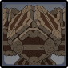
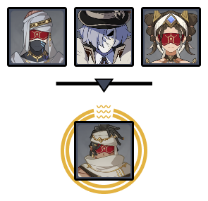
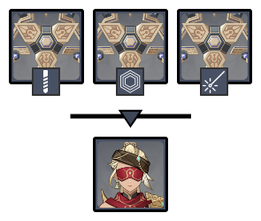
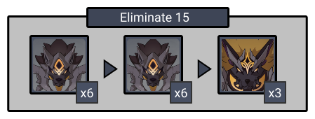

# Floor 12

## Divergence 

None

## General Tips

The bosses on the floor are scattered in the first and second half, so using a different team per chamber is even more recommended than usual.

While the Wolflord needs a  character to break the pillars, the character doesn't need to be built at all. Characters such as Ningguang who can apply Geo without relying on cooldown skills are recommended.

## Chamber 1

**Monster Level - 95**

|                            |                     Side 1                     |                     Side 2                     |
| -------------------------- | :--------------------------------------------: | :--------------------------------------------: |
| **Shieldbreakers**         |                                                |       |
| **Preferred DPS Elements** |                                                |  |
| **Avoid DPS Elements**     |  |                                                |

### Side 1

<figure><figcaption></figcaption></figure>

| In Depth Guide                                                                                 | Other Info |
| ---------------------------------------------------------------------------------------------- | ---------- |
| [perpetual-mechanical-array.md](../../monsters/elites/perpetual-mechanical-array.md "mention") |            |

* If you're unfamiliar with this boss, check out the In-Depth Guide page [perpetual-mechanical-array.md](../../monsters/elites/perpetual-mechanical-array.md "mention") for tips. It is essential to know which enemy to aim at when it **Divides**.
* After the divide phase and killing the correct target, the boss gains less resistance to everything, so make sure to time your skills and bursts during the divide phase
* Use your best non-physical single target team on this half, as the boss has a 70% resistance to physical damage
* &#x20;You may also reset until the enemy in the divide phase is a Ruin Cruiser or Destroyer, as they have a bit of lower HP. Keep in mind that this takes a lot of time however.

#### Character Recommendations

| Character                                                                                                                                                                                                                                                                 | Function                    |
| ------------------------------------------------------------------------------------------------------------------------------------------------------------------------------------------------------------------------------------------------------------------------- | --------------------------- |
|  | Strong single-target damage |

### Side 2

<figure><figcaption></figcaption></figure>

| In Depth Guide                                                                                                                                                                            | Other Info |
| ----------------------------------------------------------------------------------------------------------------------------------------------------------------------------------------- | ---------- |
| [sunfrost.md](../../monsters/eremites/sunfrost.md "mention")                                                                                                                              |            |
| [desert-clearwater.md](../../monsters/eremites/desert-clearwater.md "mention")                                                                                                            |            |
| [geochanter.md](../../monsters/fatui/geochanter.md "mention")                                                                                                                             |            |
| 
<a data-mention href="../../monsters/eremites/stone-enchanter.md">stone-enchanter.md</a> > <a data-mention href="../../mechanics/auras/rumbling-stone.md">rumbling-stone.md</a>
 |            |

* For the first wave, focus on the Fatui geochanter, as the other two will rush to you.
* All the enemies are weak to so DPS might be preferred if you have similar investments for everyone.
* For the second wave, the Stone Enchanter will spawn a Stone Drake and gain an additional 50% resistance to everything as long as the Stone Drake is alive. Switch focus to that first if your damage is lacking.
* The **Rumbling Stone** aura does considerable damage if you're not careful. Bring shields or strong healing if you're not able to avoid it well.

#### Character Recommendations

| Character                                                                                                   | Function                  |
| ----------------------------------------------------------------------------------------------------------- | ------------------------- |
|  | Shield and shieldbreaking |

## Chamber 2

**Monster Level - 98**

|                            |                                                Side 1                                                |                   Side 2                  |
| -------------------------- | :--------------------------------------------------------------------------------------------------: | :---------------------------------------: |
| **Shieldbreakers**         | (optional ) |  |
| **Preferred DPS Elements** |                                                                                                      |                                           |
| **Avoid DPS Elements**     |                                                                                                      |                                           |

### Side 1

<figure><figcaption></figcaption></figure>

| In Depth Guide                                                                        | Other Info |
| ------------------------------------------------------------------------------------- | ---------- |
| [primal-constructs.md](../../monsters/ruin-constructs/primal-constructs.md "mention") |            |
| [galehunter.md](../../monsters/eremites/galehunter.md "mention")                      |            |

* For the first wave, using  characters such as Venti and Kazuha to group the constructs might help to kill them faster.
* When the construct goes invisible, destroy the parts that spawn. Then it will generate pillars to repair it. Use  to destroy pillars or you will have to wait 10 seconds for invisibility to wear off. You can also bring  to trigger **Quicken** to break invisibility faster if required.
* For the second wave, the Galehunter will spawn a Wind Glede (Bird) and gain an additional 50% resistance to everything as long as the Wind Glede is alive. Switch focus to that first if your damage is lacking.

### Side 2

<figure><figcaption></figcaption></figure>

| In Depth Guide                                                         | Other Info |
| ---------------------------------------------------------------------- | ---------- |
| [golden-wolford.md](../../monsters/elites/golden-wolford.md "mention") |            |

* If you're unfamiliar with this boss, check out the In-Depth Guide page [golden-wolford.md](../../monsters/elites/golden-wolford.md "mention") for tips.
* At the beginning of the fight, the Wolflord can be damaged but has massively increased defenses. You can use this window to generate energy.
* Consider ranged characters that can DPS the boss during all phases. If your primary team is melee, make sure you know which moves leave the boss vulnerable to attacks and maximize your damage.
* Once the boss reaches **70% HP**, you must break the pillars the Wolflord spawns to continue the fight. This character doesn't need to be invested but applies with a continuous amount of or applies a significant amount.
* Ningguang is particularly good at breaking these as she can utilize basic/charged attacks to break it. She can also hold Thrilling Tales of Dragon Slayer to help support the rest of your team.
* Once you have starred this chamber, you may no longer need to bring  as the skulls can be destroyed by other elements. This might help when building a team for Chamber 3

#### Character Recommendations

| Character                                                                                                                                                           | Function                 |
| ------------------------------------------------------------------------------------------------------------------------------------------------------------------- | ------------------------ |
|  | Breaking Wolflord Skulls |
|    | Ranged DPS               |

## Chamber 3

**Monster Level - 100**

|                            |                     Side 1                    |                   Side 2                  |
| -------------------------- | :-------------------------------------------: | :---------------------------------------: |
| **Shieldbreakers**         |                                               |                                           |
| **Preferred DPS Elements** |  |  |
| **Avoid DPS Elements**     |   |                                           |

### Side 1

<figure><figcaption></figcaption></figure>

| In Depth Guide                                                                         | Other Info |
| -------------------------------------------------------------------------------------- | ---------- |
| [jadeplume-terrorshroom.md](../../monsters/elites/jadeplume-terrorshroom.md "mention") |            |

* If you're unfamiliar with this boss, check out the In-Depth Guide page [jadeplume-terrorshroom.md](../../monsters/elites/jadeplume-terrorshroom.md "mention") tips.
* You can Enrage the boss by applying  repeatedly. This will cause it to rampage for a short time, but afterward it will be exhausted and have its resistance reduced to 0% for all elements other than . This is the most effective strategy to deal the most damage.
* If you use the above, avoid any as this will lower the Enrage. You can safely use this once the Jadeplume is exhausted.
* Be careful as during the rampage, the Jadeplume will hit harder than usual and might kill the on-field party member if not careful

#### Character Recommendations

| Character                                                                                                                                                      | Function                                          |
| -------------------------------------------------------------------------------------------------------------------------------------------------------------- | ------------------------------------------------- |
|  |  DPS |

### Side 2

<figure><figcaption></figcaption></figure>

| In Depth Guide                                                                                                                                                                  | Other Info |
| ------------------------------------------------------------------------------------------------------------------------------------------------------------------------------- | ---------- |
| [rifthound-whelp.md](../../monsters/rifthounds/rifthound-whelp.md "mention")                                                                                                    |            |
| 
<a data-mention href="../../monsters/rifthounds/rifthound.md">rifthound.md</a> > <a data-mention href="../../mechanics/auras/rumbling-stone.md">rumbling-stone.md</a>
 |            |

* This is quite a difficult chamber, and you may not have one team that can star this chamber as well as the Wolflord chamber.
* Make sure you have a strong AoE team for this side.
* You can still choose a  team for the second half to do it one go, as the Rifthounds get decreased resistance to geo after accumulating enough hits. However, be careful of this as they’ll also do increased damage.
* Be careful of the damage from corrosion, as it’ll affect even the off-field party members.
* One of the three final Rifthounds also has Rumbling Stone aura, so be wary of it along with corrosion damage.
* Freeze teams work particularly well against Rifthounds, as it stops them moving around and mitigates their damage.

#### Character Recommendations

| Character                                                                                                                                                       | Function     |
| --------------------------------------------------------------------------------------------------------------------------------------------------------------- | ------------ |
|  | Grouping     |
|                                                        | Team Healing |
|                                                         | Freeze       |
