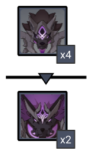
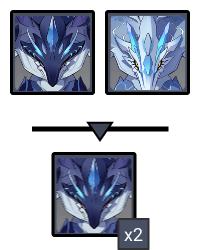
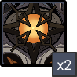
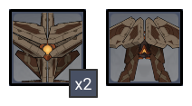

# Floor 12

## Divergence 

None

## General Tips

The only elemental requirement for this floor ison **Chamber 2 Side 2**. Otherwise, run your best teams on each side.

## Chamber 1

**Monster Level - 95**

|                            |                     Side 1                    |                     Side 2                     |
| -------------------------- | :-------------------------------------------: | :--------------------------------------------: |
| **Shieldbreakers**         |                                               |                                                |
| **Preferred DPS Elements** |  |     |
| **Avoid DPS Elements**     |                                               |  |

### Side 1

| In Depth Guide                                                               | Other Info |
| ---------------------------------------------------------------------------- | ---------- |
| [rifthound.md](../../monsters/rifthounds/rifthound.md "mention")             | 795K HP    |
| [rifthound-whelp.md](../../monsters/rifthounds/rifthound-whelp.md "mention") | 273K HP    |

If you have a goodteam, it will be the fastest at clearing since **Enraging** the Rifthounds causes theirresistance to drop. However, any damage type will work fine here.

You can useto group the smaller Rifthounds, however they tend to group naturally.

You want to try to be hitting both large Rifthounds at once to get good time. **Freeze** may be helpful to run here to keep them together, as their attacks tend to split them up.

### Side 2

| In Depth Guide                                                                              | Other Info |
| ------------------------------------------------------------------------------------------- | ---------- |
| [bathysmal-vishap.md](../../monsters/vishaps/bathysmal-vishap.md "mention") **(Hatchling)** | 454K HP    |
| [bathysmal-vishap.md](../../monsters/vishaps/bathysmal-vishap.md "mention")                 | 909K HP    |

In the first wave, getting hit by attacks from both types of enemies will cause you to **Frozen**.

Try to be hitting both enemies at once in the second wave as they have quite a large amount of HP.

Make sure to dodge the energy draining attacks if you have a team that relies heavily on Bursts, otherwise it will hurt your DPS a lot to take hits.

## Chamber 2

**Monster Level - 98**

****

|                            |                     Side 1                     |                   Side 2                  |
| -------------------------- | :--------------------------------------------: | :---------------------------------------: |
| **Shieldbreakers**         |                                                |  |
| **Preferred DPS Elements** |                                                |                                           |
| **Avoid DPS Elements**     |  |                                           |

### Side 1

| In Depth Guide                                                            | Other Info |
| ------------------------------------------------------------------------- | ---------- |
| [ruin-grader.md](../../monsters/ruin-constructs/ruin-grader.md "mention") | 690K HP    |

Run towards one Ruin Grader immediately and let the other one charge towards you. Staying in the middle can cause them both to charge which is bad.

Use your strongest AoE team here to leave plenty of time for the next side, which is Single Target focused.

### Side 2

| In Depth Guide                                                         | Other Info |
| ---------------------------------------------------------------------- | ---------- |
| [golden-wolford.md](../../monsters/elites/golden-wolford.md "mention") | 1.5M HP    |

See the in depth guide for more details.

At the beginning of the fight, the Wolflord can be damaged but has massively increased defenses. You can use this window to generate energy.

Prefer ranged characters that can DPS the boss during all phases. If your main team is melee, make sure you know which moves gives leave the boss vulnerable to attacks and maximize your damage then.

Once the boss reaches 66% HP, you will need to breakconstructs to continue the fight. This character doesn't need to be invested, but make sure they can deal sustainedDMG for most effective breaking.

**Ningguang** is particularly good at breaking these as she can utilize basic/charged attacks.

## Chamber 3

**Monster Level - 100**

|                           |                     Side 1                     |                                          Side 2                                         |
| ------------------------- | :--------------------------------------------: | :-------------------------------------------------------------------------------------: |
| **Preferred DPS Element** |                                                |                                                                                         |
| **Avoid DPS Elements**    |  |  |

### Side 1

| In Depth Guide                                                                  | Other Info |
| ------------------------------------------------------------------------------- | ---------- |
| [ruin-destroyer.md](../../monsters/ruin-constructs/ruin-destroyer.md "mention") | 416K HP    |
| [ruin-scout.md](../../monsters/ruin-constructs/ruin-scout.md "mention")         | 582K HP    |

Focus one of the Destroyers. The scout will come to you and the other Destroyer will sometimes tunnel towards you. If it doesn't, you can always reset the chamber.

This is

### Side 2

| In Depth Guide                                                                       | Other Info   |
| ------------------------------------------------------------------------------------ | ------------ |
| [bathysmal-vishap-herd.md](../../monsters/elites/bathysmal-vishap-herd.md "mention") | 1.6M HP Each |


The Bathysmal Vishaps are linked together for this fight. Once one goes down, you will have a limited time to kill the remaining one or else the first one will revive with 50% HP. You will need to balance the damage you do to each one to make sure you can kill both within 20s of each other.


See the in depth guide for more details. The only difference is that the [#wall-climb](../../monsters/elites/bathysmal-vishap-herd.md#wall-climb "mention") ability and the [#swim](../../monsters/elites/bathysmal-vishap-herd.md#swim "mention") phases are not used.

The Bathysmal Vishaps will use [#rapid-fire](../../monsters/elites/bathysmal-vishap-herd.md#rapid-fire "mention") quite early on in the fight, which causes them to leap to one side of the arena. This can be annoying for melee characters if you are not prepared, and may cause you to waste DPS skills. Be mindful of this attack and start running to the other side early.
