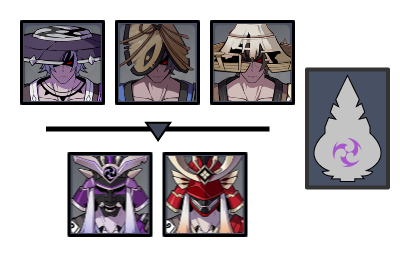
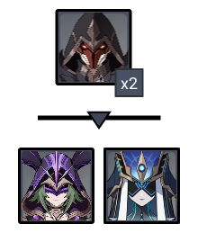
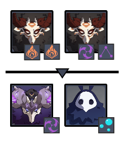
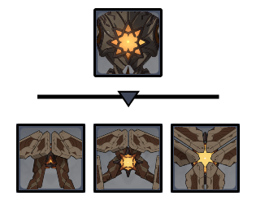
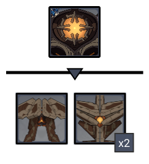

# Floor 12


page is under construction! Check back shortly!


## Divergence

**Energy Tides** are present in this challenge. They will switch between **Elemental High Tide** and **Elemental Low Tide** in **10s cycles**.

During **High Tide**, a large amount of **Elemental Particles** will be generated when a character's attack hits opponents, restoring **10 Elemental Energy**. This effect can occur once every **2.8s**.

During **Low Tide**, all characters in the party **cannot gain Elemental Energy**.

## General Tips

The **Energy Tide** mechanic provides boosted energy regeneration during high tide, but completely blocks it during low tide. You should think about this when building team compositions and during character rotations.

Pay close attention to characters that rely heavily on **Elemental Burst** \(for example **Eula**, **Ayaka**\). You need to manage the timing of abilities to ensure proper energy generation.

Characters that are not highly dependent on their **Elemental Burst** \(example **Ganyu**\) are great here as they will not be affected much by **Energy Tide**.

During **High Tide**, prioritize generating energy for your characters by rotating through your supports and using their skills. Avoid using your **Elemental Bursts** if possible, as their animations will waste time that could be spent generating energy.

During **Low Tide** is the ideal time to use **Elemental Bursts** to deal massive damage.

## Team Recommendations

|  | Side 1 | Side 2 |
| :--- | :---: | :---: |
| **Shieldbreakers** |  | or |
| **Preferred Damage** |  \(C1 & C2\) |  |
| **Avoid Damage** | \(C3\) |  |

## Chamber 1

**Monster Level - 96**

### Side 1

| **In Depth Guide** | Other Info |
| :--- | :--- |
| [Kairagi](../../monsters/untitled/kairagi.md) | ~500K HP |


The **Samurai** enemies in this chamber **cannot be picked up with****skills**.


Having **AoE DMG** in this chamber is essential. Build your compositions with this in mind.

These enemies frequently use **Dash** attacks, making it difficult to keep them together. Using **Freeze** and **Petrify** \(**Zhong Li's Elemental Burst**\) are effective ways to lock them in place and keep them together.

One effective strategy is to fight near the edge of the arena, facing inwards. This ensures that **Dash** attacks will stop at the same location, naturally grouping the enemies together.

If you kill one of the **Kairagi**, it will cause the other to use the **Heal** ability, regenerating a large chunk of health and wasting more time. Your best bet is to attempt to kill both within a few seconds of each other. You can delay the use of the **Heal** ability by using **Freeze**, or using abilities like **Zhong Li's Elemental Burst.**

After using **Heal**, the **Kairagi** will be immune to **Freeze** and **Petrify**.

| **Recommended** |
| :---: |
|  |

### Side 2

| **In Depth Guide** | Other Info |
| :--- | :--- |
| [Pyro Agent](../../monsters/fatui/pyro-agent.md) | ~350K HP |
| [Electro Cicin Mage](../../monsters/fatui/electro-cicin-mage.md) | ~350K HP |
| [Mirror Maiden](../../monsters/fatui/mirror-maiden.md) | ~650K HP |

After defeating the **Pyro Agents**, focus the **Mirror Maiden**. She has more HP, and the **Electro Cicin Mage** will naturally teleport to you.

| **Highly Recommended** |
| :---: |
|  |

## Chamber 2

**Monster Level - 98**

### Side 1

| **In Depth Guide** | Other Info |
| :--- | :--- |
| [Thunderhelm Lawachurl](../../monsters/hilichurls/thunderhelm-lawachurl.md) | ~700K HP |
| [Hydro Abyss Mage](../../monsters/abyss-order/hydro-abyss-mage.md) |  |
| Smoldering Flame/Engulfing Storm \([Debuffs](../../mechanics/debuffs/)\) |  |
| [Lightning Stake](../../mechanics/auras/lightning-stake.md) | ?? DMG |
| [Mist Bubble](../../mechanics/auras/mist-bubble.md) | ?? DMG |

Run for the **Mitachurl** behind you and let the other one come to you. That's where the **Thunderhelm Lawachurl** will spawn, and you want to kill the first wave close to there so you can start attacking it right away.

Try to make sure you clear this side quickly so you can have more time for **Side 2**.

### Side 2

| **In Depth Guide** | Other Info |
| :--- | :--- |
| [Maguu Kenki](../../monsters/elites/maguu-kenki.md) | ~1300K HP |

This is a difficult fight if you're not familiar with the attacks and dodge timings. Check the in depth guide page and practice on the overworld version a few times to get used to it's attacks.

Remember once the **Maguu Kenki** reaches **75% HP** it will become **invulnerable** and perform an **AoE** attack. Make sure not to waste your damage on it during this time.

This is mostly a DPS check, so bring your most invested composition on this side when going for 3★.

## Chamber 3

**Monster Level - 100**

### Side 1

| **In Depth Guide** | Other Info |
| :--- | :--- |
| [Ruin Hunter](../../monsters/ruin-constructs/ruin-hunter.md) | ~550K HP |
| [Ruin Scout](../../monsters/ruin-constructs/ruin-scout.md) | ~580K HP |
| [Ruin Defender](../../monsters/ruin-constructs/ruin-defender.md) | ~580K HP |
| [Ruin Cruiser](../../monsters/ruin-constructs/ruin-cruiser.md) | ~400K HP |

During the second wave, run to the one the spawns on the right \(**Ruin Cruiser**\). The other two will naturally group up around you.

As usual, **Ruin Constructs** have higher **Phys RES** than other enemies. Avoid using physical damage based characters when going for 3★. If you have to, make sure you trigger **Superconduct** regularly.

### Side 2

| **In Depth Guide** | Other Info |
| :--- | :--- |
| [Ruin Guard](../../monsters/ruin-constructs/ruin-guard.md) | ~650K HP |
| [Ruin Scout](../../monsters/ruin-constructs/ruin-scout.md) | ~580K HP |
| [Ruin Destroyer](../../monsters/ruin-constructs/ruin-destroyer.md) | ~400K HP |

During the second wave, run to either of the constructs on the sides. The other two should come towards you and group together.

As usual, **Ruin Constructs** have higher **Phys RES** than other enemies. Avoid using physical damage based characters when going for 3★. If you have to, make sure you trigger **Superconduct** regularly.

