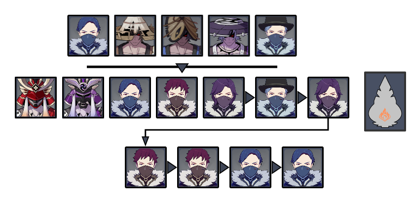
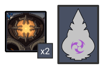
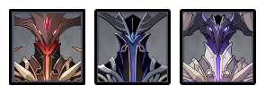
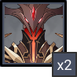
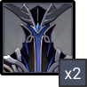

# Floor 12

## Divergence 

None

## General Tips

## Chamber 1

**Monster Level - 95**

|                            | Side 1 | Side 2 |
| -------------------------- | :----: | :----: |
| **Shieldbreakers**         |        |        |
| **Preferred DPS Elements** |        |        |
| **Avoid DPS Elements**     |        |        |

### Side 1

| In Depth Guide                                            | Other Info |
| --------------------------------------------------------- | ---------- |
| [nobushi.md](../../monsters/samurai/nobushi.md "mention") |            |
| [kairagi.md](../../monsters/samurai/kairagi.md "mention") |            |

### Side 2

| In Depth Guide                                                                  | Other Info |
| ------------------------------------------------------------------------------- | ---------- |
| ****[ruin-guard.md](../../monsters/ruin-constructs/ruin-guard.md "mention")**** |            |

## Chamber 2

**Monster Level - 98**

|                            | Side 1 | Side 2 |
| -------------------------- | :----: | :----: |
| **Shieldbreakers**         |        |        |
| **Preferred DPS Elements** |        |        |
| **Avoid DPS Elements**     |        |        |

### Side 1

| In Depth Guide                                                                  | Other Info |
| ------------------------------------------------------------------------------- | ---------- |
| [cryo-whopperflower.md](../../monsters/animals/cryo-whopperflower.md "mention") |            |
| [pyro-whopperflower.md](../../monsters/animals/pyro-whopperflower.md "mention") |            |

### Side 2

| In Depth Guide                                                                    | Other Info |
| --------------------------------------------------------------------------------- | ---------- |
| [abyss-lector-pyro.md](../../monsters/abyss-order/abyss-lector-pyro.md "mention") |            |
| [abyss-herald.md](../../monsters/abyss-order/abyss-herald.md "mention")           |            |
| [abyss-lector.md](../../monsters/abyss-order/abyss-lector.md "mention")           |            |

## Chamber 3

**Monster Level - 100**

|                            | Side 1 | Side 2 |
| -------------------------- | :----: | :----: |
| **Shieldbreakers**         |        |        |
| **Preferred DPS Elements** |        |        |
| **Avoid DPS Elements**     |        |        |

### Side 1

| In Depth Guide                                                                    | Other Info |
| --------------------------------------------------------------------------------- | ---------- |
| [abyss-lector-pyro.md](../../monsters/abyss-order/abyss-lector-pyro.md "mention") |            |

### Side 2

| In Depth Guide                                                          | Other Info |
| ----------------------------------------------------------------------- | ---------- |
| [abyss-herald.md](../../monsters/abyss-order/abyss-herald.md "mention") |            |

