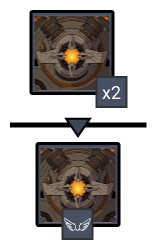
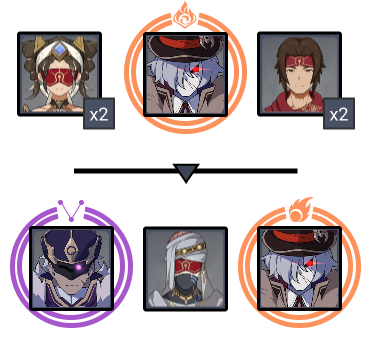
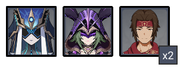
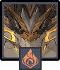
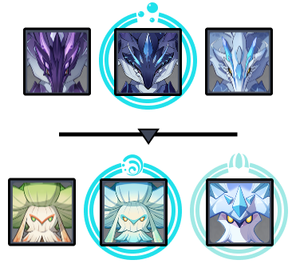

# Floor 12

## Divergence 

None

## General Tips

If you only have onecharacter that can effectively group enemies, you may want to rebuild your team specifically for Chambers 1 & 2, and the grouping requirement is on different sides. Build a team to 3★ one chamber, then retry with a different team for the other.

## Chamber 1

**Monster Level - 95**

|                            |                     Side 1                     |                     Side 2                     |
| -------------------------- | :--------------------------------------------: | :--------------------------------------------: |
| **Preferred DPS Elements** |                                                |  |
| **Avoid DPS Elements**     |  |                                                |

### Side 1

<figure><figcaption></figcaption></figure>

| In Depth Guide                                                                                | Other Info |
| --------------------------------------------------------------------------------------------- | ---------- |
| [ruin-drake-earthguard.md](../../monsters/ruin-constructs/ruin-drake-earthguard.md "mention") | 795K HP    |
| [ruin-drake-skywatch.md](../../monsters/ruin-constructs/ruin-drake-skywatch.md "mention")     | 567K HP    |

Ruin Drakes will get 40% resistance to an element when charging up. If your team primarily deals one type of damage, it's important you interrupt this by attacking their exposed Core during this time.

Having good AoE will save a lot of time as the Earthguards have a decent amount of HP, so you want to be hitting both at once.

Most melee characters will be able to hit the Skywatch's feet still, but you may have trouble hitting the Core unless you bring a Bow character.

### Side 2

<figure><figcaption></figcaption></figure>

| In Depth Guide                                                                                                                                                                                                                                                                            | Other Info |
| ----------------------------------------------------------------------------------------------------------------------------------------------------------------------------------------------------------------------------------------------------------------------------------------- | ---------- |
| Eremite - Desert Clearwater                                                                                                                                                                                                                                                               | 409K HP    |
| Eremite - Sunfrost                                                                                                                                                                                                                                                                        | 409K HP    |
| 
<a data-mention href="../../monsters/fatui/pyroslinger.md">pyroslinger.md</a> > Smoldering Flame (<a data-mention href="../../mechanics/debuffs/#aura-debuff">#aura-debuff</a>) > <a data-mention href="../../mechanics/auras/pursuing-fireball.md">pursuing-fireball.md</a>
 | 208K HP    |
| 
<a data-mention href="../../monsters/fatui/electrohammer-vanguard.md">electrohammer-vanguard.md</a> > <a data-mention href="../../mechanics/auras/lightning-stake.md">lightning-stake.md</a>
                                                                                    | 277K HP    |

Bringing ancharacter will help immensely as the enemies on this side can be easily picked up and disabled.

Humanoid enemies have lowerRES, so bringing physical damage can help if you have one invested.

The Fatui have the Auras and are the weaker enemy. Focus them first so you don't have deal with their shields or their aura effects for long.

#### Character Recommendations

| Character                                                                                                                                                       | Function      |
| --------------------------------------------------------------------------------------------------------------------------------------------------------------- | ------------- |
|  | Crowd Control |

## Chamber 2

**Monster Level - 98**

|                            |                     Side 1                     |                                        Side 2                                       |
| -------------------------- | :--------------------------------------------: | :---------------------------------------------------------------------------------: |
| **Preferred DPS Elements** |  |                                                                                     |
| **Avoid DPS Elements**     |                                                |  |

### Side 1

<figure><figcaption></figcaption></figure>

| In Depth Guide                                                                | Other Info |
| ----------------------------------------------------------------------------- | ---------- |
| [mirror-maiden.md](../../monsters/fatui/mirror-maiden.md "mention")           | 773K HP    |
| [electro-cicin-mage.md](../../monsters/fatui/electro-cicin-mage.md "mention") | 383K HP    |
| Eremite - Crossbow                                                            | 155K HP    |

Bringing ancharacter will help immensely as the enemies on this side can be easily picked up and disabled. This will also help immensely with grouping.

If you don't have access to these characters, you can also try grouping them by running backwards at the start of the chamber and let the enemies group towards you, but this may not be consistent.

#### Character Recommendations

| Character                                                                                                                                                       | Function      |
| --------------------------------------------------------------------------------------------------------------------------------------------------------------- | ------------- |
|  | Crowd Control |

#### Grouping Tip



### Side 2

<figure><figcaption></figcaption></figure>

| In Depth Guide                                                           | Other Info |
| ------------------------------------------------------------------------ | ---------- |
| [primo-geovishap.md](../../monsters/elites/primo-geovishap.md "mention") | 2.3M HP    |

Bring your best single target DPS for this side, preferably notas this version has higher resistance to it.

If your only option is, it's extremely important to bring ancharacter with 4 piece Viridescent Veneer to debuff the resist.

Check [primo-geovishap.md](../../monsters/elites/primo-geovishap.md "mention") for in depth tips.

#### Character Recommendations

| Character                                                                                                   | Function               |
| ----------------------------------------------------------------------------------------------------------- | ---------------------- |
|  | Pyro Effective Shields |

## Chamber 3

**Monster Level - 100**

|                        |                    Side 1                   |                    Side 2                    |
| ---------------------- | :-----------------------------------------: | :------------------------------------------: |
| **Avoid DPS Elements** |  |  |

### Side 1

<figure><figcaption></figcaption></figure>

| In Depth Guide                                                                                                                                                                             | Other Info |
| ------------------------------------------------------------------------------------------------------------------------------------------------------------------------------------------ | ---------- |
| 
<a data-mention href="../../monsters/vishaps/bathysmal-vishap.md">bathysmal-vishap.md</a> > <a data-mention href="../../mechanics/auras/mist-bubble.md">mist-bubble.md</a>
       | 1.1M HP    |
| [bathysmal-vishap.md](../../monsters/vishaps/bathysmal-vishap.md "mention") (hatchling)                                                                                                    | 555K HP    |
| 
<a data-mention href="../../monsters/mushrooms/grounded-hydroshroom.md">grounded-hydroshroom.md</a> > Slowing Waters <a data-mention href="../../mechanics/debuffs/">debuffs</a>
 | 277K HP    |
| 
<a data-mention href="../../monsters/mushrooms/winged-cryoshroom.md">winged-cryoshroom.md</a> > <a data-mention href="../../mechanics/auras/ice-cage.md">ice-cage.md</a>
         | 388K HP    |
| [winged-dendroshroom.md](../../monsters/mushrooms/winged-dendroshroom.md "mention")                                                                                                        | 277K HP    |

**Freeze** based teams are a nice way to keep enemies grouped and also prevent them from chaining attacks into you.

The vishaps in the first wave will naturally group, but due to staggering they will often split apart without any CC pulling them.

The **Slowing Waters** debuff in the second wave will cause increased cooldowns when you use an ability. This won't trigger right away, so you have a short window to burst down the Hydroshroom before it can debuff you.

The **Slowing Waters** debuff has an AoE indicated by the circle. You can try to avoid it by being outside when it triggers, about every 15 seconds.

Bennet and Jean are the only characters that can remove this debuff using their bursts.

#### Character Recommendations

| Character                                                                                                 | Function    |
| --------------------------------------------------------------------------------------------------------- | ----------- |
|  | Cleanse     |
|   | Freeze Team |

#### Grouping Tip



### Side 2

<figure><figcaption></figcaption></figure>

| In Depth Guide                                                                         | Other Info |
| -------------------------------------------------------------------------------------- | ---------- |
| [jadeplume-terrorshroom.md](../../monsters/elites/jadeplume-terrorshroom.md "mention") | 1.9M HP    |

Bring your best single target team.

You can Enrage the boss by applyingrepeatedly. This will cause it to rampage for a short time, but afterwards it will be exhausted and have their resistance reduced to 0% for all elements other than.

Applyingwill **Scorch** the Terrorshroom, however while this is effective against other mushroom enemies, this has the effect of causing additional enemies to spawn and movesets that are harder to avoid.

#### Character Recommendations

| Character                                                                                                  | Function          |
| ---------------------------------------------------------------------------------------------------------- | ----------------- |
|  | Single Target DPS |

###
