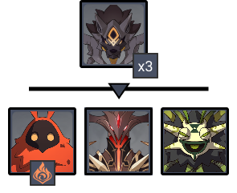
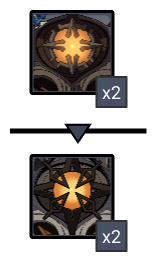

# Floor 12

## Divergence 

## General Tips

## Chamber 1

**Monster Level - 95**

### Side 1

| In Depth Guide                                                                                 | Other Info                                                                    |
| ---------------------------------------------------------------------------------------------- | ----------------------------------------------------------------------------- |
| [perpetual-mechanical-array.md](../../monsters/elites/perpetual-mechanical-array.md "mention") | 
1.8M HP Cruiser/Destroy adds 341K HP Defender/Scout adds 477K HP
 |

### Side 2

| In Depth Guide                                                                                                                                                                                          | Other Info |
| ------------------------------------------------------------------------------------------------------------------------------------------------------------------------------------------------------- | ---------- |
| [rifthound-whelp.md](../../monsters/rifthounds/rifthound-whelp.md "mention")                                                                                                                            | 273K HP    |
| [dendro-samachurl.md](../../monsters/hilichurls/samachurls/dendro-samachurl.md "mention")                                                                                                               | 69K HP     |
| 
<a data-mention href="../../monsters/abyss-order/pyro-abyss-mage.md">pyro-abyss-mage.md</a> > <a data-mention href="../../mechanics/debuffs/#aura-debuff">#aura-debuff</a> (Smoldering Flame)
 | 139K HP    |
| [abyss-lector-pyro.md](../../monsters/abyss-order/abyss-lector-pyro.md "mention")                                                                                                                       | 555K HP    |

## Chamber 2

**Monster Level - 98**

|                            | Side 1 | Side 2 |
| -------------------------- | :----: | :----: |
| **Preferred DPS Elements** |        |        |
| **Avoid DPS Elements**     |        |        |

### Side 1

| In Depth Guide                                                           | Other Info |
| ------------------------------------------------------------------------ | ---------- |
| [primo-geovishap.md](../../monsters/elites/primo-geovishap.md "mention") | 2.3M HP    |

### Side 2

| In Depth Guide                                                          | Other Info |
| ----------------------------------------------------------------------- | ---------- |
| [abyss-herald.md](../../monsters/abyss-order/abyss-herald.md "mention") | 613K HP    |

## Chamber 3

**Monster Level - 100**

|                           | Side 1 | Side 2 |
| ------------------------- | :----: | :----: |
| **Preferred DPS Element** |        |        |
| **Avoid DPS Elements**    |        |        |

### Side 1

| In Depth Guide                                                            | Other Info |
| ------------------------------------------------------------------------- | ---------- |
| [ruin-guard.md](../../monsters/ruin-constructs/ruin-guard.md "mention")   | 643K HP    |
| [ruin-grader.md](../../monsters/ruin-constructs/ruin-grader.md "mention") | 827K HP    |

### Side 2

| In Depth Guide                                              | Other Info |
| ----------------------------------------------------------- | ---------- |
| [maguu-kenki](../../monsters/elites/maguu-kenki/ "mention") | 1.8M HP    |

