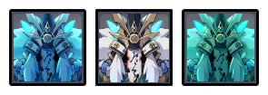

# Floor 12

## Divergence 

None

## General Tips

* Hyperbloom (+) and Aggravate () Teams are highly recommended for the first side, particularly Chambers 1 & 3.
* AoE focused teams with an  are highly recommended for the second side, particularly Chambers 1 & 3.
* Unlike recent F12 Abyss, it's not as necessary to switch up teams per chamber, and you can mostly use the same team for all chambers.
* Chamber 2 in particular has a high amount of damage output. You will need well built support characters to survive if you're not familiar with dodging the enemies.
* If you are struggling on Chamber 2, it may be good to take it slow and go for it's 3\* last

## Chamber 1

**Monster Level - 95**

|                            |                                                               Side 1                                                               |                                         Side 2                                        |
| -------------------------- | :--------------------------------------------------------------------------------------------------------------------------------: | :-----------------------------------------------------------------------------------: |
| **Shieldbreakers**         | // |  |
| **Preferred DPS Elements** |                                                                                        |                    (CC)                    |
| **Avoid DPS Elements**     |                                                                                      |                                                                                       |

### Side 1

<figure><figcaption></figcaption></figure>

| In Depth Guide                                                                                | Other Info |
| --------------------------------------------------------------------------------------------- | ---------- |
| [ruin-guard.md](../../monsters/ruin-constructs/ruin-guard.md "mention")                       |            |
| [ruin-drake-earthguard.md](../../monsters/ruin-constructs/ruin-drake-earthguard.md "mention") |            |
| [ruin-grader.md](../../monsters/ruin-constructs/ruin-grader.md "mention")                     |            |

The chamber is fairly straightforward, however enemies spawn one at a time so you will need to bring a strong single target DPS.

Be wary of the Earthguard's charging-up attack. If you can't kill it quickly enough without stunning it, it will gain massive resistance to the element from which it took the most damage. Combined with the  Shield Node it can make it very resistant to damage.

 DPS is a good choice as you can trigger Quicken easily because of the shield node.

#### Character Recommendations

| Character                                                                                                                                                                                                                                                                 | Function                    |
| ------------------------------------------------------------------------------------------------------------------------------------------------------------------------------------------------------------------------------------------------------------------------- | --------------------------- |
|  | Strong single-target damage |
|                                                                                                                                                               | Dendro based DPS            |

### Side 2

<figure><figcaption></figcaption></figure>

| In Depth Guide                                                                        | Other Info |
| ------------------------------------------------------------------------------------- | ---------- |
| [cryo-whopperflower.md](../../monsters/animals/cryo-whopperflower.md "mention")       |            |
| [pyro-whopperflower.md](../../monsters/animals/pyro-whopperflower.md "mention")       |            |
| [electro-whopperflower.md](../../monsters/animals/electro-whopperflower.md "mention") |            |
| [pyro-abyss-mage.md](../../monsters/abyss-order/pyro-abyss-mage.md "mention")         |            |
| [electro-abyss-mage.md](../../monsters/abyss-order/electro-abyss-mage.md "mention")   |            |
| [cryo-abyss-mage.md](../../monsters/abyss-order/cryo-abyss-mage.md "mention")         |            |
| [desert-clearwater.md](../../monsters/eremites/desert-clearwater.md "mention")        |            |
| [sunfrost.md](../../monsters/eremites/sunfrost.md "mention")                          |            |

 character is highly recommended for this side to group and CC the enemies.

The second wave consists of three different Abyss Mages. Swirling them together with an  is an effective way to destroy 2/3 of the shields, leaving only one to break with your team.

If you do not swirl any shields, you'll need at least  on your team to break the shields.

Be careful getting Frozen by combined attacks on the last wave.  CC helps greatly here, but if you can't disable the enemies, try to focus down one type at a time so you don't have to deal with Freeze.

#### Character Recommendations

| Character                                                                                                                                                       | Function |
| --------------------------------------------------------------------------------------------------------------------------------------------------------------- | -------- |
|  | Anemo CC |

## Chamber 2

**Monster Level - 98**

|                            |                                          Side 1                                         | Side 2 |
| -------------------------- | :-------------------------------------------------------------------------------------: | :----: |
| **Shieldbreakers**         |                                                                                         |        |
| **Preferred DPS Elements** |                                                                                         |        |
| **Avoid DPS Elements**     |  |        |

### Side 1

<figure><figcaption></figcaption></figure>

| In Depth Guide                                            | Other Info |
| --------------------------------------------------------- | ---------- |
| [nobushi.md](../../monsters/samurai/nobushi.md "mention") |            |
| [kairagi.md](../../monsters/samurai/kairagi.md "mention") |            |
| Consecrated Red Vulture                                   |            |
| Consecrated Scorpion                                      |            |

The floor is filled with hard-hitting enemies, so make sure your healers get enough uptime and heal, or your shielders are adequately built.

You can also consider picking up “Character Elemental Bursts Instantly restore 30% HP” buff card if available, which helps for the chamber if it's available as a buff.

Nobushis and Kairagi are the enemies of the First wave. Stay close to the Kairgai and let the Nobushi come to you.

A Consecrated Vulture and Scorpion make up the Second wave. They both have 60% resistance to their respective elements, so avoid bringing them if possible. This can be countered this by waiting for them to use their barrage attacks, at which point they will spawn a small totem, which you can destroy to restore their normal resistance.

Be wary of the slam attacks at the start of the second wave because they hit hard.

The Consecrated Scorpion performs a lot of sweeping attacks at melee range, and make it difficult to stay close to it while dealing damage. Having characters that can attack at a range may be easier if you don't have shields.

#### Character Recommendations

| Character                                                                                                   | Function               |
| ----------------------------------------------------------------------------------------------------------- | ---------------------- |
|  | Strong shielder/healer |

### Side 2

<figure><figcaption></figcaption></figure>

| In Depth Guide                                                                                           | Other Info |
| -------------------------------------------------------------------------------------------------------- | ---------- |
| [maguu-kenki-split-version.md](../../monsters/elites/maguu-kenki/maguu-kenki-split-version.md "mention") |            |

Each variant will attack every 10 seconds.

Trying to run outside the AoE attacks is not recommended as it wastes valuable time. If you can't reliably dodge these attacks, make sure to save a burst to i-frame through it. They tend to attack at the same time, so you can often dodge multiple attacks with just a burst or two.&#x20;

You also have the option of tanking the attacks by bringing a decently built shielder or a character that gives damage reduction such as Xingqiu and Beidou.

Make sure you have a composition with good AoE damage on this side. It's important when going for stars to be hitting all the enemies at once. Grouping becomes very important here.

Be careful when using characters like Bennett that applyto your character. The Cryo variant's slam attack does significant damage, and this will cause it to Melt for increased damage.

Also, be careful of characters that self-apply , even if momentarily. These are characters like Kokomi or Xingqiu, as the short time you’re frozen can be enough to kill you.

Avoid getting hit as much as possible. If you get staggered by damage, you can often get comboed by the other attacks very quickly. Bring shields if you're not confident in your dodging.

#### **Grouping Strategies**

In general, the enemies will move towards you, but their attacks can send them far away. Avoid standing in the middle of them all, and keep them all on one side. This way they all walk towards you from the same direction.

Below is an example of a consistent strategy to start all 3 Maguu Kenkis together. Note how the Cryo



After doing an initial grouping, try to stay close to the Cryo variant to prevent it from using the dash attack.

## Chamber 3

**Monster Level - 100**

|                            |                                           Side 1                                          |                                             Side 2                                             |
| -------------------------- | :---------------------------------------------------------------------------------------: | :--------------------------------------------------------------------------------------------: |
| **Shieldbreakers**         |                                              |                                                                                                |
| **Preferred DPS Elements** |  | (CC)  |
| **Avoid DPS Elements**     |                                                                                           |                                                                                                |

### Side 1

<figure><figcaption></figcaption></figure>

| In Depth Guide                                         | Other Info |
| ------------------------------------------------------ | ---------- |
| [asimon.md](../../monsters/elites/asimon.md "mention") |            |

It is highly recommended to bring an  character or else you may lose a lot of time to the invisibility phase. Note that this character doesn't need to be built for damage, though that can help.

See **Invisibility** for in depth explanation of ASIMON's invisibility mechanic. It is important to understand this before heading into the fight. As long as you're familiar with this, you can mostly ignore the rest of the boss mechanics.

If your team composition allows it, you can bring both + as using Quicken is the fastest way to break invisibility, however this may not be worth lowering your damage for, as usually just will be enough.

If you skip bringing , then you can simply deal damage to the boss during windows when it is repairing the components you destroyed. However this allows it to unleash additional attacks after repairing the components which may make the fight more difficult.

Characters such as Nahida are helpful as they apply a mark making the boss easily detectable during its invisibility phase, making it much easier to apply quicken to force it out of invisibility

### Side 2

<figure><figcaption></figcaption></figure>

| In Depth Guide                                                                                                                                                                       | Other Info |
| ------------------------------------------------------------------------------------------------------------------------------------------------------------------------------------ | ---------- |
| 
<a data-mention href="../../monsters/eremites/desert-clearwater.md">desert-clearwater.md</a> > <a data-mention href="../../mechanics/debuffs/">debuffs</a>(Slowing Waters)
 |            |
| [sunfrost.md](../../monsters/eremites/sunfrost.md "mention")                                                                                                                         |            |
| [daythunder.md](../../monsters/eremites/daythunder.md "mention")                                                                                                                     |            |
| Scorching Loremaster                                                                                                                                                                 |            |
| [floral-ring-dancer.md](../../monsters/eremites/floral-ring-dancer.md "mention")                                                                                                     |            |
| [galehunter.md](../../monsters/eremites/galehunter.md "mention")                                                                                                                     |            |

The enemies here are weak to , so you can consider using it if you have a team built.

Be wary of the Desert Clearwater as she has a slowing water aura. If she is not killed fast enough, she will apply a debuff making your cooldown two times longer. You will have 15 seconds to kill her before the debuff hits you.

If you cannot kill her in this time, you may want to consider bringing Bennett or Jean, who can cleanse the Aura.

Second wave is the harder wave comprising an Eremite Galehunter, Loremaster, & Ring-dancer. Their chamber variants spawns their summon immediately, making them more resilient ot damage.

Try to kill their summons first, as they only have \~30% of the Eremite’s hp. Killing them will not only reduce their resistance back to normal, but it also deals 37.5% of their current hp as damage.

An  grouper such as Venti or Kazuha really helps as you can kill the summons while damaging the Eremites.

#### Character Recommendations

| Character                                                                                                                                                       | Function |
| --------------------------------------------------------------------------------------------------------------------------------------------------------------- | -------- |
|  | Anemo CC |
|                                                        | Cleanse  |

##
