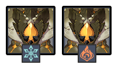

# Floor 12

## Divergence 

None

## Chamber 1

**Monster Level - 90**

|                            | Side 1 | Side 2 |
| -------------------------- | :----: | :----: |
| **Shieldbreakers**         |        |        |
| **Preferred DPS Elements** |        |        |
| **Avoid DPS Elements**     |        |        |

### Side 1

| In Depth Guide                                                               | Other Info |
| ---------------------------------------------------------------------------- | ---------- |
| [rifthound-whelp.md](../../monsters/rifthounds/rifthound-whelp.md "mention") | 273K HP    |
| [rifthound.md](../../monsters/rifthounds/rifthound.md "mention")             | 795K HP    |

### Side 2

| In Depth Guide                                                               | Other Info |
| ---------------------------------------------------------------------------- | ---------- |
| [rifthound-whelp.md](../../monsters/rifthounds/rifthound-whelp.md "mention") | 273K HP    |
| [rifthound.md](../../monsters/rifthounds/rifthound.md "mention")             | 795K HP    |

## Chamber 2

**Monster Level - 92**

|                            | Side 1 | Side 2 |
| -------------------------- | :----: | :----: |
| **Shieldbreakers**         |        |        |
| **Preferred DPS Elements** |        |        |
| **Avoid DPS Elements**     |        |        |

### Side 1

| In Depth Guide                                                | Other Info |
| ------------------------------------------------------------- | ---------- |
| [geovishap.md](../../monsters/animals/geovishap.md "mention") | 613K HP    |

### Side 2

| In Depth Guide                                                                                           | Other Info |
| -------------------------------------------------------------------------------------------------------- | ---------- |
| [maguu-kenki-split-version.md](../../monsters/elites/maguu-kenki/maguu-kenki-split-version.md "mention") | 1.2M HP    |

## Chamber 3

**Monster Level - 100**

|                           | Side 1 | Side 2 |
| ------------------------- | :----: | :----: |
| **Preferred DPS Element** |        |        |
| **Avoid DPS Elements**    |        |        |

### Side 1

| In Depth Guide                                                                | Other Info |
| ----------------------------------------------------------------------------- | ---------- |
| [ruin-defender.md](../../monsters/ruin-constructs/ruin-defender.md "mention") | 582K HP    |
| [ruin-cruiser.md](../../monsters/ruin-constructs/ruin-cruiser.md "mention")   | 416K HP    |
| [rifthound.md](../../monsters/rifthounds/rifthound.md "mention")              | 970K HP    |

### Side 2

| In Depth Guide                                                                                                                                                                     | Other Info                    |
| ---------------------------------------------------------------------------------------------------------------------------------------------------------------------------------- | ----------------------------- |
| 
<a data-mention href="../../monsters/rifthounds/rifthound.md">rifthound.md</a>

> <a data-mention href="../../mechanics/auras/rumbling-stone.md">rumbling-stone.md</a>
 | 
970K HP

> ?? DMG
 |
| [rifthound-whelp.md](../../monsters/rifthounds/rifthound-whelp.md "mention")                                                                                                       | 333K HP                       |
| [ruin-guard.md](../../monsters/ruin-constructs/ruin-guard.md "mention")                                                                                                            | 643K HP                       |
